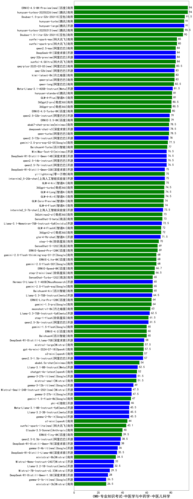

| 类别 | 大模型                         | CMB-专业知识考试-中医学与中药学-中医儿科学 | 排名 |
|-----|------------------------------|---------|----|
|商用|ERNIE-4.5-8K-Preview(new)|94.0|1|
|商用|hunyuan-turbos-20250226(new)|94.0|2|
|商用|Doubao-1.5-pro-32k-250115|91.5|3|
|商用|hunyuan-turbo|91.0|4|
|开源|hunyuan-large|91.0|5|
|商用|hunyuan-turbos-20250313(new)|90.5|6|
|商用|Doubao-1.5-lite-32k-250115|90.0|7|
|商用|xunfei-spark-max|85.0|8|
|商用|xunfei-spark-pro|85.0|9|
|开源|DeepSeek-R1|84.0|10|
|商用|xunfei-4.0Ultra|84.0|11|
|商用|qwen2.5-max|84.0|12|
|开源|qwq-32b-preview|84.0|13|
|商用|qwq-plus-2025-03-05(new)|83.5|14|
|商用|qwen-plus|83.0|15|
|商用|kimi-latest-8k|83.0|16|
|开源|qwq-32b(new)|83.0|17|
|商用|qwen-long|82.5|18|
|开源|Meta-Llama-3.1-405B-Instruct|81.5|19|
|商用|hunyuan-standard|81.0|20|
|商用|GLM-4-Plus|81.0|21|
|商用|360gpt-pro|80.5|22|
|商用|360gpt2-pro|80.5|23|
|商用|ERNIE-4.0-Turbo-8K|80.0|24|
|商用|ERNIE-3.5-8K|79.0|25|
|开源|qwen2.5-32b-instruct|79.0|26|
|商用|qwen-turbo|78.5|27|
|商用|abab7-chat-preview|78.5|28|
|开源|deepseek-chat-v3|78.5|29|
|开源|qwen2.5-72b-instruct|78.0|30|
|商用|gemini-2.0-pro-exp-02-05|77.5|31|
|商用|Baichuan4-Turbo|77.0|32|
|开源|MiniMax-Text-01|76.5|33|
|开源|DeepSeek-R1-Distill-Qwen-14B|76.5|34|
|开源|qwen2.5-14b-instruct|76.5|35|
|开源|qwen2.5-7b-instruct|76.5|36|
|商用|GLM-4-Air|75.0|37|
|开源|internlm2_5-20b-chat|75.0|38|
|商用|yi-lightning|75.0|39|
|开源|DeepSeek-R1-Distill-Qwen-32B|75.0|40|
|商用|GLM-4-Long|74.5|41|
|商用|GLM-4-AirX|74.5|42|
|商用|360gpt-turbo|74.5|43|
|商用|GLM-Zero-Preview|74.0|44|
|商用|GLM-4-Flash|74.0|45|
|开源|internlm2_5-7b-chat|73.5|46|
|商用|SenseChat-5-beta|73.0|47|
|商用|360zhinao2-o1|73.0|48|
|开源|Llama-3.1-Nemotron-70B-Instruct-fp8|72.5|49|
|商用|360gpt2-o1|72.0|50|
|商用|GLM-4-FlashX|72.0|51|
|开源|glm-4-9b-chat|71.5|52|
|商用|step-1-8k|70.0|53|
|商用|ERNIE-Speed-Pro-128K|69.0|54|
|商用|SenseChat-5-1202|69.0|55|
|商用|gemini-2.0-flash-thinking-exp-01-21|68.0|56|
|商用|gemini-2.0-flash-001|68.0|57|
|商用|ERNIE-Lite-8K|68.0|58|
|商用|ERNIE-Speed-8K|66.7|59|
|商用|step-2-mini(new)|66.5|60|
|商用|gemini-2.0-flash-exp|65.0|61|
|开源|Hermes-3-Llama-3.1-405B|65.0|62|
|商用|Baichuan4-Air|65.0|63|
|商用|SenseChat-Turbo-1202|65.0|64|
|开源|Llama-3.3-70B-Instruct|64.5|65|
|商用|gemini-1.5-pro|64.0|66|
|商用|ERNIE-Lite-Pro-128K|64.0|67|
|商用|moonshot-v1-8k|63.0|68|
|开源|Llama-3.3-70B-Instruct-fp8|62.5|69|
|商用|step-1-flash|61.5|70|
|开源|qwen2.5-3b-instruct|61.5|71|
|商用|gemini-1.5-flash|60.0|72|
|商用|ERNIE-4.0|60.0|73|
|商用|Baichuan4|60.0|74|
|开源|DeepSeek-R1-Distill-Llama-70B|58.0|75|
|商用|mistral-large|57.5|76|
|商用|gpt-4o-mini-2024-07-18|57.5|77|
|开源|qwen2.5-1.5b-instruct|57.0|78|
|商用|o3-mini|57.0|79|
|商用|abab6.5s-chat|54.0|80|
|开源|Llama-3.1-8B-Instruct|52.5|81|
|商用|chatgpt-4o-latest|52.0|82|
|商用|mistral-small|51.5|83|
|开源|gemma-3-27b-it(new)|51.5|84|
|开源|gemma-3-12b-it(new)|49.0|85|
|开源|gemma-2-27b-it|47.5|86|
|开源|Mistral-Small-24B-Instruct-2501(new)|47.5|87|
|商用|gemini-1.5-flash-8b|47.0|88|
|开源|phi-4|46.0|89|
|开源|Meta-Llama-3.1-8B-Instruct-fp8|45.5|90|
|开源|Llama-3.2-3B-Instruct|45.5|91|
|开源|gemma-2-9b-it|45.5|92|
|商用|o1-mini|44.0|93|
|商用|xunfei-spark-lite(new)|43.1|94|
|商用|Claude-3.5-Sonnet|40.0|95|
|商用|ERNIE-Tiny-8K|39.5|96|
|开源|qwen2.5-0.5b-instruct|38.5|97|
|开源|DeepSeek-R1-Distill-Qwen-7B|38.0|98|
|开源|gemma-3-4b-it(new)|36.0|99|
|开源|DeepSeek-R1-Distill-Llama-8B|35.5|100|
|商用|ministral-8b|34.5|101|
|开源|Mistral-Nemo-Instruct-2407|33.0|102|
|开源|Llama-3.2-1B-Instruct|32.5|103|
|开源|Mistral-7B-Instruct-v0.3|29.5|104|
|开源|DeepSeek-R1-Distill-Qwen-1.5B|28.0|105|
|商用|ministral-3b|26.5|106|
|开源|gemma-3-1b-it(new)|26.5|107|
|开源|qwen2.5-math-72b-instruct|/|108|
|开源|Yi-1.5-34B-Chat|/|109|
|开源|Yi-1.5-9B-Chat|/|110|

