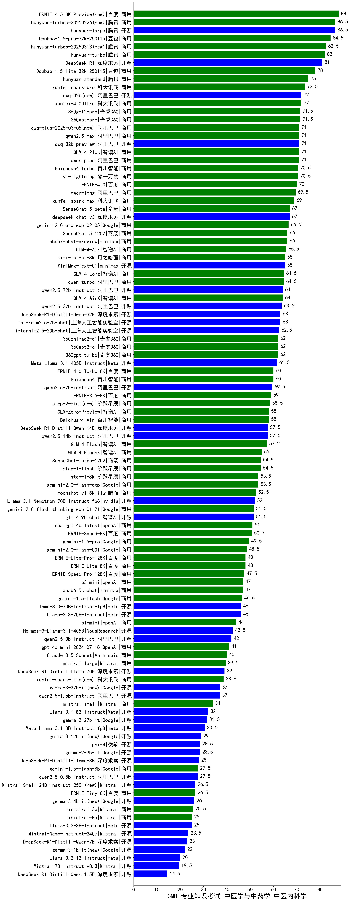

| 类别 | 大模型                         | CMB-专业知识考试-中医学与中药学-中医内科学 | 排名 |
|-----|------------------------------|---------|----|
|商用|ERNIE-4.5-8K-Preview(new)|88.0|1|
|开源|hunyuan-large|86.5|2|
|商用|hunyuan-turbos-20250226(new)|86.5|3|
|商用|Doubao-1.5-pro-32k-250115|84.5|4|
|商用|hunyuan-turbos-20250313(new)|82.5|5|
|商用|hunyuan-turbo|82.0|6|
|开源|DeepSeek-R1|81.0|7|
|商用|Doubao-1.5-lite-32k-250115|78.0|8|
|商用|hunyuan-standard|75.0|9|
|商用|xunfei-spark-pro|73.5|10|
|商用|xunfei-4.0Ultra|72.0|11|
|开源|qwq-32b(new)|72.0|12|
|商用|360gpt2-pro|71.5|13|
|商用|360gpt-pro|71.5|14|
|开源|qwq-32b-preview|71.0|15|
|商用|GLM-4-Plus|71.0|16|
|商用|qwen2.5-max|71.0|17|
|商用|qwen-plus|71.0|18|
|商用|qwq-plus-2025-03-05(new)|71.0|19|
|商用|Baichuan4-Turbo|70.5|20|
|商用|yi-lightning|70.5|21|
|商用|ERNIE-4.0|70.0|22|
|商用|qwen-long|69.5|23|
|商用|xunfei-spark-max|69.0|24|
|开源|deepseek-chat-v3|67.0|25|
|商用|SenseChat-5-beta|67.0|26|
|商用|gemini-2.0-pro-exp-02-05|66.5|27|
|商用|SenseChat-5-1202|66.0|28|
|商用|abab7-chat-preview|66.0|29|
|商用|GLM-4-Air|65.5|30|
|商用|kimi-latest-8k|65.0|31|
|开源|MiniMax-Text-01|65.0|32|
|商用|GLM-4-Long|64.5|33|
|商用|qwen-turbo|64.5|34|
|商用|GLM-4-AirX|64.0|35|
|开源|qwen2.5-72b-instruct|64.0|36|
|开源|qwen2.5-32b-instruct|63.5|37|
|开源|internlm2_5-7b-chat|63.0|38|
|开源|DeepSeek-R1-Distill-Qwen-32B|63.0|39|
|开源|internlm2_5-20b-chat|62.5|40|
|商用|360gpt2-o1|62.0|41|
|商用|360zhinao2-o1|62.0|42|
|商用|360gpt-turbo|62.0|43|
|开源|Meta-Llama-3.1-405B-Instruct|61.5|44|
|商用|ERNIE-4.0-Turbo-8K|60.0|45|
|商用|Baichuan4|60.0|46|
|开源|qwen2.5-7b-instruct|59.5|47|
|商用|ERNIE-3.5-8K|59.0|48|
|商用|step-2-mini(new)|58.5|49|
|商用|GLM-Zero-Preview|58.0|50|
|商用|Baichuan4-Air|58.0|51|
|开源|DeepSeek-R1-Distill-Qwen-14B|57.5|52|
|开源|qwen2.5-14b-instruct|57.5|53|
|商用|GLM-4-Flash|57.2|54|
|商用|GLM-4-FlashX|55.0|55|
|商用|SenseChat-Turbo-1202|54.5|56|
|商用|step-1-flash|54.5|57|
|商用|gemini-2.0-flash-exp|53.5|58|
|商用|step-1-8k|53.5|59|
|商用|moonshot-v1-8k|52.5|60|
|开源|Llama-3.1-Nemotron-70B-Instruct-fp8|52.0|61|
|开源|glm-4-9b-chat|51.5|62|
|商用|gemini-2.0-flash-thinking-exp-01-21|51.5|63|
|商用|chatgpt-4o-latest|51.0|64|
|商用|ERNIE-Speed-8K|50.7|65|
|商用|gemini-1.5-pro|49.5|66|
|商用|gemini-2.0-flash-001|48.5|67|
|商用|ERNIE-Lite-Pro-128K|48.0|68|
|商用|ERNIE-Lite-8K|48.0|69|
|商用|ERNIE-Speed-Pro-128K|47.5|70|
|商用|abab6.5s-chat|47.0|71|
|商用|o3-mini|47.0|72|
|商用|gemini-1.5-flash|46.5|73|
|开源|Llama-3.3-70B-Instruct|46.0|74|
|开源|Llama-3.3-70B-Instruct-fp8|46.0|75|
|商用|o1-mini|44.0|76|
|开源|Hermes-3-Llama-3.1-405B|42.5|77|
|开源|qwen2.5-3b-instruct|42.0|78|
|商用|gpt-4o-mini-2024-07-18|41.0|79|
|商用|Claude-3.5-Sonnet|40.0|80|
|商用|mistral-large|39.5|81|
|开源|DeepSeek-R1-Distill-Llama-70B|39.0|82|
|商用|xunfei-spark-lite(new)|38.6|83|
|开源|gemma-3-27b-it(new)|37.0|84|
|开源|qwen2.5-1.5b-instruct|37.0|85|
|商用|mistral-small|34.0|86|
|开源|Llama-3.1-8B-Instruct|32.0|87|
|开源|gemma-2-27b-it|31.5|88|
|开源|Meta-Llama-3.1-8B-Instruct-fp8|30.5|89|
|开源|gemma-3-12b-it(new)|29.0|90|
|开源|gemma-2-9b-it|28.5|91|
|开源|phi-4|28.5|92|
|开源|DeepSeek-R1-Distill-Llama-8B|28.0|93|
|开源|qwen2.5-0.5b-instruct|27.5|94|
|商用|gemini-1.5-flash-8b|27.5|95|
|商用|ERNIE-Tiny-8K|26.5|96|
|开源|Mistral-Small-24B-Instruct-2501(new)|26.5|97|
|开源|gemma-3-4b-it(new)|26.0|98|
|商用|ministral-3b|25.5|99|
|开源|Llama-3.2-3B-Instruct|25.0|100|
|商用|ministral-8b|25.0|101|
|开源|Mistral-Nemo-Instruct-2407|23.5|102|
|开源|DeepSeek-R1-Distill-Qwen-7B|23.0|103|
|开源|gemma-3-1b-it(new)|22.0|104|
|开源|Llama-3.2-1B-Instruct|20.0|105|
|开源|Mistral-7B-Instruct-v0.3|19.5|106|
|开源|DeepSeek-R1-Distill-Qwen-1.5B|14.5|107|
|开源|qwen2.5-math-72b-instruct|/|108|
|开源|Yi-1.5-34B-Chat|/|109|
|开源|Yi-1.5-9B-Chat|/|110|

