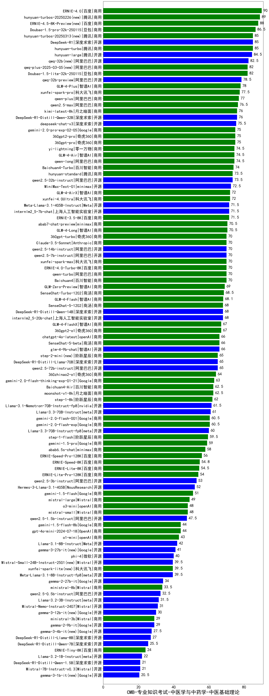

| 类别 | 大模型                         | CMB-专业知识考试-中医学与中药学-中医基础理论 | 排名 |
|-----|------------------------------|---------|----|
|商用|ERNIE-4.0|90.0|1|
|商用|hunyuan-turbos-20250226(new)|89.0|2|
|商用|ERNIE-4.5-8K-Preview(new)|88.0|3|
|商用|Doubao-1.5-pro-32k-250115|86.5|4|
|开源|DeepSeek-R1|85.0|5|
|商用|hunyuan-turbo|85.0|6|
|商用|hunyuan-turbos-20250313(new)|85.0|7|
|开源|hunyuan-large|84.5|8|
|开源|qwq-32b(new)|82.5|9|
|商用|Doubao-1.5-lite-32k-250115|82.0|10|
|商用|qwq-plus-2025-03-05(new)|82.0|11|
|开源|qwq-32b-preview|78.5|12|
|商用|GLM-4-Plus|78.0|13|
|商用|xunfei-spark-pro|77.5|14|
|商用|qwen-plus|77.0|15|
|商用|qwen2.5-max|76.5|16|
|开源|DeepSeek-R1-Distill-Qwen-32B|76.0|17|
|商用|kimi-latest-8k|76.0|18|
|开源|deepseek-chat-v3|75.5|19|
|商用|360gpt2-pro|75.0|20|
|商用|360gpt-pro|75.0|21|
|商用|gemini-2.0-pro-exp-02-05|75.0|22|
|商用|GLM-4-Air|74.5|23|
|商用|yi-lightning|74.5|24|
|商用|qwen-long|74.5|25|
|商用|Baichuan4-Turbo|74.0|26|
|商用|hunyuan-standard|73.5|27|
|开源|qwen2.5-32b-instruct|73.5|28|
|开源|MiniMax-Text-01|72.5|29|
|商用|xunfei-4.0Ultra|72.0|30|
|商用|GLM-4-AirX|72.0|31|
|开源|Meta-Llama-3.1-405B-Instruct|71.5|32|
|开源|internlm2_5-7b-chat|71.5|33|
|商用|ERNIE-3.5-8K|71.5|34|
|商用|abab7-chat-preview|70.5|35|
|商用|GLM-4-Long|70.5|36|
|开源|qwen2.5-14b-instruct|70.0|37|
|开源|qwen2.5-7b-instruct|70.0|38|
|商用|Claude-3.5-Sonnet|70.0|39|
|商用|xunfei-spark-max|70.0|40|
|商用|Baichuan4|70.0|41|
|商用|ERNIE-4.0-Turbo-8K|70.0|42|
|商用|qwen-turbo|70.0|43|
|商用|360gpt-turbo|70.0|44|
|商用|GLM-Zero-Preview|69.0|45|
|商用|SenseChat-Turbo-1202|68.5|46|
|商用|GLM-4-Flash|68.1|47|
|商用|SenseChat-5-1202|68.0|48|
|开源|DeepSeek-R1-Distill-Qwen-14B|68.0|49|
|开源|internlm2_5-20b-chat|68.0|50|
|商用|360gpt2-o1|67.0|51|
|商用|GLM-4-FlashX|67.0|52|
|商用|chatgpt-4o-latest|66.0|53|
|商用|SenseChat-5-beta|66.0|54|
|开源|glm-4-9b-chat|66.0|55|
|开源|DeepSeek-R1-Distill-Llama-70B|65.0|56|
|商用|step-2-mini(new)|65.0|57|
|开源|qwen2.5-72b-instruct|65.0|58|
|商用|360zhinao2-o1|64.0|59|
|商用|gemini-2.0-flash-thinking-exp-01-21|63.0|60|
|商用|moonshot-v1-8k|62.5|61|
|商用|Baichuan4-Air|62.5|62|
|商用|step-1-8k|62.0|63|
|开源|Llama-3.1-Nemotron-70B-Instruct-fp8|61.5|64|
|开源|Llama-3.3-70B-Instruct|61.0|65|
|商用|gemini-2.0-flash-001|60.5|66|
|商用|gemini-2.0-flash-exp|60.5|67|
|开源|Llama-3.3-70B-Instruct-fp8|60.0|68|
|商用|step-1-flash|59.5|69|
|商用|gemini-1.5-pro|59.0|70|
|商用|abab6.5s-chat|58.0|71|
|商用|ERNIE-Speed-Pro-128K|56.0|72|
|商用|ERNIE-Speed-8K|54.8|73|
|商用|ERNIE-Lite-8K|54.5|74|
|商用|ERNIE-Lite-Pro-128K|54.0|75|
|开源|qwen2.5-3b-instruct|53.0|76|
|开源|Hermes-3-Llama-3.1-405B|52.0|77|
|商用|gemini-1.5-flash|51.0|78|
|商用|mistral-large|49.0|79|
|商用|o3-mini|48.0|80|
|商用|mistral-small|48.0|81|
|开源|qwen2.5-1.5b-instruct|47.5|82|
|商用|gemini-1.5-flash-8b|44.0|83|
|商用|gpt-4o-mini-2024-07-18|44.0|84|
|商用|o1-mini|43.0|85|
|开源|Llama-3.1-8B-Instruct|42.0|86|
|开源|gemma-3-27b-it(new)|41.0|87|
|开源|phi-4|40.0|88|
|开源|Mistral-Small-24B-Instruct-2501(new)|39.5|89|
|开源|Meta-Llama-3.1-8B-Instruct-fp8|39.5|90|
|商用|xunfei-spark-lite(new)|39.5|91|
|开源|gemma-2-27b-it|34.0|92|
|商用|ministral-8b|33.5|93|
|开源|qwen2.5-0.5b-instruct|32.5|94|
|开源|Llama-3.2-3B-Instruct|31.5|95|
|开源|Mistral-Nemo-Instruct-2407|31.0|96|
|开源|gemma-3-12b-it(new)|30.0|97|
|开源|gemma-2-9b-it|29.0|98|
|商用|ministral-3b|29.0|99|
|开源|gemma-3-4b-it(new)|27.5|100|
|开源|DeepSeek-R1-Distill-Llama-8B|27.0|101|
|开源|DeepSeek-R1-Distill-Qwen-7B|25.5|102|
|商用|ERNIE-Tiny-8K|24.0|103|
|开源|Llama-3.2-1B-Instruct|22.0|104|
|开源|DeepSeek-R1-Distill-Qwen-1.5B|21.0|105|
|开源|Mistral-7B-Instruct-v0.3|21.0|106|
|开源|gemma-3-1b-it(new)|20.5|107|
|开源|qwen2.5-math-72b-instruct|/|108|

