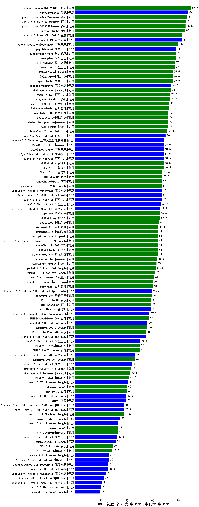

| 类别 | 大模型                         | CMB-专业知识考试-中医学与中药学-中医学 | 排名 |
|-----|------------------------------|---------|----|
|商用|Doubao-1.5-pro-32k-250115|89.5|1|
|开源|hunyuan-large|87.5|2|
|商用|hunyuan-turbos-20250226(new)|87.0|3|
|商用|ERNIE-4.5-8K-Preview(new)|86.0|4|
|商用|hunyuan-turbos-20250313(new)|85.5|5|
|商用|hunyuan-turbo|85.0|6|
|商用|Doubao-1.5-lite-32k-250115|83.0|7|
|开源|DeepSeek-R1|83.0|8|
|商用|qwq-plus-2025-03-05(new)|80.0|9|
|开源|qwq-32b(new)|78.0|10|
|商用|qwen-plus|78.0|11|
|商用|xunfei-spark-pro|78.0|12|
|商用|yi-lightning|77.0|13|
|商用|qwen-long|77.0|14|
|商用|qwen-turbo|75.5|15|
|商用|360gpt-pro|75.5|16|
|商用|360gpt2-pro|75.5|17|
|开源|deepseek-chat-v3|74.5|18|
|商用|xunfei-spark-max|74.0|19|
|商用|qwen2.5-max|73.5|20|
|商用|hunyuan-standard|73.5|21|
|商用|xunfei-4.0Ultra|73.0|22|
|商用|Baichuan4-Turbo|72.5|23|
|商用|360gpt-turbo|72.0|24|
|商用|abab7-chat-preview|72.0|25|
|商用|GLM-4-Plus|72.0|26|
|商用|kimi-latest-8k|72.0|27|
|商用|SenseChat-Turbo-1202|71.5|28|
|开源|qwen2.5-72b-instruct|70.0|29|
|开源|internlm2_5-7b-chat|69.0|30|
|开源|MiniMax-Text-01|68.5|31|
|开源|internlm2_5-20b-chat|68.5|32|
|商用|GLM-4-AirX|68.5|33|
|商用|GLM-4-Air|68.5|34|
|开源|qwen2.5-14b-instruct|68.5|35|
|开源|qwq-32b-preview|68.5|36|
|商用|GLM-4-Flash|67.6|37|
|商用|ERNIE-3.5-8K|67.5|38|
|开源|qwen2.5-32b-instruct|67.0|39|
|开源|Meta-Llama-3.1-405B-Instruct|67.0|40|
|开源|DeepSeek-R1-Distill-Qwen-32B|67.0|41|
|商用|gemini-2.0-pro-exp-02-05|67.0|42|
|商用|SenseChat-5-beta|67.0|43|
|开源|qwen2.5-7b-instruct|66.5|44|
|开源|DeepSeek-R1-Distill-Qwen-14B|65.5|45|
|商用|step-1-8k|65.5|46|
|商用|GLM-4-Long|65.5|47|
|商用|360gpt2-o1|65.0|48|
|商用|Baichuan4-Air|64.5|49|
|商用|moonshot-v1-8k|64.0|50|
|商用|SenseChat-5-1202|64.0|51|
|商用|gemini-2.0-flash-thinking-exp-01-21|64.0|52|
|商用|chatgpt-4o-latest|64.0|53|
|商用|GLM-4-FlashX|64.0|54|
|商用|360zhinao2-o1|64.0|55|
|商用|abab6.5s-chat|63.5|56|
|商用|GLM-Zero-Preview|63.0|57|
|商用|gemini-2.0-flash-001|62.5|58|
|商用|gemini-2.0-flash-exp|62.0|59|
|商用|step-2-mini(new)|61.0|60|
|商用|Baichuan4|60.0|61|
|商用|Claude-3.5-Sonnet|60.0|62|
|开源|Llama-3.1-Nemotron-70B-Instruct-fp8|59.5|63|
|商用|step-1-flash|59.5|64|
|商用|ERNIE-Speed-8K|59.0|65|
|开源|glm-4-9b-chat|59.0|66|
|商用|ERNIE-Lite-8K|59.0|67|
|开源|Hermes-3-Llama-3.1-405B|57.5|68|
|商用|ERNIE-Speed-Pro-128K|57.0|69|
|开源|Llama-3.3-70B-Instruct|56.0|70|
|商用|gemini-1.5-pro|56.0|71|
|开源|Llama-3.3-70B-Instruct-fp8|55.0|72|
|商用|ERNIE-Lite-Pro-128K|55.0|73|
|开源|qwen2.5-3b-instruct|50.5|74|
|商用|mistral-large|50.0|75|
|商用|ERNIE-4.0-Turbo-8K|50.0|76|
|商用|gemini-1.5-flash|46.0|77|
|开源|DeepSeek-R1-Distill-Llama-70B|46.0|78|
|开源|qwen2.5-1.5b-instruct|44.0|79|
|商用|gpt-4o-mini-2024-07-18|43.0|80|
|商用|xunfei-spark-lite(new)|42.8|81|
|商用|mistral-small|41.5|82|
|开源|gemma-3-27b-it(new)|41.0|83|
|商用|ERNIE-4.0|40.0|84|
|商用|o3-mini|40.0|85|
|开源|Llama-3.1-8B-Instruct|39.5|86|
|开源|phi-4|39.0|87|
|开源|Mistral-Small-24B-Instruct-2501(new)|38.0|88|
|开源|Meta-Llama-3.1-8B-Instruct-fp8|37.5|89|
|商用|gemini-1.5-flash-8b|37.5|90|
|开源|gemma-2-9b-it|35.0|91|
|商用|o1-mini|33.0|92|
|开源|gemma-3-12b-it(new)|33.0|93|
|商用|ministral-8b|33.0|94|
|开源|qwen2.5-0.5b-instruct|32.5|95|
|开源|gemma-2-27b-it|31.5|96|
|商用|ERNIE-Tiny-8K|29.0|97|
|商用|ministral-3b|28.5|98|
|开源|gemma-3-4b-it(new)|26.0|99|
|开源|Mistral-Nemo-Instruct-2407|26.0|100|
|开源|Llama-3.2-3B-Instruct|25.5|101|
|开源|DeepSeek-R1-Distill-Qwen-7B|25.5|102|
|开源|DeepSeek-R1-Distill-Llama-8B|24.0|103|
|开源|Mistral-7B-Instruct-v0.3|22.0|104|
|开源|DeepSeek-R1-Distill-Qwen-1.5B|21.0|105|
|开源|Llama-3.2-1B-Instruct|20.0|106|
|开源|gemma-3-1b-it(new)|19.0|107|
|开源|qwen2.5-math-72b-instruct|/|108|

