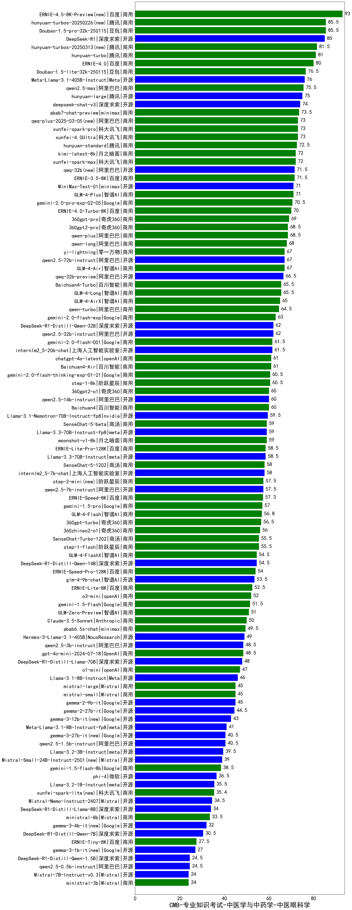

| 类别 | 大模型                         | CMB-专业知识考试-中医学与中药学-中医眼科学 | 排名 |
|-----|------------------------------|---------|----|
|商用|ERNIE-4.5-8K-Preview(new)|93.0|1|
|商用|Doubao-1.5-pro-32k-250115|85.5|2|
|商用|hunyuan-turbos-20250226(new)|85.5|3|
|开源|DeepSeek-R1|85.0|4|
|商用|hunyuan-turbos-20250313(new)|81.5|5|
|商用|hunyuan-turbo|81.0|6|
|商用|ERNIE-4.0|80.0|7|
|商用|Doubao-1.5-lite-32k-250115|76.5|8|
|开源|Meta-Llama-3.1-405B-Instruct|76.0|9|
|商用|qwen2.5-max|75.5|10|
|开源|hunyuan-large|75.0|11|
|开源|deepseek-chat-v3|74.0|12|
|商用|abab7-chat-preview|73.5|13|
|商用|xunfei-spark-pro|73.0|14|
|商用|qwq-plus-2025-03-05(new)|73.0|15|
|商用|xunfei-4.0Ultra|73.0|16|
|商用|hunyuan-standard|72.5|17|
|商用|xunfei-spark-max|72.0|18|
|商用|kimi-latest-8k|72.0|19|
|商用|ERNIE-3.5-8K|71.5|20|
|开源|qwq-32b(new)|71.5|21|
|开源|MiniMax-Text-01|71.0|22|
|商用|GLM-4-Plus|71.0|23|
|商用|gemini-2.0-pro-exp-02-05|70.5|24|
|商用|ERNIE-4.0-Turbo-8K|70.0|25|
|商用|360gpt-pro|69.0|26|
|商用|360gpt2-pro|68.5|27|
|商用|qwen-plus|68.5|28|
|商用|qwen-long|68.0|29|
|商用|yi-lightning|67.0|30|
|商用|GLM-4-Air|67.0|31|
|开源|qwen2.5-72b-instruct|67.0|32|
|开源|qwq-32b-preview|66.5|33|
|商用|Baichuan4-Turbo|65.5|34|
|商用|GLM-4-Long|65.5|35|
|商用|GLM-4-AirX|65.0|36|
|商用|qwen-turbo|64.5|37|
|商用|gemini-2.0-flash-exp|63.0|38|
|开源|qwen2.5-32b-instruct|62.0|39|
|开源|DeepSeek-R1-Distill-Qwen-32B|62.0|40|
|商用|gemini-2.0-flash-001|61.5|41|
|开源|internlm2_5-20b-chat|61.5|42|
|商用|chatgpt-4o-latest|61.0|43|
|商用|Baichuan4-Air|61.0|44|
|商用|step-1-8k|60.5|45|
|商用|gemini-2.0-flash-thinking-exp-01-21|60.5|46|
|开源|qwen2.5-14b-instruct|60.0|47|
|商用|Baichuan4|60.0|48|
|商用|360gpt2-o1|60.0|49|
|开源|Llama-3.1-Nemotron-70B-Instruct-fp8|59.5|50|
|开源|Llama-3.3-70B-Instruct-fp8|59.0|51|
|商用|SenseChat-5-beta|59.0|52|
|商用|moonshot-v1-8k|59.0|53|
|商用|ERNIE-Lite-Pro-128K|58.5|54|
|开源|Llama-3.3-70B-Instruct|58.5|55|
|商用|SenseChat-5-1202|58.0|56|
|开源|internlm2_5-7b-chat|58.0|57|
|开源|qwen2.5-7b-instruct|57.5|58|
|商用|step-2-mini(new)|57.5|59|
|商用|ERNIE-Speed-8K|57.3|60|
|商用|gemini-1.5-pro|57.0|61|
|商用|GLM-4-Flash|56.8|62|
|商用|360gpt-turbo|56.5|63|
|商用|360zhinao2-o1|56.0|64|
|商用|step-1-flash|55.5|65|
|商用|SenseChat-Turbo-1202|55.5|66|
|商用|GLM-4-FlashX|54.5|67|
|开源|DeepSeek-R1-Distill-Qwen-14B|54.5|68|
|商用|ERNIE-Speed-Pro-128K|54.0|69|
|开源|glm-4-9b-chat|53.5|70|
|商用|ERNIE-Lite-8K|52.5|71|
|商用|o3-mini|52.0|72|
|商用|gemini-1.5-flash|51.5|73|
|商用|GLM-Zero-Preview|51.0|74|
|商用|Claude-3.5-Sonnet|50.0|75|
|商用|abab6.5s-chat|49.5|76|
|开源|Hermes-3-Llama-3.1-405B|49.0|77|
|商用|gpt-4o-mini-2024-07-18|48.5|78|
|开源|qwen2.5-3b-instruct|48.5|79|
|开源|DeepSeek-R1-Distill-Llama-70B|48.0|80|
|商用|o1-mini|47.0|81|
|开源|Llama-3.1-8B-Instruct|46.0|82|
|商用|mistral-large|45.0|83|
|商用|mistral-small|45.0|84|
|开源|gemma-2-9b-it|45.0|85|
|开源|gemma-2-27b-it|44.5|86|
|开源|gemma-3-12b-it(new)|43.0|87|
|开源|Meta-Llama-3.1-8B-Instruct-fp8|41.0|88|
|开源|qwen2.5-1.5b-instruct|40.5|89|
|开源|gemma-3-27b-it(new)|40.5|90|
|开源|Llama-3.2-3B-Instruct|39.5|91|
|开源|Mistral-Small-24B-Instruct-2501(new)|39.0|92|
|商用|gemini-1.5-flash-8b|38.5|93|
|开源|phi-4|36.5|94|
|开源|Llama-3.2-1B-Instruct|35.5|95|
|商用|xunfei-spark-lite(new)|35.4|96|
|开源|Mistral-Nemo-Instruct-2407|34.5|97|
|开源|DeepSeek-R1-Distill-Llama-8B|34.0|98|
|商用|ministral-8b|33.5|99|
|开源|gemma-3-4b-it(new)|32.0|100|
|开源|DeepSeek-R1-Distill-Qwen-7B|30.5|101|
|商用|ERNIE-Tiny-8K|27.5|102|
|开源|gemma-3-1b-it(new)|27.0|103|
|开源|DeepSeek-R1-Distill-Qwen-1.5B|24.5|104|
|开源|qwen2.5-0.5b-instruct|24.5|105|
|开源|Mistral-7B-Instruct-v0.3|24.0|106|
|商用|ministral-3b|24.0|107|
|开源|qwen2.5-math-72b-instruct|/|108|
|开源|Yi-1.5-34B-Chat|/|109|
|开源|Yi-1.5-9B-Chat|/|110|

