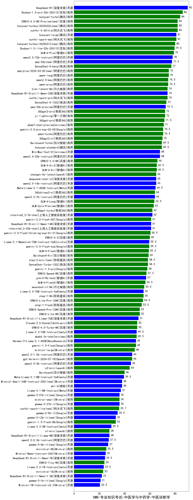

| 类别 | 大模型                         | CMB-专业知识考试-中医学与中药学-中医诊断学 | 排名 |
|-----|------------------------------|---------|----|
|开源|DeepSeek-R1|90.0|1|
|商用|Doubao-1.5-pro-32k-250115|86.0|2|
|商用|hunyuan-turbo|84.0|3|
|商用|xunfei-4.0Ultra|82.0|4|
|商用|ERNIE-4.5-8K-Preview(new)|82.0|5|
|商用|hunyuan-turbos-20250226(new)|82.0|6|
|商用|xunfei-spark-max|81.0|7|
|开源|hunyuan-large|81.0|8|
|商用|hunyuan-turbos-20250313(new)|80.0|9|
|商用|Doubao-1.5-lite-32k-250115|79.5|10|
|商用|GLM-4-Plus|79.0|11|
|开源|qwen2.5-72b-instruct|78.0|12|
|开源|qwq-32b(new)|77.5|13|
|商用|SenseChat-5-beta|77.0|14|
|商用|qwen-long|75.0|15|
|商用|qwq-plus-2025-03-05(new)|75.0|16|
|商用|qwen2.5-max|74.5|17|
|商用|qwen-plus|74.5|18|
|开源|DeepSeek-R1-Distill-Qwen-32B|74.0|19|
|商用|kimi-latest-8k|74.0|20|
|商用|xunfei-spark-pro|74.0|21|
|商用|SenseChat-5-1202|73.0|22|
|开源|qwq-32b-preview|72.5|23|
|商用|360gpt2-pro|72.0|24|
|商用|yi-lightning|72.0|25|
|商用|360gpt-pro|71.5|26|
|商用|abab7-chat-preview|71.0|27|
|商用|qwen-turbo|70.5|28|
|商用|gemini-2.0-pro-exp-02-05|70.5|29|
|商用|360gpt2-o1|70.0|30|
|商用|Baichuan4-Turbo|69.5|31|
|商用|hunyuan-standard|69.5|32|
|开源|qwen2.5-32b-instruct|68.0|33|
|开源|MiniMax-Text-01|68.0|34|
|商用|ERNIE-3.5-8K|66.0|35|
|商用|GLM-4-AirX|65.5|36|
|商用|GLM-4-Air|65.5|37|
|商用|chatgpt-4o-latest|65.0|38|
|开源|qwen2.5-14b-instruct|65.0|39|
|开源|deepseek-chat-v3|65.0|40|
|开源|Meta-Llama-3.1-405B-Instruct|64.5|41|
|开源|qwen2.5-7b-instruct|64.0|42|
|商用|360zhinao2-o1|64.0|43|
|商用|GLM-4-Long|63.5|44|
|商用|GLM-Zero-Preview|63.0|45|
|开源|internlm2_5-7b-chat|62.0|46|
|商用|360gpt-turbo|62.0|47|
|开源|internlm2_5-20b-chat|61.0|48|
|商用|gemini-2.0-flash-001|61.0|49|
|开源|DeepSeek-R1-Distill-Qwen-14B|61.0|50|
|商用|gemini-2.0-flash-thinking-exp-01-21|60.5|51|
|商用|ERNIE-4.0|60.0|52|
|商用|gemini-2.0-flash-exp|59.5|53|
|开源|Llama-3.1-Nemotron-70B-Instruct-fp8|59.5|54|
|商用|GLM-4-Flash|59.2|55|
|商用|Baichuan4-Air|59.0|56|
|商用|step-2-mini(new)|58.5|57|
|商用|SenseChat-Turbo-1202|58.5|58|
|商用|gemini-1.5-pro|58.0|59|
|商用|ERNIE-Speed-8K|57.3|60|
|开源|glm-4-9b-chat|57.0|61|
|商用|GLM-4-FlashX|56.5|62|
|商用|moonshot-v1-8k|55.5|63|
|开源|Llama-3.3-70B-Instruct-fp8|55.0|64|
|商用|step-1-8k|55.0|65|
|商用|ERNIE-Lite-Pro-128K|54.5|66|
|商用|step-1-flash|53.5|67|
|商用|ERNIE-Speed-Pro-128K|52.0|68|
|商用|ERNIE-Lite-8K|52.0|69|
|开源|DeepSeek-R1-Distill-Llama-70B|51.0|70|
|商用|ERNIE-4.0-Turbo-8K|50.0|71|
|商用|Claude-3.5-Sonnet|50.0|72|
|商用|abab6.5s-chat|49.5|73|
|开源|Llama-3.3-70B-Instruct|49.5|74|
|开源|Hermes-3-Llama-3.1-405B|49.0|75|
|商用|gemini-1.5-flash|49.0|76|
|商用|mistral-large|48.0|77|
|商用|gpt-4o-mini-2024-07-18|46.0|78|
|开源|qwen2.5-1.5b-instruct|46.0|79|
|开源|qwen2.5-3b-instruct|45.0|80|
|商用|o3-mini|44.0|81|
|商用|Baichuan4|40.0|82|
|开源|Meta-Llama-3.1-8B-Instruct-fp8|39.5|83|
|开源|phi-4|38.0|84|
|开源|Mistral-Small-24B-Instruct-2501(new)|38.0|85|
|开源|Llama-3.1-8B-Instruct|37.0|86|
|开源|gemma-3-27b-it(new)|36.0|87|
|开源|gemma-2-27b-it|36.0|88|
|商用|mistral-small|36.0|89|
|商用|xunfei-spark-lite(new)|35.7|90|
|开源|gemma-2-9b-it|34.5|91|
|开源|gemma-3-12b-it(new)|33.0|92|
|商用|gemini-1.5-flash-8b|33.0|93|
|开源|Llama-3.2-3B-Instruct|29.5|94|
|开源|DeepSeek-R1-Distill-Llama-8B|28.0|95|
|商用|o1-mini|28.0|96|
|开源|qwen2.5-0.5b-instruct|27.5|97|
|开源|gemma-3-4b-it(new)|27.0|98|
|商用|ministral-8b|25.5|99|
|开源|Mistral-Nemo-Instruct-2407|25.0|100|
|开源|DeepSeek-R1-Distill-Qwen-7B|24.5|101|
|商用|ERNIE-Tiny-8K|24.0|102|
|开源|Llama-3.2-1B-Instruct|23.5|103|
|商用|ministral-3b|23.0|104|
|开源|DeepSeek-R1-Distill-Qwen-1.5B|22.0|105|
|开源|gemma-3-1b-it(new)|21.0|106|
|开源|Mistral-7B-Instruct-v0.3|20.5|107|
|开源|qwen2.5-math-72b-instruct|/|108|

