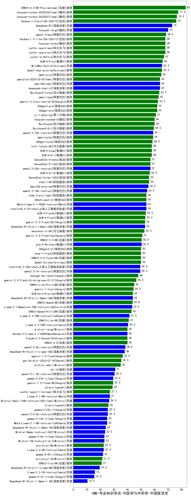

| 类别 | 大模型                         | CMB-专业知识考试-中医学与中药学-中国医学史 | 排名 |
|-----|------------------------------|---------|----|
|商用|ERNIE-4.5-8K-Preview(new)|83.0|1|
|商用|hunyuan-turbos-20250226(new)|77.5|2|
|商用|hunyuan-turbos-20250313(new)|76.5|3|
|商用|Doubao-1.5-pro-32k-250115|76.0|4|
|开源|DeepSeek-R1|73.0|5|
|开源|hunyuan-large|70.0|6|
|商用|qwen2.5-max|68.5|7|
|商用|Doubao-1.5-lite-32k-250115|68.0|8|
|商用|xunfei-spark-pro|68.0|9|
|商用|xunfei-spark-max|68.0|10|
|商用|hunyuan-turbo|68.0|11|
|商用|xunfei-4.0Ultra|67.0|12|
|商用|GLM-4-Plus|66.0|13|
|开源|MiniMax-Text-01|65.5|14|
|商用|abab7-chat-preview|65.5|15|
|商用|qwen-plus|65.0|16|
|开源|deepseek-chat-v3|64.0|17|
|开源|qwq-32b(new)|64.0|18|
|商用|qwq-plus-2025-03-05(new)|64.0|19|
|商用|Baichuan4-Turbo|63.5|20|
|商用|qwen-long|63.0|21|
|商用|gemini-2.0-pro-exp-02-05|62.5|22|
|商用|360gpt-pro|62.0|23|
|商用|360gpt2-pro|62.0|24|
|商用|yi-lightning|61.0|25|
|商用|Baichuan4|60.0|26|
|商用|hunyuan-standard|60.0|27|
|商用|Baichuan4-Air|59.5|28|
|商用|qwen-turbo|59.0|29|
|开源|qwen2.5-72b-instruct|59.0|30|
|商用|360gpt-turbo|58.5|31|
|商用|GLM-4-Long|58.0|32|
|商用|GLM-4-Air|58.0|33|
|商用|kimi-latest-8k|58.0|34|
|商用|SenseChat-5-beta|57.0|35|
|开源|qwen2.5-32b-instruct|57.0|36|
|商用|SenseChat-5-1202|57.0|37|
|商用|GLM-4-AirX|56.5|38|
|商用|SenseChat-Turbo-1202|56.0|39|
|商用|step-1-8k|56.0|40|
|开源|qwq-32b-preview|55.5|41|
|开源|qwen2.5-14b-instruct|54.5|42|
|开源|Meta-Llama-3.1-405B-Instruct|54.0|43|
|开源|internlm2_5-7b-chat|54.0|44|
|商用|step-2-mini(new)|54.0|45|
|商用|360zhinao2-o1|54.0|46|
|商用|GLM-4-FlashX|53.5|47|
|商用|GLM-4-Flash|53.2|48|
|商用|gemini-2.0-flash-001|53.0|49|
|开源|DeepSeek-R1-Distill-Qwen-32B|53.0|50|
|商用|moonshot-v1-8k|52.5|51|
|商用|gemini-2.0-flash-exp|51.0|52|
|商用|ERNIE-3.5-8K|50.5|53|
|开源|glm-4-9b-chat|50.5|54|
|商用|abab6.5s-chat|50.0|55|
|商用|360gpt2-o1|50.0|56|
|商用|step-1-flash|50.0|57|
|商用|ERNIE-4.0-Turbo-8K|50.0|58|
|开源|internlm2_5-20b-chat|49.5|59|
|开源|qwen2.5-7b-instruct|49.5|60|
|商用|chatgpt-4o-latest|48.0|61|
|商用|gemini-2.0-flash-thinking-exp-01-21|46.5|62|
|商用|ERNIE-Lite-Pro-128K|45.0|63|
|商用|gemini-1.5-pro|44.5|64|
|开源|DeepSeek-R1-Distill-Qwen-14B|44.0|65|
|商用|GLM-Zero-Preview|44.0|66|
|商用|ERNIE-Speed-8K|43.8|67|
|开源|Llama-3.1-Nemotron-70B-Instruct-fp8|43.5|68|
|商用|ERNIE-Speed-Pro-128K|43.0|69|
|开源|Llama-3.3-70B-Instruct-fp8|41.5|70|
|商用|ERNIE-Lite-8K|41.0|71|
|开源|Llama-3.3-70B-Instruct|40.5|72|
|商用|mistral-large|40.0|73|
|商用|Claude-3.5-Sonnet|40.0|74|
|商用|ERNIE-4.0|40.0|75|
|开源|Hermes-3-Llama-3.1-405B|40.0|76|
|开源|qwen2.5-3b-instruct|38.5|77|
|开源|DeepSeek-R1-Distill-Llama-70B|38.0|78|
|商用|gemini-1.5-flash|36.5|79|
|商用|gpt-4o-mini-2024-07-18|35.5|80|
|商用|mistral-small|35.0|81|
|开源|phi-4|31.0|82|
|开源|qwen2.5-1.5b-instruct|30.5|83|
|开源|gemma-3-27b-it(new)|29.5|84|
|商用|gemini-1.5-flash-8b|29.5|85|
|商用|o3-mini|29.0|86|
|商用|xunfei-spark-lite(new)|27.1|87|
|开源|Llama-3.1-8B-Instruct|27.0|88|
|开源|Mistral-Small-24B-Instruct-2501(new)|26.5|89|
|商用|o1-mini|26.0|90|
|开源|qwen2.5-0.5b-instruct|25.5|91|
|开源|gemma-2-27b-it|25.5|92|
|开源|gemma-3-12b-it(new)|25.0|93|
|开源|Meta-Llama-3.1-8B-Instruct-fp8|25.0|94|
|开源|DeepSeek-R1-Distill-Qwen-7B|24.0|95|
|开源|Mistral-Nemo-Instruct-2407|23.5|96|
|开源|Mistral-7B-Instruct-v0.3|23.0|97|
|开源|gemma-3-4b-it(new)|23.0|98|
|商用|ministral-8b|22.5|99|
|开源|Llama-3.2-3B-Instruct|22.5|100|
|开源|gemma-2-9b-it|22.0|101|
|商用|ministral-3b|21.5|102|
|商用|ERNIE-Tiny-8K|21.0|103|
|开源|DeepSeek-R1-Distill-Llama-8B|19.5|104|
|开源|Llama-3.2-1B-Instruct|16.0|105|
|开源|gemma-3-1b-it(new)|15.5|106|
|开源|DeepSeek-R1-Distill-Qwen-1.5B|10.5|107|
|开源|qwen2.5-math-72b-instruct|/|108|

