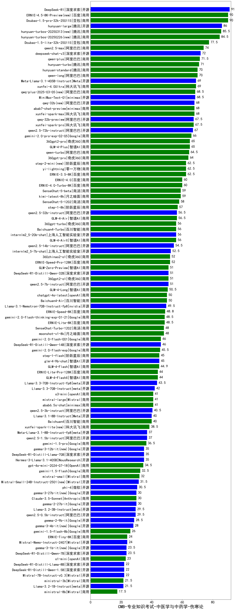

| 类别 | 大模型                         | CMB-专业知识考试-中医学与中药学-伤寒论 | 排名 |
|-----|------------------------------|---------|----|
|开源|DeepSeek-R1|91.0|1|
|商用|ERNIE-4.5-8K-Preview(new)|90.0|2|
|商用|Doubao-1.5-pro-32k-250115|90.0|3|
|开源|hunyuan-large|86.0|4|
|商用|hunyuan-turbos-20250313(new)|85.5|5|
|商用|hunyuan-turbos-20250226(new)|84.5|6|
|商用|Doubao-1.5-lite-32k-250115|77.5|7|
|商用|qwen2.5-max|74.0|8|
|开源|deepseek-chat-v3|72.0|9|
|商用|qwen-plus|71.5|10|
|商用|hunyuan-turbo|71.0|11|
|商用|hunyuan-standard|70.0|12|
|商用|qwen-long|70.0|13|
|商用|xunfei-4.0Ultra|69.0|14|
|开源|Meta-Llama-3.1-405B-Instruct|69.0|15|
|商用|qwq-plus-2025-03-05(new)|68.5|16|
|开源|MiniMax-Text-01|68.5|17|
|商用|xunfei-spark-max|68.0|18|
|开源|qwq-32b(new)|68.0|19|
|商用|abab7-chat-preview|68.0|20|
|商用|xunfei-spark-pro|67.5|21|
|开源|qwq-32b-preview|67.5|22|
|开源|qwen2.5-72b-instruct|67.0|23|
|商用|gemini-2.0-pro-exp-02-05|66.0|24|
|商用|360gpt2-pro|65.0|25|
|商用|GLM-4-Plus|65.0|26|
|商用|qwen-turbo|64.5|27|
|商用|360gpt-pro|64.0|28|
|商用|ERNIE-3.5-8K|62.5|29|
|商用|yi-lightning|62.5|30|
|商用|step-2-mini(new)|62.5|31|
|商用|ERNIE-4.0-Turbo-8K|60.0|32|
|商用|ERNIE-4.0|60.0|33|
|商用|kimi-latest-8k|59.0|34|
|商用|SenseChat-5-beta|59.0|35|
|商用|SenseChat-5-1202|58.0|36|
|商用|step-1-8k|57.0|37|
|开源|qwen2.5-32b-instruct|56.5|38|
|商用|GLM-4-Air|56.5|39|
|开源|internlm2_5-20b-chat|56.0|40|
|商用|Baichuan4-Turbo|56.0|41|
|商用|360gpt-turbo|56.0|42|
|商用|GLM-4-AirX|56.0|43|
|开源|qwen2.5-14b-instruct|54.5|44|
|开源|internlm2_5-7b-chat|52.5|45|
|商用|360zhinao2-o1|52.0|46|
|商用|ERNIE-Speed-Pro-128K|52.0|47|
|开源|qwen2.5-7b-instruct|51.0|48|
|商用|GLM-Zero-Preview|51.0|49|
|开源|DeepSeek-R1-Distill-Qwen-32B|51.0|50|
|商用|360gpt2-o1|51.0|51|
|商用|GLM-4-Long|50.5|52|
|商用|chatgpt-4o-latest|50.0|53|
|商用|Baichuan4-Air|50.0|54|
|开源|Llama-3.1-Nemotron-70B-Instruct-fp8|49.5|55|
|商用|ERNIE-Speed-8K|48.8|56|
|商用|ERNIE-Lite-8K|48.5|57|
|商用|gemini-2.0-flash-thinking-exp-01-21|48.5|58|
|商用|SenseChat-Turbo-1202|48.0|59|
|商用|moonshot-v1-8k|48.0|60|
|商用|gemini-2.0-flash-001|46.0|61|
|开源|DeepSeek-R1-Distill-Qwen-14B|46.0|62|
|商用|gemini-2.0-flash-exp|45.5|63|
|商用|step-1-flash|45.0|64|
|开源|glm-4-9b-chat|45.0|65|
|商用|GLM-4-Flash|44.9|66|
|商用|GLM-4-FlashX|44.0|67|
|商用|ERNIE-Lite-Pro-128K|44.0|68|
|开源|Llama-3.3-70B-Instruct-fp8|43.5|69|
|开源|Llama-3.3-70B-Instruct|42.0|70|
|商用|o3-mini|41.0|71|
|商用|mistral-large|41.0|72|
|商用|abab6.5s-chat|41.0|73|
|开源|qwen2.5-3b-instruct|40.5|74|
|商用|Baichuan4|40.0|75|
|开源|Llama-3.1-8B-Instruct|40.0|76|
|商用|xunfei-spark-lite(new)|38.5|77|
|开源|qwen2.5-1.5b-instruct|37.0|78|
|开源|Meta-Llama-3.1-8B-Instruct-fp8|37.0|79|
|商用|gemini-1.5-pro|36.5|80|
|开源|DeepSeek-R1-Distill-Llama-70B|35.0|81|
|开源|Hermes-3-Llama-3.1-405B|35.0|82|
|开源|gemma-3-12b-it(new)|35.0|83|
|商用|gpt-4o-mini-2024-07-18|34.5|84|
|商用|gemini-1.5-flash|32.5|85|
|商用|mistral-small|32.0|86|
|开源|Mistral-Small-24B-Instruct-2501(new)|31.5|87|
|开源|phi-4|30.5|88|
|开源|gemma-2-27b-it|30.0|89|
|开源|gemma-3-27b-it(new)|30.0|90|
|商用|Claude-3.5-Sonnet|30.0|91|
|开源|qwen2.5-0.5b-instruct|29.5|92|
|开源|Llama-3.2-3B-Instruct|29.5|93|
|开源|gemma-2-9b-it|28.5|94|
|开源|gemma-3-4b-it(new)|28.0|95|
|商用|gemini-1.5-flash-8b|26.0|96|
|商用|ERNIE-Tiny-8K|24.0|97|
|开源|Mistral-Nemo-Instruct-2407|24.0|98|
|开源|gemma-3-1b-it(new)|23.5|99|
|开源|DeepSeek-R1-Distill-Qwen-7B|23.5|100|
|商用|o1-mini|23.0|101|
|开源|DeepSeek-R1-Distill-Qwen-1.5B|22.0|102|
|开源|Mistral-7B-Instruct-v0.3|22.0|103|
|开源|DeepSeek-R1-Distill-Llama-8B|22.0|104|
|商用|ministral-3b|21.5|105|
|开源|Llama-3.2-1B-Instruct|21.5|106|
|商用|ministral-8b|17.5|107|
|开源|qwen2.5-math-72b-instruct|/|108|

