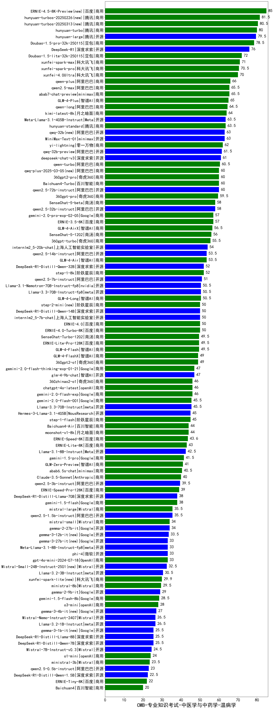

| 类别 | 大模型                         | CMB-专业知识考试-中医学与中药学-温病学 | 排名 |
|-----|------------------------------|---------|----|
|商用|ERNIE-4.5-8K-Preview(new)|85.0|1|
|商用|hunyuan-turbos-20250226(new)|81.5|2|
|商用|hunyuan-turbos-20250313(new)|80.5|3|
|商用|hunyuan-turbo|80.0|4|
|开源|hunyuan-large|79.5|5|
|商用|Doubao-1.5-pro-32k-250115|78.5|6|
|开源|DeepSeek-R1|76.0|7|
|商用|Doubao-1.5-lite-32k-250115|72.0|8|
|商用|xunfei-spark-max|71.0|9|
|商用|xunfei-spark-pro|70.5|10|
|商用|xunfei-4.0Ultra|70.0|11|
|商用|qwen-plus|66.0|12|
|商用|abab7-chat-preview|65.5|13|
|商用|qwen2.5-max|65.5|14|
|商用|GLM-4-Plus|65.0|15|
|商用|qwen-long|64.5|16|
|商用|kimi-latest-8k|64.0|17|
|商用|hunyuan-standard|63.5|18|
|开源|Meta-Llama-3.1-405B-Instruct|63.5|19|
|开源|MiniMax-Text-01|63.0|20|
|开源|qwq-32b(new)|63.0|21|
|商用|yi-lightning|62.0|22|
|开源|qwq-32b-preview|61.5|23|
|开源|deepseek-chat-v3|61.0|24|
|商用|qwen-turbo|60.5|25|
|商用|360gpt2-pro|60.0|26|
|商用|Baichuan4-Turbo|60.0|27|
|开源|qwen2.5-72b-instruct|60.0|28|
|商用|qwq-plus-2025-03-05(new)|60.0|29|
|商用|360gpt-pro|59.5|30|
|开源|qwen2.5-32b-instruct|58.0|31|
|商用|SenseChat-5-beta|58.0|32|
|商用|gemini-2.0-pro-exp-02-05|57.0|33|
|商用|ERNIE-3.5-8K|57.0|34|
|商用|GLM-4-AirX|56.5|35|
|商用|SenseChat-5-1202|56.0|36|
|商用|360gpt-turbo|55.5|37|
|开源|internlm2_5-20b-chat|54.0|38|
|商用|GLM-4-Air|53.5|39|
|开源|qwen2.5-14b-instruct|53.5|40|
|商用|step-1-8k|52.0|41|
|开源|DeepSeek-R1-Distill-Qwen-32B|52.0|42|
|开源|qwen2.5-7b-instruct|51.0|43|
|商用|GLM-4-Long|50.5|44|
|开源|Llama-3.1-Nemotron-70B-Instruct-fp8|50.5|45|
|开源|Llama-3.3-70B-Instruct-fp8|50.5|46|
|商用|ERNIE-4.0|50.0|47|
|商用|ERNIE-4.0-Turbo-8K|50.0|48|
|商用|step-2-mini(new)|50.0|49|
|开源|internlm2_5-7b-chat|50.0|50|
|开源|DeepSeek-R1-Distill-Qwen-14B|50.0|51|
|商用|GLM-4-Flash|49.5|52|
|商用|ERNIE-Lite-Pro-128K|49.5|53|
|商用|SenseChat-Turbo-1202|49.5|54|
|商用|360gpt2-o1|49.0|55|
|商用|GLM-4-FlashX|49.0|56|
|商用|gemini-2.0-flash-thinking-exp-01-21|47.0|57|
|开源|glm-4-9b-chat|47.0|58|
|商用|360zhinao2-o1|46.0|59|
|商用|chatgpt-4o-latest|46.0|60|
|商用|gemini-2.0-flash-exp|46.0|61|
|商用|gemini-2.0-flash-001|45.5|62|
|开源|Llama-3.3-70B-Instruct|45.5|63|
|商用|step-1-flash|45.0|64|
|开源|Hermes-3-Llama-3.1-405B|45.0|65|
|商用|Baichuan4-Air|44.0|66|
|商用|moonshot-v1-8k|44.0|67|
|商用|ERNIE-Speed-8K|43.6|68|
|商用|ERNIE-Lite-8K|43.0|69|
|开源|Llama-3.1-8B-Instruct|42.5|70|
|商用|gemini-1.5-pro|41.5|71|
|商用|GLM-Zero-Preview|41.0|72|
|商用|abab6.5s-chat|40.5|73|
|商用|Claude-3.5-Sonnet|40.0|74|
|开源|qwen2.5-3b-instruct|39.5|75|
|商用|ERNIE-Speed-Pro-128K|39.0|76|
|开源|DeepSeek-R1-Distill-Llama-70B|38.0|77|
|商用|gemini-1.5-flash|38.0|78|
|开源|qwen2.5-1.5b-instruct|35.5|79|
|商用|mistral-large|35.5|80|
|商用|mistral-small|34.0|81|
|开源|gemma-2-27b-it|34.0|82|
|开源|gemma-3-12b-it(new)|33.5|83|
|商用|gpt-4o-mini-2024-07-18|33.0|84|
|开源|Meta-Llama-3.1-8B-Instruct-fp8|33.0|85|
|开源|gemma-3-27b-it(new)|33.0|86|
|开源|phi-4|33.0|87|
|开源|Mistral-Small-24B-Instruct-2501(new)|32.5|88|
|开源|Llama-3.2-3B-Instruct|30.5|89|
|商用|xunfei-spark-lite(new)|29.9|90|
|商用|ministral-8b|29.5|91|
|开源|gemma-2-9b-it|29.0|92|
|商用|gemini-1.5-flash-8b|28.5|93|
|商用|o3-mini|28.0|94|
|开源|gemma-3-4b-it(new)|27.0|95|
|开源|Llama-3.2-1B-Instruct|26.5|96|
|开源|Mistral-Nemo-Instruct-2407|26.5|97|
|开源|DeepSeek-R1-Distill-Qwen-7B|25.5|98|
|开源|gemma-3-1b-it(new)|25.5|99|
|开源|DeepSeek-R1-Distill-Llama-8B|25.5|100|
|开源|Mistral-7B-Instruct-v0.3|24.5|101|
|商用|o1-mini|24.0|102|
|商用|ministral-3b|23.5|103|
|开源|qwen2.5-0.5b-instruct|23.0|104|
|开源|DeepSeek-R1-Distill-Qwen-1.5B|22.5|105|
|商用|ERNIE-Tiny-8K|22.0|106|
|商用|Baichuan4|20.0|107|
|开源|qwen2.5-math-72b-instruct|/|108|

