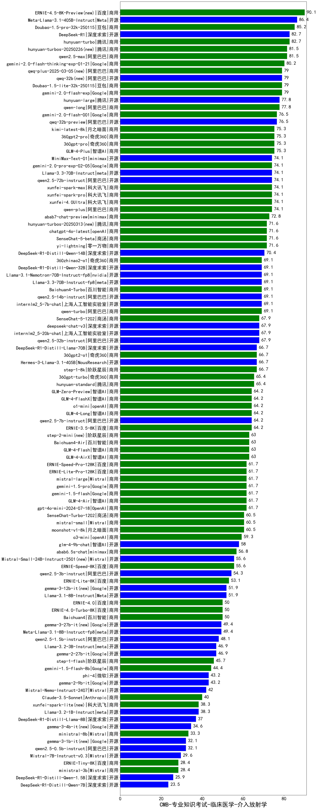

| 类别 | 大模型                         | CMB-专业知识考试-临床医学-介入放射学 | 排名 |
|-----|------------------------------|---------|----|
|商用|ERNIE-4.5-8K-Preview(new)|90.1|1|
|开源|Meta-Llama-3.1-405B-Instruct|86.4|2|
|商用|Doubao-1.5-pro-32k-250115|85.2|3|
|商用|hunyuan-turbo|82.7|4|
|开源|DeepSeek-R1|82.7|5|
|商用|qwen2.5-max|81.5|6|
|商用|hunyuan-turbos-20250226(new)|81.5|7|
|商用|gemini-2.0-flash-thinking-exp-01-21|80.2|8|
|商用|gemini-2.0-flash-exp|79.0|9|
|开源|qwq-32b(new)|79.0|10|
|商用|Doubao-1.5-lite-32k-250115|79.0|11|
|商用|qwq-plus-2025-03-05(new)|79.0|12|
|商用|qwen-long|77.8|13|
|开源|hunyuan-large|77.8|14|
|开源|qwq-32b-preview|76.5|15|
|商用|gemini-2.0-flash-001|76.5|16|
|商用|360gpt2-pro|75.3|17|
|商用|GLM-4-Plus|75.3|18|
|商用|360gpt-pro|75.3|19|
|商用|kimi-latest-8k|75.3|20|
|开源|MiniMax-Text-01|74.1|21|
|开源|Llama-3.3-70B-Instruct|74.1|22|
|商用|xunfei-spark-pro|74.1|23|
|开源|qwen2.5-72b-instruct|74.1|24|
|商用|xunfei-spark-max|74.1|25|
|商用|qwen-plus|74.1|26|
|商用|xunfei-4.0Ultra|74.1|27|
|商用|gemini-2.0-pro-exp-02-05|74.1|28|
|商用|abab7-chat-preview|72.8|29|
|商用|yi-lightning|71.6|30|
|商用|SenseChat-5-beta|71.6|31|
|商用|hunyuan-turbos-20250313(new)|71.6|32|
|商用|chatgpt-4o-latest|71.6|33|
|开源|DeepSeek-R1-Distill-Qwen-14B|70.4|34|
|开源|qwen2.5-14b-instruct|69.1|35|
|商用|qwen-turbo|69.1|36|
|开源|Llama-3.3-70B-Instruct-fp8|69.1|37|
|商用|Baichuan4-Turbo|69.1|38|
|商用|360zhinao2-o1|69.1|39|
|开源|internlm2_5-7b-chat|69.1|40|
|开源|Llama-3.1-Nemotron-70B-Instruct-fp8|69.1|41|
|开源|DeepSeek-R1-Distill-Qwen-32B|69.1|42|
|开源|internlm2_5-20b-chat|67.9|43|
|开源|qwen2.5-32b-instruct|67.9|44|
|商用|SenseChat-5-1202|67.9|45|
|开源|deepseek-chat-v3|67.9|46|
|商用|step-1-8k|66.7|47|
|开源|Hermes-3-Llama-3.1-405B|66.7|48|
|开源|DeepSeek-R1-Distill-Llama-70B|66.7|49|
|商用|360gpt2-o1|66.7|50|
|商用|hunyuan-standard|65.4|51|
|商用|360gpt-turbo|65.4|52|
|商用|o1-mini|64.2|53|
|商用|GLM-4-FlashX|64.2|54|
|商用|GLM-Zero-Preview|64.2|55|
|商用|GLM-4-Long|64.2|56|
|开源|qwen2.5-7b-instruct|64.2|57|
|商用|ERNIE-3.5-8K|64.2|58|
|商用|Baichuan4-Air|63.0|59|
|商用|step-2-mini(new)|63.0|60|
|商用|GLM-4-AirX|63.0|61|
|商用|GLM-4-Flash|63.0|62|
|商用|gemini-1.5-flash|61.7|63|
|商用|gpt-4o-mini-2024-07-18|61.7|64|
|商用|gemini-1.5-pro|61.7|65|
|商用|ERNIE-Lite-Pro-128K|61.7|66|
|商用|mistral-large|61.7|67|
|商用|ERNIE-Speed-Pro-128K|61.7|68|
|商用|GLM-4-Air|61.7|69|
|商用|SenseChat-Turbo-1202|60.5|70|
|商用|moonshot-v1-8k|60.5|71|
|商用|mistral-small|60.5|72|
|商用|o3-mini|59.3|73|
|开源|glm-4-9b-chat|58.0|74|
|商用|abab6.5s-chat|56.8|75|
|商用|ERNIE-Speed-8K|55.6|76|
|开源|Mistral-Small-24B-Instruct-2501(new)|55.6|77|
|开源|qwen2.5-3b-instruct|54.3|78|
|商用|ERNIE-Lite-8K|53.1|79|
|开源|Llama-3.1-8B-Instruct|51.9|80|
|开源|gemma-3-12b-it(new)|51.9|81|
|商用|Baichuan4|50.0|82|
|商用|ERNIE-4.0-Turbo-8K|50.0|83|
|商用|ERNIE-4.0|50.0|84|
|开源|Meta-Llama-3.1-8B-Instruct-fp8|49.4|85|
|开源|gemma-3-27b-it(new)|49.4|86|
|开源|qwen2.5-1.5b-instruct|48.1|87|
|开源|Llama-3.2-3B-Instruct|46.9|88|
|开源|gemma-2-27b-it|46.9|89|
|商用|step-1-flash|45.7|90|
|商用|gemini-1.5-flash-8b|44.4|91|
|开源|gemma-2-9b-it|43.2|92|
|开源|phi-4|43.2|93|
|开源|Mistral-Nemo-Instruct-2407|42.0|94|
|商用|Claude-3.5-Sonnet|40.0|95|
|商用|xunfei-spark-lite(new)|38.3|96|
|开源|Llama-3.2-1B-Instruct|38.3|97|
|开源|DeepSeek-R1-Distill-Llama-8B|37.0|98|
|开源|gemma-3-4b-it(new)|34.6|99|
|商用|ministral-8b|33.3|100|
|开源|gemma-3-1b-it(new)|32.1|101|
|开源|qwen2.5-0.5b-instruct|32.1|102|
|开源|Mistral-7B-Instruct-v0.3|29.6|103|
|商用|ministral-3b|28.4|104|
|商用|ERNIE-Tiny-8K|28.4|105|
|开源|DeepSeek-R1-Distill-Qwen-1.5B|25.9|106|
|开源|DeepSeek-R1-Distill-Qwen-7B|23.5|107|
|开源|qwen2.5-math-72b-instruct|/|108|

