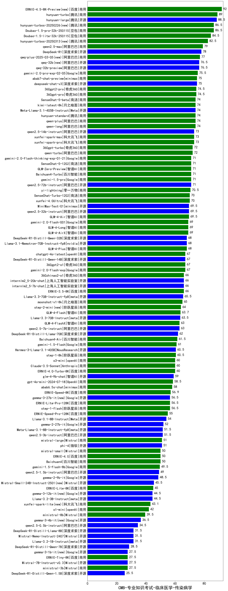

| 类别 | 大模型                         | CMB-专业知识考试-临床医学-传染病学 | 排名 |
|-----|------------------------------|---------|----|
|商用|hunyuan-turbo|89.0|1|
|开源|hunyuan-large|88.5|2|
|商用|Doubao-1.5-pro-32k-250115|86.5|3|
|商用|hunyuan-turbos-20250226(new)|86.5|4|
|商用|Doubao-1.5-lite-32k-250115|84.5|5|
|商用|qwen2.5-max|79.0|6|
|开源|DeepSeek-R1|78.0|7|
|商用|qwq-plus-2025-03-05(new)|77.0|8|
|开源|qwq-32b-preview|76.5|9|
|开源|qwq-32b(new)|76.5|10|
|商用|gemini-2.0-pro-exp-02-05|75.5|11|
|商用|abab7-chat-preview|75.0|12|
|开源|deepseek-chat-v3|75.0|13|
|商用|360gpt2-pro|74.5|14|
|商用|360gpt-pro|74.5|15|
|开源|Meta-Llama-3.1-405B-Instruct|74.0|16|
|商用|SenseChat-5-beta|74.0|17|
|商用|qwen-plus|74.0|18|
|商用|qwen-long|74.0|19|
|商用|kimi-latest-8k|74.0|20|
|商用|hunyuan-standard|74.0|21|
|商用|xunfei-spark-pro|73.0|22|
|开源|qwen2.5-14b-instruct|73.0|23|
|商用|xunfei-spark-max|73.0|24|
|商用|qwen-turbo|72.0|25|
|商用|360gpt-turbo|72.0|26|
|商用|Baichuan4-Turbo|71.0|27|
|开源|qwen2.5-72b-instruct|71.0|28|
|商用|gemini-1.5-pro|71.0|29|
|商用|SenseChat-5-1202|71.0|30|
|商用|gemini-2.0-flash-thinking-exp-01-21|71.0|31|
|商用|GLM-Zero-Preview|71.0|32|
|商用|yi-lightning|70.5|33|
|商用|SenseChat-Turbo-1202|70.0|34|
|商用|xunfei-4.0Ultra|70.0|35|
|开源|qwen2.5-32b-instruct|69.5|36|
|商用|MiniMax-Text-01|69.5|37|
|商用|GLM-4-Air|69.5|38|
|商用|GLM-4-AirX|69.0|39|
|商用|gemini-2.0-flash-001|69.0|40|
|商用|GLM-4-Long|69.0|41|
|开源|Llama-3.1-Nemotron-70B-Instruct-fp8|68.0|42|
|商用|GLM-4-Plus|68.0|43|
|开源|DeepSeek-R1-Distill-Qwen-32B|68.0|44|
|商用|360gpt2-o1|67.0|45|
|开源|DeepSeek-R1-Distill-Qwen-14B|67.0|46|
|商用|chatgpt-4o-latest|67.0|47|
|商用|gemini-2.0-flash-exp|67.0|48|
|开源|internlm2_5-20b-chat|66.0|49|
|商用|360zhinao2-o1|66.0|50|
|开源|internlm2_5-7b-chat|66.0|51|
|商用|ERNIE-3.5-8K|66.0|52|
|开源|Llama-3.3-70B-Instruct-fp8|65.5|53|
|商用|moonshot-v1-8k|65.0|54|
|商用|step-2-mini(new)|64.0|55|
|商用|GLM-4-Flash|63.7|56|
|开源|Llama-3.3-70B-Instruct|63.5|57|
|商用|GLM-4-FlashX|63.0|58|
|开源|qwen2.5-7b-instruct|63.0|59|
|开源|DeepSeek-R1-Distill-Llama-70B|62.0|60|
|商用|Baichuan4-Air|61.5|61|
|商用|gemini-1.5-flash|61.0|62|
|开源|Hermes-3-Llama-3.1-405B|60.5|63|
|商用|step-1-8k|60.5|64|
|商用|Claude-3.5-Sonnet|60.0|65|
|商用|o3-mini|60.0|66|
|商用|ERNIE-4.0-Turbo-8K|60.0|67|
|开源|glm-4-9b-chat|59.0|68|
|商用|gpt-4o-mini-2024-07-18|58.5|69|
|商用|abab6.5s-chat|58.0|70|
|商用|ERNIE-Speed-8K|56.9|71|
|商用|ERNIE-Lite-Pro-128K|56.5|72|
|商用|step-1-flash|56.5|73|
|开源|gemma-3-27b-it(new)|56.5|74|
|商用|ERNIE-Speed-Pro-128K|55.0|75|
|开源|Llama-3.1-8B-Instruct|54.0|76|
|开源|gemma-2-27b-it|52.0|77|
|开源|Meta-Llama-3.1-8B-Instruct-fp8|51.5|78|
|开源|qwen2.5-3b-instruct|51.5|79|
|商用|mistral-large|51.0|80|
|开源|phi-4|51.0|81|
|商用|ERNIE-4.0|50.0|82|
|商用|Baichuan4|50.0|83|
|商用|mistral-small|50.0|84|
|商用|gemini-1.5-flash-8b|49.5|85|
|开源|qwen2.5-1.5b-instruct|49.0|86|
|开源|gemma-2-9b-it|48.5|87|
|开源|Mistral-Small-24B-Instruct-2501(new)|45.5|88|
|商用|ERNIE-Lite-8K|45.0|89|
|开源|Llama-3.2-3B-Instruct|44.5|90|
|商用|xunfei-spark-lite(new)|43.1|91|
|商用|o1-mini|42.0|92|
|商用|ministral-8b|39.5|93|
|开源|qwen2.5-0.5b-instruct|34.5|94|
|开源|Llama-3.2-1B-Instruct|31.5|95|
|开源|DeepSeek-R1-Distill-Llama-8B|31.5|96|
|开源|Mistral-Nemo-Instruct-2407|31.5|97|
|开源|DeepSeek-R1-Distill-Qwen-7B|28.5|98|
|商用|ERNIE-Tiny-8K|27.5|99|
|开源|Mistral-7B-Instruct-v0.3|27.5|100|
|商用|ministral-3b|27.5|101|
|开源|DeepSeek-R1-Distill-Qwen-1.5B|25.5|102|
|开源|Yi-1.5-34B-Chat|/|103|
|开源|Yi-1.5-9B-Chat|/|104|
|开源|qwen2.5-math-72b-instruct|/|105|

