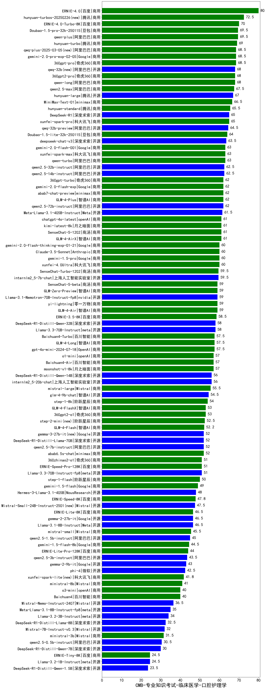

| 类别 | 大模型                         | CMB-专业知识考试-临床医学-口腔护理学 | 排名 |
|-----|------------------------------|---------|----|
|商用|ERNIE-4.0|80.0|1|
|商用|hunyuan-turbos-20250226(new)|72.5|2|
|商用|ERNIE-4.0-Turbo-8K|70.0|3|
|商用|Doubao-1.5-pro-32k-250115|69.5|4|
|商用|qwen-plus|69.5|5|
|商用|hunyuan-turbo|69.0|6|
|商用|360gpt-pro|68.5|7|
|商用|gemini-2.0-pro-exp-02-05|68.5|8|
|商用|qwq-plus-2025-03-05(new)|68.5|9|
|商用|360gpt2-pro|68.0|10|
|开源|qwq-32b(new)|68.0|11|
|商用|qwen-long|68.0|12|
|商用|qwen2.5-max|67.5|13|
|开源|hunyuan-large|67.0|14|
|商用|MiniMax-Text-01|66.5|15|
|商用|hunyuan-standard|65.5|16|
|开源|DeepSeek-R1|65.0|17|
|商用|xunfei-spark-pro|65.0|18|
|开源|qwq-32b-preview|64.5|19|
|商用|Doubao-1.5-lite-32k-250115|64.0|20|
|开源|deepseek-chat-v3|63.5|21|
|商用|qwen-turbo|63.0|22|
|商用|xunfei-spark-max|63.0|23|
|商用|gemini-2.0-flash-001|63.0|24|
|开源|qwen2.5-14b-instruct|62.5|25|
|开源|qwen2.5-32b-instruct|62.5|26|
|商用|abab7-chat-preview|62.0|27|
|商用|gemini-2.0-flash-exp|62.0|28|
|商用|360gpt-turbo|62.0|29|
|商用|GLM-4-Plus|62.0|30|
|开源|qwen2.5-72b-instruct|62.0|31|
|开源|Meta-Llama-3.1-405B-Instruct|61.5|32|
|商用|GLM-4-AirX|61.0|33|
|商用|kimi-latest-8k|61.0|34|
|商用|SenseChat-5-1202|61.0|35|
|商用|chatgpt-4o-latest|61.0|36|
|商用|gemini-1.5-pro|60.0|37|
|商用|gemini-2.0-flash-thinking-exp-01-21|60.0|38|
|商用|xunfei-4.0Ultra|60.0|39|
|商用|Claude-3.5-Sonnet|60.0|40|
|开源|internlm2_5-7b-chat|59.5|41|
|商用|SenseChat-Turbo-1202|59.5|42|
|商用|SenseChat-5-beta|59.0|43|
|商用|GLM-Zero-Preview|59.0|44|
|商用|yi-lightning|59.0|45|
|商用|GLM-4-Air|59.0|46|
|开源|Llama-3.1-Nemotron-70B-Instruct-fp8|59.0|47|
|商用|ERNIE-3.5-8K|58.5|48|
|开源|Llama-3.3-70B-Instruct|58.0|49|
|开源|DeepSeek-R1-Distill-Qwen-32B|58.0|50|
|商用|GLM-4-Long|57.5|51|
|商用|gpt-4o-mini-2024-07-18|57.5|52|
|商用|Baichuan4-Turbo|57.5|53|
|商用|Baichuan4-Air|57.0|54|
|商用|o1-mini|57.0|55|
|商用|moonshot-v1-8k|57.0|56|
|开源|internlm2_5-20b-chat|56.0|57|
|开源|DeepSeek-R1-Distill-Qwen-14B|56.0|58|
|商用|mistral-large|55.5|59|
|开源|glm-4-9b-chat|54.5|60|
|商用|step-1-8k|54.0|61|
|商用|360gpt2-o1|53.0|62|
|商用|GLM-4-FlashX|53.0|63|
|商用|step-2-mini(new)|52.5|64|
|商用|GLM-4-Flash|52.2|65|
|开源|gemma-3-27b-it(new)|52.0|66|
|开源|DeepSeek-R1-Distill-Llama-70B|52.0|67|
|商用|abab6.5s-chat|52.0|68|
|开源|qwen2.5-7b-instruct|52.0|69|
|商用|360zhinao2-o1|51.0|70|
|开源|Llama-3.3-70B-Instruct-fp8|51.0|71|
|商用|ERNIE-Speed-Pro-128K|51.0|72|
|商用|step-1-flash|50.0|73|
|商用|gemini-1.5-flash|49.0|74|
|开源|Hermes-3-Llama-3.1-405B|48.0|75|
|商用|ERNIE-Speed-8K|47.8|76|
|开源|Mistral-Small-24B-Instruct-2501(new)|47.5|77|
|开源|gemma-2-27b-it|46.5|78|
|商用|ERNIE-Lite-8K|46.5|79|
|开源|Llama-3.1-8B-Instruct|46.5|80|
|商用|mistral-small|45.5|81|
|开源|qwen2.5-1.5b-instruct|45.0|82|
|商用|gemini-1.5-flash-8b|44.5|83|
|商用|ERNIE-Lite-Pro-128K|44.0|84|
|开源|qwen2.5-3b-instruct|43.5|85|
|开源|gemma-2-9b-it|43.0|86|
|开源|phi-4|42.5|87|
|商用|xunfei-spark-lite(new)|41.8|88|
|商用|ministral-8b|41.0|89|
|商用|o3-mini|40.0|90|
|商用|Baichuan4|40.0|91|
|开源|Mistral-Nemo-Instruct-2407|36.5|92|
|开源|Meta-Llama-3.1-8B-Instruct-fp8|35.0|93|
|开源|Llama-3.2-3B-Instruct|34.0|94|
|开源|DeepSeek-R1-Distill-Llama-8B|32.5|95|
|开源|Mistral-7B-Instruct-v0.3|32.0|96|
|商用|ministral-3b|31.5|97|
|开源|qwen2.5-0.5b-instruct|30.5|98|
|开源|DeepSeek-R1-Distill-Qwen-7B|30.0|99|
|开源|Llama-3.2-1B-Instruct|24.5|100|
|商用|ERNIE-Tiny-8K|24.5|101|
|开源|DeepSeek-R1-Distill-Qwen-1.5B|23.5|102|
|开源|Yi-1.5-34B-Chat|/|103|
|开源|Yi-1.5-9B-Chat|/|104|
|开源|qwen2.5-math-72b-instruct|/|105|

