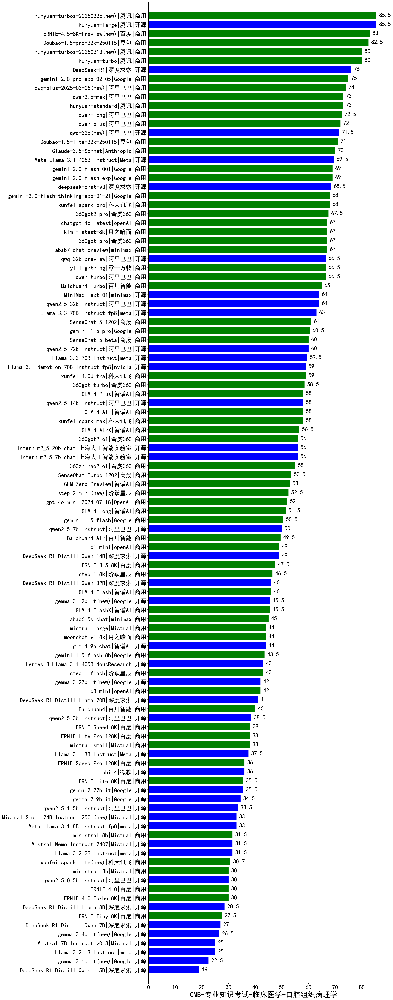

| 类别 | 大模型                         | CMB-专业知识考试-临床医学-口腔组织病理学 | 排名 |
|-----|------------------------------|---------|----|
|开源|hunyuan-large|85.5|1|
|商用|hunyuan-turbos-20250226(new)|85.5|2|
|商用|Doubao-1.5-pro-32k-250115|82.5|3|
|商用|hunyuan-turbo|80.0|4|
|开源|DeepSeek-R1|76.0|5|
|商用|gemini-2.0-pro-exp-02-05|75.0|6|
|商用|qwq-plus-2025-03-05(new)|74.0|7|
|商用|qwen2.5-max|73.0|8|
|商用|hunyuan-standard|73.0|9|
|商用|qwen-long|72.5|10|
|商用|qwen-plus|72.0|11|
|开源|qwq-32b(new)|71.5|12|
|商用|Doubao-1.5-lite-32k-250115|71.0|13|
|商用|Claude-3.5-Sonnet|70.0|14|
|开源|Meta-Llama-3.1-405B-Instruct|69.5|15|
|商用|gemini-2.0-flash-001|69.0|16|
|商用|gemini-2.0-flash-exp|69.0|17|
|开源|deepseek-chat-v3|68.5|18|
|商用|xunfei-spark-pro|68.0|19|
|商用|gemini-2.0-flash-thinking-exp-01-21|68.0|20|
|商用|360gpt2-pro|67.5|21|
|商用|chatgpt-4o-latest|67.0|22|
|商用|360gpt-pro|67.0|23|
|商用|abab7-chat-preview|67.0|24|
|商用|kimi-latest-8k|67.0|25|
|商用|yi-lightning|66.5|26|
|商用|qwen-turbo|66.5|27|
|开源|qwq-32b-preview|66.5|28|
|商用|Baichuan4-Turbo|65.0|29|
|开源|MiniMax-Text-01|64.0|30|
|开源|qwen2.5-32b-instruct|64.0|31|
|开源|Llama-3.3-70B-Instruct-fp8|63.0|32|
|商用|SenseChat-5-1202|61.0|33|
|商用|gemini-1.5-pro|60.5|34|
|商用|SenseChat-5-beta|60.0|35|
|开源|qwen2.5-72b-instruct|60.0|36|
|开源|Llama-3.3-70B-Instruct|59.5|37|
|商用|xunfei-4.0Ultra|59.0|38|
|开源|Llama-3.1-Nemotron-70B-Instruct-fp8|59.0|39|
|商用|360gpt-turbo|58.5|40|
|商用|GLM-4-Plus|58.0|41|
|商用|xunfei-spark-max|58.0|42|
|开源|qwen2.5-14b-instruct|58.0|43|
|商用|GLM-4-Air|58.0|44|
|商用|GLM-4-AirX|56.5|45|
|开源|internlm2_5-20b-chat|56.0|46|
|开源|internlm2_5-7b-chat|56.0|47|
|商用|360gpt2-o1|56.0|48|
|商用|360zhinao2-o1|55.0|49|
|商用|SenseChat-Turbo-1202|53.5|50|
|商用|GLM-Zero-Preview|53.0|51|
|商用|step-2-mini(new)|52.5|52|
|商用|gpt-4o-mini-2024-07-18|52.0|53|
|商用|GLM-4-Long|51.5|54|
|商用|gemini-1.5-flash|50.5|55|
|开源|qwen2.5-7b-instruct|50.0|56|
|商用|Baichuan4-Air|49.5|57|
|开源|DeepSeek-R1-Distill-Qwen-14B|49.0|58|
|商用|o1-mini|49.0|59|
|商用|ERNIE-3.5-8K|47.5|60|
|商用|step-1-8k|46.5|61|
|商用|GLM-4-Flash|46.0|62|
|开源|DeepSeek-R1-Distill-Qwen-32B|46.0|63|
|商用|GLM-4-FlashX|45.5|64|
|商用|abab6.5s-chat|45.0|65|
|开源|glm-4-9b-chat|44.0|66|
|商用|mistral-large|44.0|67|
|商用|moonshot-v1-8k|44.0|68|
|商用|gemini-1.5-flash-8b|43.5|69|
|商用|step-1-flash|43.0|70|
|开源|Hermes-3-Llama-3.1-405B|43.0|71|
|开源|gemma-3-27b-it(new)|42.0|72|
|商用|o3-mini|42.0|73|
|开源|DeepSeek-R1-Distill-Llama-70B|41.0|74|
|商用|Baichuan4|40.0|75|
|开源|qwen2.5-3b-instruct|38.5|76|
|商用|ERNIE-Speed-8K|38.1|77|
|商用|ERNIE-Lite-Pro-128K|38.0|78|
|商用|mistral-small|38.0|79|
|开源|Llama-3.1-8B-Instruct|37.5|80|
|开源|phi-4|36.0|81|
|商用|ERNIE-Speed-Pro-128K|36.0|82|
|商用|ERNIE-Lite-8K|35.5|83|
|开源|gemma-2-27b-it|35.5|84|
|开源|gemma-2-9b-it|34.5|85|
|开源|qwen2.5-1.5b-instruct|33.5|86|
|开源|Meta-Llama-3.1-8B-Instruct-fp8|33.0|87|
|开源|Mistral-Small-24B-Instruct-2501(new)|33.0|88|
|开源|Llama-3.2-3B-Instruct|31.5|89|
|开源|Mistral-Nemo-Instruct-2407|31.5|90|
|商用|ministral-8b|31.5|91|
|商用|xunfei-spark-lite(new)|30.7|92|
|商用|ministral-3b|30.0|93|
|开源|qwen2.5-0.5b-instruct|30.0|94|
|商用|ERNIE-4.0|30.0|95|
|商用|ERNIE-4.0-Turbo-8K|30.0|96|
|开源|DeepSeek-R1-Distill-Llama-8B|28.5|97|
|商用|ERNIE-Tiny-8K|27.5|98|
|开源|DeepSeek-R1-Distill-Qwen-7B|27.0|99|
|开源|Llama-3.2-1B-Instruct|25.0|100|
|开源|Mistral-7B-Instruct-v0.3|25.0|101|
|开源|DeepSeek-R1-Distill-Qwen-1.5B|19.0|102|
|开源|Yi-1.5-34B-Chat|/|103|
|开源|Yi-1.5-9B-Chat|/|104|
|开源|qwen2.5-math-72b-instruct|/|105|

