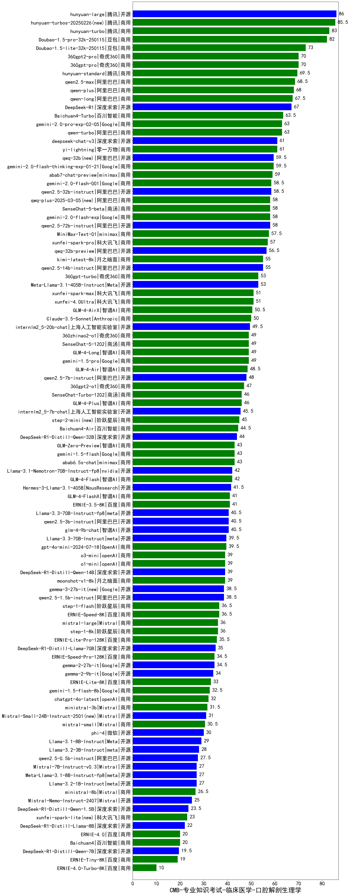

| 类别 | 大模型                         | CMB-专业知识考试-临床医学-口腔解剖生理学 | 排名 |
|-----|------------------------------|---------|----|
|开源|hunyuan-large|86.0|1|
|商用|hunyuan-turbos-20250226(new)|85.5|2|
|商用|hunyuan-turbo|83.0|3|
|商用|Doubao-1.5-pro-32k-250115|82.0|4|
|商用|Doubao-1.5-lite-32k-250115|73.0|5|
|商用|360gpt-pro|70.0|6|
|商用|360gpt2-pro|70.0|7|
|商用|hunyuan-standard|69.5|8|
|商用|qwen2.5-max|68.5|9|
|商用|qwen-plus|68.0|10|
|商用|qwen-long|67.5|11|
|开源|DeepSeek-R1|67.0|12|
|商用|Baichuan4-Turbo|63.5|13|
|商用|qwen-turbo|63.0|14|
|商用|gemini-2.0-pro-exp-02-05|63.0|15|
|开源|deepseek-chat-v3|61.0|16|
|商用|yi-lightning|61.0|17|
|商用|gemini-2.0-flash-thinking-exp-01-21|59.5|18|
|开源|qwq-32b(new)|59.5|19|
|商用|abab7-chat-preview|59.0|20|
|开源|qwen2.5-32b-instruct|58.5|21|
|商用|gemini-2.0-flash-001|58.5|22|
|开源|qwen2.5-72b-instruct|58.0|23|
|商用|qwq-plus-2025-03-05(new)|58.0|24|
|商用|SenseChat-5-beta|58.0|25|
|商用|gemini-2.0-flash-exp|58.0|26|
|开源|MiniMax-Text-01|57.5|27|
|商用|xunfei-spark-pro|57.0|28|
|开源|qwq-32b-preview|56.5|29|
|商用|kimi-latest-8k|55.0|30|
|开源|qwen2.5-14b-instruct|55.0|31|
|商用|360gpt-turbo|53.0|32|
|开源|Meta-Llama-3.1-405B-Instruct|53.0|33|
|商用|xunfei-spark-max|51.0|34|
|商用|xunfei-4.0Ultra|51.0|35|
|商用|GLM-4-AirX|50.5|36|
|商用|Claude-3.5-Sonnet|50.0|37|
|开源|internlm2_5-20b-chat|49.5|38|
|商用|gemini-1.5-pro|49.0|39|
|商用|SenseChat-5-1202|49.0|40|
|商用|GLM-4-Long|49.0|41|
|商用|360zhinao2-o1|49.0|42|
|商用|GLM-4-Air|48.5|43|
|开源|qwen2.5-7b-instruct|48.0|44|
|商用|360gpt2-o1|47.0|45|
|商用|SenseChat-Turbo-1202|46.0|46|
|商用|GLM-4-Plus|46.0|47|
|开源|internlm2_5-7b-chat|45.5|48|
|商用|step-2-mini(new)|45.0|49|
|商用|Baichuan4-Air|44.5|50|
|开源|DeepSeek-R1-Distill-Qwen-32B|44.0|51|
|商用|abab6.5s-chat|43.0|52|
|商用|gemini-1.5-flash|43.0|53|
|商用|GLM-Zero-Preview|43.0|54|
|开源|Llama-3.1-Nemotron-70B-Instruct-fp8|42.0|55|
|商用|GLM-4-Flash|42.0|56|
|开源|Hermes-3-Llama-3.1-405B|41.5|57|
|商用|ERNIE-3.5-8K|41.0|58|
|商用|GLM-4-FlashX|41.0|59|
|开源|Llama-3.3-70B-Instruct-fp8|40.5|60|
|开源|glm-4-9b-chat|40.5|61|
|开源|qwen2.5-3b-instruct|40.5|62|
|开源|Llama-3.3-70B-Instruct|39.5|63|
|商用|gpt-4o-mini-2024-07-18|39.5|64|
|商用|o1-mini|39.0|65|
|开源|DeepSeek-R1-Distill-Qwen-14B|39.0|66|
|商用|o3-mini|39.0|67|
|商用|moonshot-v1-8k|39.0|68|
|开源|qwen2.5-1.5b-instruct|38.5|69|
|开源|gemma-3-27b-it(new)|38.5|70|
|商用|ERNIE-Speed-8K|36.5|71|
|商用|step-1-flash|36.5|72|
|商用|step-1-8k|36.0|73|
|商用|mistral-large|36.0|74|
|商用|ERNIE-Lite-Pro-128K|35.5|75|
|开源|DeepSeek-R1-Distill-Llama-70B|35.0|76|
|商用|ERNIE-Speed-Pro-128K|34.5|77|
|开源|gemma-2-27b-it|34.5|78|
|开源|gemma-2-9b-it|34.0|79|
|商用|ERNIE-Lite-8K|33.0|80|
|商用|gemini-1.5-flash-8b|32.5|81|
|商用|chatgpt-4o-latest|32.0|82|
|商用|ministral-3b|31.5|83|
|开源|Mistral-Small-24B-Instruct-2501(new)|31.0|84|
|商用|mistral-small|30.5|85|
|开源|phi-4|30.0|86|
|开源|Llama-3.1-8B-Instruct|29.0|87|
|开源|Llama-3.2-3B-Instruct|28.0|88|
|开源|qwen2.5-0.5b-instruct|27.5|89|
|开源|Meta-Llama-3.1-8B-Instruct-fp8|27.0|90|
|开源|Llama-3.2-1B-Instruct|27.0|91|
|开源|Mistral-7B-Instruct-v0.3|27.0|92|
|商用|ministral-8b|26.5|93|
|开源|Mistral-Nemo-Instruct-2407|25.0|94|
|开源|DeepSeek-R1-Distill-Qwen-1.5B|23.5|95|
|商用|xunfei-spark-lite(new)|23.0|96|
|开源|DeepSeek-R1-Distill-Llama-8B|22.0|97|
|商用|Baichuan4|20.0|98|
|商用|ERNIE-4.0|20.0|99|
|开源|DeepSeek-R1-Distill-Qwen-7B|19.5|100|
|商用|ERNIE-Tiny-8K|19.0|101|
|商用|ERNIE-4.0-Turbo-8K|10.0|102|
|开源|Yi-1.5-34B-Chat|/|103|
|开源|Yi-1.5-9B-Chat|/|104|
|开源|qwen2.5-math-72b-instruct|/|105|

