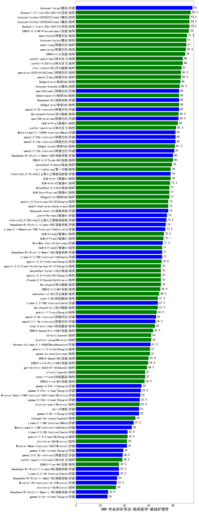

| 类别 | 大模型                         | CMB-专业知识考试-临床医学-基础护理学 | 排名 |
|-----|------------------------------|---------|----|
|开源|hunyuan-large|96.0|1|
|商用|Doubao-1.5-lite-32k-250115|94.5|2|
|商用|Doubao-1.5-pro-32k-250115|93.5|3|
|商用|hunyuan-turbos-20250226(new)|93.5|4|
|商用|qwen-turbo|91.5|5|
|商用|hunyuan-turbo|91.0|6|
|商用|qwen-long|91.0|7|
|商用|qwen-plus|90.5|8|
|商用|ERNIE-4.0|90.0|9|
|商用|xunfei-spark-max|88.0|10|
|商用|xunfei-4.0Ultra|88.0|11|
|商用|kimi-latest-8k|87.0|12|
|商用|qwq-plus-2025-03-05(new)|86.5|13|
|商用|qwen2.5-max|86.5|14|
|商用|360gpt2-pro|86.0|15|
|商用|hunyuan-standard|85.5|16|
|开源|qwen2.5-7b-instruct|85.0|17|
|商用|360gpt-pro|85.0|18|
|开源|qwq-32b(new)|85.0|19|
|开源|DeepSeek-R1|85.0|20|
|商用|360zhinao2-o1|85.0|21|
|开源|qwq-32b-preview|84.5|22|
|商用|Baichuan4-Turbo|84.5|23|
|商用|GLM-4-Plus|84.0|24|
|商用|xunfei-spark-pro|82.5|25|
|开源|qwen2.5-32b-instruct|82.0|26|
|开源|qwen2.5-14b-instruct|82.0|27|
|开源|Meta-Llama-3.1-405B-Instruct|82.0|28|
|商用|360gpt-turbo|81.5|29|
|开源|qwen2.5-72b-instruct|81.0|30|
|开源|DeepSeek-R1-Distill-Qwen-32B|80.0|31|
|商用|ERNIE-4.0-Turbo-8K|80.0|32|
|商用|SenseChat-5-beta|79.0|33|
|开源|internlm2_5-7b-chat|78.0|34|
|商用|yi-lightning|78.0|35|
|商用|GLM-4-Air|78.0|36|
|商用|GLM-4-AirX|77.5|37|
|商用|GLM-Zero-Preview|77.0|38|
|商用|360gpt2-o1|77.0|39|
|商用|SenseChat-5-1202|77.0|40|
|开源|deepseek-chat-v3|76.0|41|
|商用|gemini-2.0-pro-exp-02-05|76.0|42|
|商用|abab7-chat-preview|76.0|43|
|开源|glm-4-9b-chat|75.0|44|
|开源|internlm2_5-20b-chat|74.5|45|
|开源|DeepSeek-R1-Distill-Llama-70B|74.0|46|
|开源|Llama-3.1-Nemotron-70B-Instruct-fp8|73.5|47|
|商用|GLM-4-Long|72.5|48|
|商用|GLM-4-Flash|72.1|49|
|商用|MiniMax-Text-01|71.5|50|
|开源|Llama-3.3-70B-Instruct-fp8|71.0|51|
|商用|GLM-4-FlashX|71.0|52|
|开源|DeepSeek-R1-Distill-Qwen-14B|71.0|53|
|商用|gemini-2.0-flash-exp|70.5|54|
|商用|SenseChat-Turbo-1202|70.0|55|
|商用|Baichuan4|70.0|56|
|商用|gemini-2.0-flash-thinking-exp-01-21|70.0|57|
|商用|Claude-3.5-Sonnet|70.0|58|
|商用|gemini-2.0-flash-001|70.0|59|
|商用|ERNIE-3.5-8K|69.5|60|
|商用|moonshot-v1-8k|68.5|61|
|商用|step-1-8k|67.5|62|
|商用|Baichuan4-Air|67.5|63|
|开源|Llama-3.3-70B-Instruct|67.5|64|
|商用|gemini-1.5-pro|66.5|65|
|开源|qwen2.5-3b-instruct|66.0|66|
|开源|qwen2.5-1.5b-instruct|65.5|67|
|商用|step-2-mini(new)|65.0|68|
|商用|ERNIE-Speed-Pro-128K|63.5|69|
|商用|o3-mini|62.0|70|
|商用|mistral-large|62.0|71|
|开源|Hermes-3-Llama-3.1-405B|61.5|72|
|商用|abab6.5s-chat|61.0|73|
|商用|gemini-1.5-flash|61.0|74|
|商用|ERNIE-Speed-8K|59.8|75|
|商用|ERNIE-Lite-Pro-128K|59.5|76|
|商用|gpt-4o-mini-2024-07-18|58.5|77|
|商用|step-1-flash|57.0|78|
|商用|o1-mini|57.0|79|
|商用|ERNIE-Lite-8K|56.5|80|
|开源|gemma-2-27b-it|54.0|81|
|开源|gemma-3-27b-it(new)|53.5|82|
|开源|Mistral-Small-24B-Instruct-2501(new)|53.0|83|
|商用|mistral-small|52.5|84|
|开源|phi-4|52.0|85|
|开源|gemma-2-9b-it|52.0|86|
|商用|chatgpt-4o-latest|49.0|87|
|开源|Llama-3.1-8B-Instruct|47.5|88|
|开源|Meta-Llama-3.1-8B-Instruct-fp8|46.0|89|
|开源|Llama-3.2-3B-Instruct|42.5|90|
|商用|gemini-1.5-flash-8b|42.5|91|
|开源|Mistral-Nemo-Instruct-2407|42.0|92|
|商用|ministral-8b|42.0|93|
|开源|qwen2.5-0.5b-instruct|38.5|94|
|商用|xunfei-spark-lite(new)|38.2|95|
|开源|Llama-3.2-1B-Instruct|35.5|96|
|开源|DeepSeek-R1-Distill-Llama-8B|35.5|97|
|商用|ERNIE-Tiny-8K|35.5|98|
|开源|DeepSeek-R1-Distill-Qwen-7B|34.0|99|
|开源|Mistral-7B-Instruct-v0.3|33.5|100|
|商用|ministral-3b|33.0|101|
|开源|DeepSeek-R1-Distill-Qwen-1.5B|26.5|102|
|开源|Yi-1.5-34B-Chat|/|103|
|开源|Yi-1.5-9B-Chat|/|104|
|开源|qwen2.5-math-72b-instruct|/|105|

