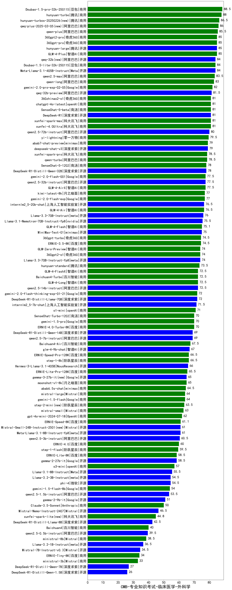

| 类别 | 大模型                         | CMB-专业知识考试-临床医学-外科学 | 排名 |
|-----|------------------------------|---------|----|
|商用|Doubao-1.5-pro-32k-250115|88.5|1|
|商用|hunyuan-turbo|88.0|2|
|商用|hunyuan-turbos-20250226(new)|86.5|3|
|商用|qwq-plus-2025-03-05(new)|86.0|4|
|商用|qwen-plus|85.5|5|
|商用|360gpt-pro|85.0|6|
|商用|GLM-4-Plus|85.0|7|
|开源|hunyuan-large|85.0|8|
|商用|360gpt2-pro|85.0|9|
|开源|qwq-32b(new)|84.0|10|
|开源|Meta-Llama-3.1-405B-Instruct|84.0|11|
|商用|Doubao-1.5-lite-32k-250115|84.0|12|
|商用|qwen2.5-max|83.5|13|
|商用|qwen-long|83.0|14|
|商用|gemini-2.0-pro-exp-02-05|82.0|15|
|开源|qwq-32b-preview|81.5|16|
|开源|DeepSeek-R1|81.0|17|
|商用|xunfei-spark-max|81.0|18|
|商用|chatgpt-4o-latest|81.0|19|
|商用|360zhinao2-o1|81.0|20|
|商用|SenseChat-5-beta|81.0|21|
|商用|xunfei-4.0Ultra|81.0|22|
|开源|qwen2.5-72b-instruct|80.0|23|
|商用|yi-lightning|79.5|24|
|商用|abab7-chat-preview|79.0|25|
|开源|deepseek-chat-v3|79.0|26|
|商用|qwen-turbo|78.5|27|
|商用|xunfei-spark-pro|78.5|28|
|开源|DeepSeek-R1-Distill-Qwen-32B|78.0|29|
|商用|SenseChat-5-1202|78.0|30|
|开源|qwen2.5-32b-instruct|77.5|31|
|商用|gemini-2.0-flash-001|77.5|32|
|商用|GLM-4-AirX|77.5|33|
|商用|kimi-latest-8k|77.0|34|
|商用|gemini-2.0-flash-exp|77.0|35|
|商用|GLM-4-Air|76.5|36|
|开源|internlm2_5-20b-chat|76.5|37|
|开源|Llama-3.3-70B-Instruct|76.0|38|
|开源|Llama-3.1-Nemotron-70B-Instruct-fp8|75.5|39|
|商用|GLM-4-Flash|75.1|40|
|开源|MiniMax-Text-01|75.0|41|
|商用|ERNIE-3.5-8K|74.5|42|
|商用|360gpt-turbo|74.5|43|
|开源|Llama-3.3-70B-Instruct-fp8|74.0|44|
|商用|360gpt2-o1|74.0|45|
|商用|GLM-Zero-Preview|74.0|46|
|商用|hunyuan-standard|73.5|47|
|商用|GLM-4-Long|72.5|48|
|开源|qwen2.5-14b-instruct|72.5|49|
|商用|GLM-4-FlashX|72.5|50|
|商用|Baichuan4-Turbo|72.5|51|
|开源|DeepSeek-R1-Distill-Llama-70B|72.0|52|
|商用|gemini-2.0-flash-thinking-exp-01-21|72.0|53|
|开源|internlm2_5-7b-chat|71.5|54|
|商用|o1-mini|71.0|55|
|商用|SenseChat-Turbo-1202|70.0|56|
|商用|gemini-1.5-pro|70.0|57|
|商用|ERNIE-4.0-Turbo-8K|70.0|58|
|开源|DeepSeek-R1-Distill-Qwen-14B|69.0|59|
|开源|qwen2.5-7b-instruct|69.0|60|
|商用|Baichuan4-Air|67.5|61|
|开源|glm-4-9b-chat|67.0|62|
|商用|step-1-8k|66.5|63|
|商用|ERNIE-Speed-Pro-128K|66.5|64|
|开源|Hermes-3-Llama-3.1-405B|66.0|65|
|商用|ERNIE-Lite-Pro-128K|65.5|66|
|商用|moonshot-v1-8k|65.0|67|
|开源|gemma-3-27b-it(new)|65.0|68|
|商用|abab6.5s-chat|64.5|69|
|商用|mistral-large|64.0|70|
|商用|gemini-1.5-flash|64.0|71|
|商用|step-2-mini(new)|63.5|72|
|商用|mistral-small|63.0|73|
|商用|gpt-4o-mini-2024-07-18|62.0|74|
|商用|ERNIE-Speed-8K|61.1|75|
|开源|Meta-Llama-3.1-8B-Instruct-fp8|61.0|76|
|开源|Mistral-Small-24B-Instruct-2501(new)|61.0|77|
|开源|qwen2.5-3b-instruct|60.5|78|
|商用|ERNIE-4.0|60.0|79|
|商用|step-1-flash|59.5|80|
|商用|ERNIE-Lite-8K|58.5|81|
|开源|gemma-2-27b-it|58.5|82|
|商用|o3-mini|57.0|83|
|开源|Llama-3.1-8B-Instruct|55.5|84|
|开源|phi-4|54.5|85|
|开源|Llama-3.2-3B-Instruct|54.5|86|
|商用|gemini-1.5-flash-8b|54.0|87|
|开源|qwen2.5-1.5b-instruct|53.5|88|
|开源|gemma-2-9b-it|51.0|89|
|商用|Claude-3.5-Sonnet|50.0|90|
|开源|Mistral-Nemo-Instruct-2407|46.5|91|
|商用|xunfei-spark-lite(new)|44.8|92|
|开源|DeepSeek-R1-Distill-Llama-8B|42.5|93|
|商用|Baichuan4|40.0|94|
|开源|qwen2.5-0.5b-instruct|39.5|95|
|商用|ministral-8b|38.5|96|
|开源|Llama-3.2-1B-Instruct|36.5|97|
|开源|Mistral-7B-Instruct-v0.3|34.5|98|
|商用|ERNIE-Tiny-8K|34.0|99|
|商用|ministral-3b|33.0|100|
|开源|DeepSeek-R1-Distill-Qwen-7B|27.0|101|
|开源|DeepSeek-R1-Distill-Qwen-1.5B|26.0|102|
|开源|Yi-1.5-34B-Chat|/|103|
|开源|Yi-1.5-9B-Chat|/|104|
|开源|qwen2.5-math-72b-instruct|/|105|

