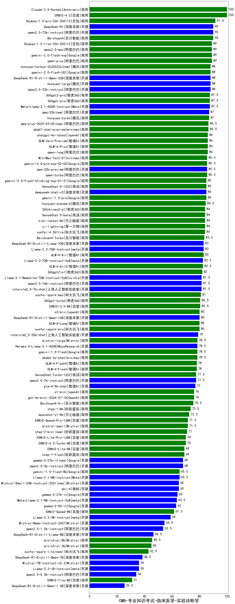

| 类别 | 大模型                         | CMB-专业知识考试-临床医学-实验诊断学 | 排名 |
|-----|------------------------------|---------|----|
|商用|ERNIE-4.0|100.0|1|
|商用|Claude-3.5-Sonnet|100.0|2|
|商用|Doubao-1.5-pro-32k-250115|91.5|3|
|开源|qwen2.5-72b-instruct|90.0|4|
|商用|Baichuan4|90.0|5|
|开源|DeepSeek-R1|90.0|6|
|商用|gemini-2.0-flash-exp|89.0|7|
|商用|qwen-plus|89.0|8|
|商用|Doubao-1.5-lite-32k-250115|89.0|9|
|商用|qwen2.5-max|89.0|10|
|开源|DeepSeek-R1-Distill-Qwen-32B|88.0|11|
|商用|hunyuan-turbos-20250226(new)|88.0|12|
|开源|qwen2.5-32b-instruct|88.0|13|
|开源|hunyuan-large|88.0|14|
|商用|gemini-2.0-flash-001|88.0|15|
|商用|360gpt-pro|87.5|16|
|开源|Meta-Llama-3.1-405B-Instruct|87.5|17|
|商用|360gpt2-pro|87.5|18|
|商用|hunyuan-turbo|87.0|19|
|开源|qwq-32b(new)|87.0|20|
|商用|qwq-plus-2025-03-05(new)|86.5|21|
|商用|abab7-chat-preview|86.5|22|
|商用|chatgpt-4o-latest|86.0|23|
|商用|GLM-4-Plus|86.0|24|
|商用|qwen-long|86.0|25|
|商用|GLM-Zero-Preview|86.0|26|
|商用|qwen-turbo|85.5|27|
|开源|qwq-32b-preview|85.5|28|
|开源|MiniMax-Text-01|85.5|29|
|商用|gemini-2.0-pro-exp-02-05|85.5|30|
|商用|gemini-2.0-flash-thinking-exp-01-21|85.0|31|
|商用|gemini-1.5-pro|85.0|32|
|开源|deepseek-chat-v3|85.0|33|
|商用|SenseChat-5-1202|85.0|34|
|商用|hunyuan-standard|84.5|35|
|商用|kimi-latest-8k|84.0|36|
|商用|SenseChat-5-beta|84.0|37|
|商用|360zhinao2-o1|84.0|38|
|商用|yi-lightning|84.0|39|
|商用|xunfei-4.0Ultra|84.0|40|
|商用|Baichuan4-Turbo|83.5|41|
|商用|GLM-4-Air|83.0|42|
|开源|DeepSeek-R1-Distill-Llama-70B|83.0|43|
|开源|Llama-3.3-70B-Instruct|83.0|44|
|开源|Llama-3.3-70B-Instruct-fp8|82.5|45|
|商用|GLM-4-AirX|82.5|46|
|商用|360gpt2-o1|82.0|47|
|开源|internlm2_5-7b-chat|81.5|48|
|开源|qwen2.5-14b-instruct|81.5|49|
|开源|Llama-3.1-Nemotron-70B-Instruct-fp8|81.5|50|
|商用|xunfei-spark-max|81.0|51|
|商用|360gpt-turbo|80.5|52|
|商用|ERNIE-3.5-8K|80.5|53|
|商用|o3-mini|80.0|54|
|商用|GLM-4-Long|80.0|55|
|商用|xunfei-spark-pro|80.0|56|
|开源|DeepSeek-R1-Distill-Qwen-14B|80.0|57|
|开源|internlm2_5-20b-chat|79.0|58|
|商用|mistral-large|78.5|59|
|开源|Hermes-3-Llama-3.1-405B|78.5|60|
|商用|abab6.5s-chat|78.5|61|
|商用|gemini-1.5-flash|78.5|62|
|商用|GLM-4-Flash|78.0|63|
|商用|GLM-4-FlashX|78.0|64|
|商用|SenseChat-Turbo-1202|77.5|65|
|开源|qwen2.5-7b-instruct|77.5|66|
|开源|glm-4-9b-chat|77.0|67|
|商用|gpt-4o-mini-2024-07-18|76.0|68|
|商用|o1-mini|76.0|69|
|商用|Baichuan4-Air|75.5|70|
|商用|step-1-8k|73.5|71|
|商用|moonshot-v1-8k|72.5|72|
|商用|ERNIE-Speed-Pro-128K|71.5|73|
|商用|mistral-small|71.5|74|
|商用|step-2-mini(new)|71.0|75|
|商用|ERNIE-4.0-Turbo-8K|70.0|76|
|商用|ERNIE-Lite-Pro-128K|70.0|77|
|商用|step-1-flash|69.0|78|
|商用|ERNIE-Lite-8K|69.0|79|
|开源|gemma-3-27b-it(new)|68.0|80|
|开源|qwen2.5-3b-instruct|68.0|81|
|开源|Llama-3.1-8B-Instruct|65.5|82|
|商用|gemini-1.5-flash-8b|65.5|83|
|开源|phi-4|65.0|84|
|开源|Mistral-Small-24B-Instruct-2501(new)|65.0|85|
|开源|gemma-2-27b-it|64.0|86|
|开源|Meta-Llama-3.1-8B-Instruct-fp8|63.5|87|
|开源|gemma-2-9b-it|63.0|88|
|商用|ERNIE-Speed-8K|61.5|89|
|开源|Llama-3.2-3B-Instruct|59.0|90|
|开源|Mistral-Nemo-Instruct-2407|54.5|91|
|开源|qwen2.5-1.5b-instruct|53.5|92|
|开源|DeepSeek-R1-Distill-Llama-8B|46.5|93|
|商用|ministral-8b|45.5|94|
|商用|ministral-3b|45.0|95|
|商用|xunfei-spark-lite(new)|42.9|96|
|开源|DeepSeek-R1-Distill-Qwen-7B|38.5|97|
|开源|Llama-3.2-1B-Instruct|36.0|98|
|开源|Mistral-7B-Instruct-v0.3|36.0|99|
|开源|qwen2.5-0.5b-instruct|34.0|100|
|商用|ERNIE-Tiny-8K|31.0|101|
|开源|DeepSeek-R1-Distill-Qwen-1.5B|25.5|102|
|开源|Yi-1.5-34B-Chat|/|103|
|开源|Yi-1.5-9B-Chat|/|104|
|开源|qwen2.5-math-72b-instruct|/|105|

