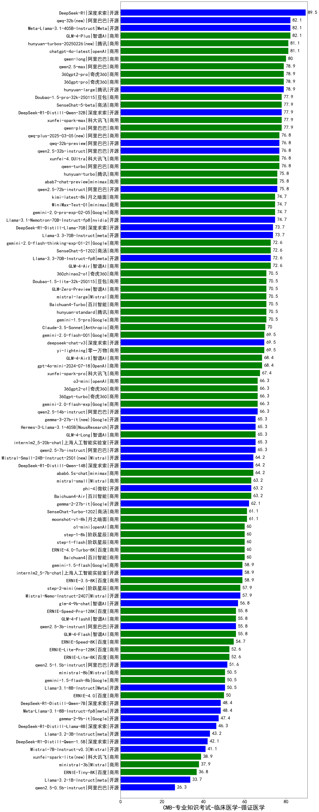

| 类别 | 大模型                         | CMB-专业知识考试-临床医学-循证医学 | 排名 |
|-----|------------------------------|---------|----|
|开源|DeepSeek-R1|89.5|1|
|商用|GLM-4-Plus|82.1|2|
|开源|qwq-32b(new)|82.1|3|
|开源|Meta-Llama-3.1-405B-Instruct|82.1|4|
|商用|hunyuan-turbos-20250226(new)|81.1|5|
|商用|chatgpt-4o-latest|81.1|6|
|商用|qwen-long|80.0|7|
|商用|hunyuan-turbos-20250313(new)|80.0|8|
|商用|360gpt2-pro|78.9|9|
|商用|360gpt-pro|78.9|10|
|商用|qwen2.5-max|78.9|11|
|开源|hunyuan-large|78.9|12|
|商用|xunfei-spark-max|77.9|13|
|商用|qwen-plus|77.9|14|
|商用|Doubao-1.5-pro-32k-250115|77.9|15|
|开源|DeepSeek-R1-Distill-Qwen-32B|77.9|16|
|商用|SenseChat-5-beta|77.9|17|
|商用|qwen-turbo|76.8|18|
|商用|qwq-plus-2025-03-05(new)|76.8|19|
|商用|xunfei-4.0Ultra|76.8|20|
|开源|qwen2.5-32b-instruct|76.8|21|
|开源|qwq-32b-preview|76.8|22|
|商用|hunyuan-turbo|75.8|23|
|开源|qwen2.5-72b-instruct|75.8|24|
|商用|abab7-chat-preview|75.8|25|
|商用|ERNIE-4.5-8K-Preview(new)|75.8|26|
|商用|gemini-2.0-pro-exp-02-05|74.7|27|
|商用|kimi-latest-8k|74.7|28|
|开源|Llama-3.1-Nemotron-70B-Instruct-fp8|74.7|29|
|开源|MiniMax-Text-01|74.7|30|
|开源|DeepSeek-R1-Distill-Llama-70B|73.7|31|
|开源|Llama-3.3-70B-Instruct|73.7|32|
|商用|gemini-2.0-flash-thinking-exp-01-21|72.6|33|
|商用|SenseChat-5-1202|72.6|34|
|开源|Llama-3.3-70B-Instruct-fp8|72.6|35|
|商用|GLM-4-Air|72.6|36|
|商用|hunyuan-standard|70.5|37|
|商用|gemini-1.5-pro|70.5|38|
|商用|Doubao-1.5-lite-32k-250115|70.5|39|
|商用|GLM-Zero-Preview|70.5|40|
|商用|mistral-large|70.5|41|
|商用|Baichuan4-Turbo|70.5|42|
|商用|360zhinao2-o1|70.5|43|
|商用|Claude-3.5-Sonnet|70.0|44|
|开源|deepseek-chat-v3|69.5|45|
|商用|yi-lightning|69.5|46|
|商用|gemini-2.0-flash-001|69.5|47|
|商用|gpt-4o-mini-2024-07-18|68.4|48|
|商用|GLM-4-AirX|68.4|49|
|商用|xunfei-spark-pro|67.4|50|
|商用|gemini-2.0-flash-exp|66.3|51|
|商用|o3-mini|66.3|52|
|商用|360gpt2-o1|66.3|53|
|开源|qwen2.5-14b-instruct|66.3|54|
|商用|360gpt-turbo|66.3|55|
|开源|Hermes-3-Llama-3.1-405B|65.3|56|
|商用|GLM-4-Long|65.3|57|
|开源|gemma-3-27b-it(new)|65.3|58|
|开源|internlm2_5-20b-chat|65.3|59|
|开源|qwen2.5-7b-instruct|65.3|60|
|开源|Mistral-Small-24B-Instruct-2501(new)|64.2|61|
|开源|DeepSeek-R1-Distill-Qwen-14B|64.2|62|
|商用|abab6.5s-chat|64.2|63|
|开源|phi-4|63.2|64|
|商用|Baichuan4-Air|63.2|65|
|商用|mistral-small|63.2|66|
|开源|gemma-2-27b-it|62.1|67|
|商用|moonshot-v1-8k|61.1|68|
|商用|SenseChat-Turbo-1202|61.1|69|
|商用|Baichuan4|60.0|70|
|商用|o1-mini|60.0|71|
|商用|step-1-flash|60.0|72|
|商用|step-1-8k|60.0|73|
|商用|ERNIE-4.0-Turbo-8K|60.0|74|
|开源|internlm2_5-7b-chat|58.9|75|
|商用|gemini-1.5-flash|58.9|76|
|商用|ERNIE-3.5-8K|58.9|77|
|开源|Mistral-Nemo-Instruct-2407|57.9|78|
|商用|step-2-mini(new)|57.9|79|
|开源|glm-4-9b-chat|56.8|80|
|开源|qwen2.5-3b-instruct|55.8|81|
|商用|GLM-4-Flash|55.8|82|
|商用|ERNIE-Speed-Pro-128K|55.8|83|
|商用|GLM-4-FlashX|55.8|84|
|商用|ERNIE-Speed-8K|54.7|85|
|商用|ERNIE-Lite-8K|52.6|86|
|商用|ERNIE-Lite-Pro-128K|52.6|87|
|开源|qwen2.5-1.5b-instruct|51.6|88|
|商用|ministral-8b|50.5|89|
|商用|gemini-1.5-flash-8b|50.5|90|
|开源|Llama-3.1-8B-Instruct|50.5|91|
|商用|ERNIE-4.0|50.0|92|
|开源|gemma-3-4b-it(new)|49.5|93|
|开源|gemma-3-12b-it(new)|49.5|94|
|开源|Meta-Llama-3.1-8B-Instruct-fp8|48.4|95|
|开源|DeepSeek-R1-Distill-Qwen-7B|48.4|96|
|开源|gemma-2-9b-it|47.4|97|
|开源|DeepSeek-R1-Distill-Llama-8B|46.3|98|
|开源|Llama-3.2-3B-Instruct|43.2|99|
|开源|DeepSeek-R1-Distill-Qwen-1.5B|42.1|100|
|开源|Mistral-7B-Instruct-v0.3|41.1|101|
|商用|xunfei-spark-lite(new)|38.9|102|
|开源|gemma-3-1b-it(new)|38.9|103|
|商用|ministral-3b|37.9|104|
|商用|ERNIE-Tiny-8K|36.8|105|
|开源|Llama-3.2-1B-Instruct|33.7|106|
|开源|qwen2.5-0.5b-instruct|26.3|107|
|开源|qwen2.5-math-72b-instruct|/|108|
|开源|Yi-1.5-34B-Chat|/|109|
|开源|Yi-1.5-9B-Chat|/|110|

