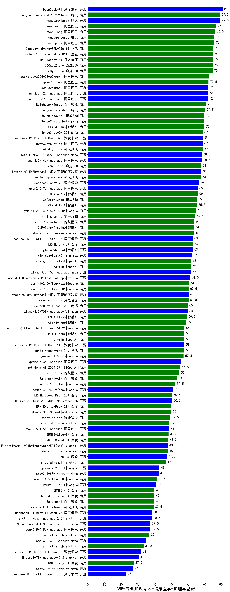

| 类别 | 大模型                         | CMB-专业知识考试-临床医学-护理学基础 | 排名 |
|-----|------------------------------|---------|----|
|商用|ERNIE-4.5-8K-Preview(new)|86.0|1|
|开源|DeepSeek-R1|81.0|2|
|商用|hunyuan-turbos-20250313(new)|80.5|3|
|开源|hunyuan-large|79.5|4|
|商用|hunyuan-turbos-20250226(new)|79.5|5|
|商用|qwen-turbo|77.0|6|
|商用|qwen-long|76.5|7|
|商用|qwen-plus|76.0|8|
|商用|hunyuan-turbo|76.0|9|
|商用|Doubao-1.5-pro-32k-250115|75.5|10|
|商用|360gpt2-pro|75.0|11|
|商用|360gpt-pro|75.0|12|
|商用|kimi-latest-8k|75.0|13|
|商用|Doubao-1.5-lite-32k-250115|75.0|14|
|商用|qwq-plus-2025-03-05(new)|73.0|15|
|商用|qwen2.5-max|72.5|16|
|开源|qwq-32b(new)|72.0|17|
|开源|qwen2.5-72b-instruct|72.0|18|
|开源|qwen2.5-32b-instruct|72.0|19|
|商用|Baichuan4-Turbo|71.0|20|
|商用|hunyuan-standard|70.5|21|
|商用|GLM-4-Plus|70.0|22|
|商用|360zhinao2-o1|70.0|23|
|商用|SenseChat-5-beta|70.0|24|
|开源|DeepSeek-R1-Distill-Qwen-32B|69.0|25|
|开源|qwq-32b-preview|69.0|26|
|商用|xunfei-4.0Ultra|69.0|27|
|商用|SenseChat-5-1202|69.0|28|
|开源|Meta-Llama-3.1-405B-Instruct|68.5|29|
|开源|qwen2.5-14b-instruct|68.5|30|
|开源|internlm2_5-7b-chat|68.0|31|
|商用|xunfei-spark-max|68.0|32|
|商用|360gpt2-o1|68.0|33|
|开源|deepseek-chat-v3|67.0|34|
|商用|GLM-4-Air|66.0|35|
|开源|qwen2.5-7b-instruct|66.0|36|
|商用|GLM-4-AirX|65.5|37|
|商用|360gpt-turbo|65.5|38|
|商用|gemini-2.0-pro-exp-02-05|65.0|39|
|商用|yi-lightning|64.5|40|
|商用|abab7-chat-preview|64.0|41|
|商用|GLM-Zero-Preview|64.0|42|
|商用|step-2-mini(new)|64.0|43|
|商用|ERNIE-3.5-8K|63.0|44|
|开源|DeepSeek-R1-Distill-Llama-70B|63.0|45|
|开源|glm-4-9b-chat|63.0|46|
|开源|MiniMax-Text-01|62.5|47|
|开源|Llama-3.3-70B-Instruct|62.0|48|
|商用|chatgpt-4o-latest|62.0|49|
|商用|o3-mini|62.0|50|
|开源|Llama-3.1-Nemotron-70B-Instruct-fp8|61.5|51|
|商用|gemini-2.0-flash-exp|61.0|52|
|开源|internlm2_5-20b-chat|60.5|53|
|商用|gemini-2.0-flash-001|60.5|54|
|商用|moonshot-v1-8k|60.5|55|
|商用|SenseChat-Turbo-1202|60.0|56|
|开源|Llama-3.3-70B-Instruct-fp8|60.0|57|
|商用|GLM-4-Flash|59.5|58|
|商用|GLM-4-Long|59.0|59|
|商用|gemini-2.0-flash-thinking-exp-01-21|58.0|60|
|商用|xunfei-spark-pro|58.0|61|
|商用|GLM-4-FlashX|58.0|62|
|商用|o1-mini|58.0|63|
|开源|DeepSeek-R1-Distill-Qwen-14B|58.0|64|
|商用|gemini-1.5-pro|57.5|65|
|开源|qwen2.5-3b-instruct|56.0|66|
|商用|gpt-4o-mini-2024-07-18|55.5|67|
|商用|step-1-8k|55.0|68|
|商用|Baichuan4-Air|53.5|69|
|商用|gemini-1.5-flash|52.5|70|
|开源|gemma-3-27b-it(new)|51.0|71|
|商用|ERNIE-Speed-Pro-128K|50.5|72|
|开源|Hermes-3-Llama-3.1-405B|50.5|73|
|商用|ERNIE-Lite-Pro-128K|50.0|74|
|商用|Claude-3.5-Sonnet|50.0|75|
|商用|step-1-flash|49.5|76|
|开源|qwen2.5-1.5b-instruct|49.0|77|
|商用|mistral-large|49.0|78|
|商用|ERNIE-Lite-8K|48.5|79|
|商用|ERNIE-Speed-8K|48.3|80|
|商用|abab6.5s-chat|48.0|81|
|开源|Mistral-Small-24B-Instruct-2501(new)|48.0|82|
|开源|phi-4|47.5|83|
|商用|mistral-small|47.0|84|
|开源|gemma-3-12b-it(new)|44.5|85|
|开源|gemma-2-27b-it|43.0|86|
|开源|Llama-3.1-8B-Instruct|42.5|87|
|商用|gemini-1.5-flash-8b|41.5|88|
|开源|gemma-2-9b-it|41.0|89|
|商用|Baichuan4|40.0|90|
|商用|ERNIE-4.0-Turbo-8K|40.0|91|
|商用|ERNIE-4.0|40.0|92|
|商用|xunfei-spark-lite(new)|39.5|93|
|开源|Mistral-Nemo-Instruct-2407|38.5|94|
|开源|DeepSeek-R1-Distill-Qwen-7B|38.5|95|
|开源|qwen2.5-0.5b-instruct|37.5|96|
|开源|Meta-Llama-3.1-8B-Instruct-fp8|37.5|97|
|商用|ministral-8b|37.0|98|
|开源|Llama-3.2-3B-Instruct|35.0|99|
|商用|ministral-3b|33.5|100|
|开源|gemma-3-4b-it(new)|32.5|101|
|开源|DeepSeek-R1-Distill-Llama-8B|32.0|102|
|开源|Mistral-7B-Instruct-v0.3|30.5|103|
|商用|ERNIE-Tiny-8K|27.5|104|
|开源|Llama-3.2-1B-Instruct|27.0|105|
|开源|DeepSeek-R1-Distill-Qwen-1.5B|23.0|106|
|开源|gemma-3-1b-it(new)|22.5|107|
|开源|qwen2.5-math-72b-instruct|/|108|

