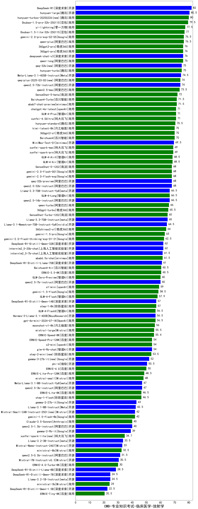

| 类别 | 大模型                         | CMB-专业知识考试-临床医学-放射学 | 排名 |
|-----|------------------------------|---------|----|
|开源|DeepSeek-R1|82.0|1|
|开源|hunyuan-large|80.5|2|
|商用|hunyuan-turbos-20250226(new)|80.0|3|
|商用|Doubao-1.5-pro-32k-250115|79.5|4|
|商用|yi-lightning|77.5|5|
|商用|Doubao-1.5-lite-32k-250115|77.0|6|
|商用|qwen-plus|76.5|7|
|商用|gemini-2.0-pro-exp-02-05|76.5|8|
|商用|qwen-long|76.0|9|
|商用|360gpt-pro|76.0|10|
|商用|360gpt2-pro|76.0|11|
|开源|deepseek-chat-v3|76.0|12|
|开源|qwq-32b(new)|75.0|13|
|商用|hunyuan-turbo|75.0|14|
|开源|Meta-Llama-3.1-405B-Instruct|74.5|15|
|商用|qwq-plus-2025-03-05(new)|74.0|16|
|开源|qwen2.5-72b-instruct|74.0|17|
|商用|qwen2.5-max|73.5|18|
|商用|SenseChat-5-beta|72.0|19|
|商用|abab7-chat-preview|71.5|20|
|商用|Baichuan4-Turbo|71.5|21|
|商用|GLM-4-Plus|71.0|22|
|商用|xunfei-4.0Ultra|71.0|23|
|商用|chatgpt-4o-latest|71.0|24|
|商用|hunyuan-standard|70.5|25|
|商用|kimi-latest-8k|70.0|26|
|商用|360gpt2-o1|70.0|27|
|商用|Baichuan4|70.0|28|
|开源|MiniMax-Text-01|69.5|29|
|商用|xunfei-spark-max|69.0|30|
|商用|xunfei-spark-pro|69.0|31|
|商用|GLM-4-AirX|68.5|32|
|商用|GLM-4-Air|68.5|33|
|商用|SenseChat-5-1202|68.0|34|
|商用|gemini-2.0-flash-001|68.0|35|
|商用|gemini-2.0-flash-exp|68.0|36|
|开源|qwq-32b-preview|68.0|37|
|开源|qwen2.5-32b-instruct|68.0|38|
|开源|qwen2.5-14b-instruct|66.5|39|
|开源|Llama-3.3-70B-Instruct-fp8|66.5|40|
|商用|GLM-4-Long|66.5|41|
|商用|qwen-turbo|66.0|42|
|商用|360gpt-turbo|65.5|43|
|开源|Llama-3.3-70B-Instruct|65.0|44|
|商用|SenseChat-Turbo-1202|65.0|45|
|开源|Llama-3.1-Nemotron-70B-Instruct-fp8|64.5|46|
|商用|360zhinao2-o1|64.0|47|
|商用|gemini-1.5-pro|63.0|48|
|商用|gemini-2.0-flash-thinking-exp-01-21|62.5|49|
|开源|DeepSeek-R1-Distill-Qwen-32B|62.0|50|
|开源|internlm2_5-20b-chat|62.0|51|
|商用|abab6.5s-chat|61.5|52|
|开源|internlm2_5-7b-chat|61.5|53|
|开源|DeepSeek-R1-Distill-Llama-70B|61.0|54|
|商用|ERNIE-3.5-8K|60.5|55|
|商用|Baichuan4-Air|60.5|56|
|开源|qwen2.5-7b-instruct|60.0|57|
|商用|GLM-Zero-Preview|60.0|58|
|商用|o1-mini|59.0|59|
|商用|gemini-1.5-flash|58.5|60|
|商用|GLM-4-Flash|57.9|61|
|商用|step-1-8k|57.0|62|
|开源|DeepSeek-R1-Distill-Qwen-14B|57.0|63|
|商用|GLM-4-FlashX|56.5|64|
|开源|Hermes-3-Llama-3.1-405B|56.5|65|
|商用|gpt-4o-mini-2024-07-18|56.5|66|
|商用|moonshot-v1-8k|56.0|67|
|商用|mistral-large|55.5|68|
|商用|ERNIE-Speed-8K|55.4|69|
|商用|ERNIE-Speed-Pro-128K|54.0|70|
|开源|glm-4-9b-chat|54.0|71|
|商用|o3-mini|54.0|72|
|商用|step-2-mini(new)|53.5|73|
|开源|gemma-3-27b-it(new)|52.0|74|
|开源|phi-4|50.5|75|
|商用|ERNIE-4.0|50.0|76|
|商用|ERNIE-Lite-Pro-128K|48.5|77|
|商用|mistral-small|48.0|78|
|开源|Meta-Llama-3.1-8B-Instruct-fp8|47.0|79|
|开源|qwen2.5-3b-instruct|47.0|80|
|商用|ERNIE-Lite-8K|46.5|81|
|商用|step-1-flash|46.5|82|
|开源|gemma-2-27b-it|43.0|83|
|开源|Llama-3.1-8B-Instruct|42.5|84|
|开源|Mistral-Small-24B-Instruct-2501(new)|42.0|85|
|商用|gemini-1.5-flash-8b|42.0|86|
|开源|qwen2.5-1.5b-instruct|40.0|87|
|商用|Claude-3.5-Sonnet|40.0|88|
|开源|gemma-2-9b-it|39.0|89|
|商用|xunfei-spark-lite(new)|34.7|90|
|开源|Llama-3.2-3B-Instruct|33.5|91|
|开源|Mistral-Nemo-Instruct-2407|33.0|92|
|商用|ministral-8b|32.5|93|
|开源|qwen2.5-0.5b-instruct|31.5|94|
|开源|Mistral-7B-Instruct-v0.3|30.5|95|
|商用|ERNIE-4.0-Turbo-8K|30.0|96|
|开源|DeepSeek-R1-Distill-Llama-8B|28.5|97|
|开源|DeepSeek-R1-Distill-Qwen-7B|24.5|98|
|开源|Llama-3.2-1B-Instruct|24.5|99|
|商用|ministral-3b|24.0|100|
|开源|DeepSeek-R1-Distill-Qwen-1.5B|22.5|101|
|商用|ERNIE-Tiny-8K|20.5|102|
|开源|Yi-1.5-34B-Chat|/|103|
|开源|Yi-1.5-9B-Chat|/|104|
|开源|qwen2.5-math-72b-instruct|/|105|

