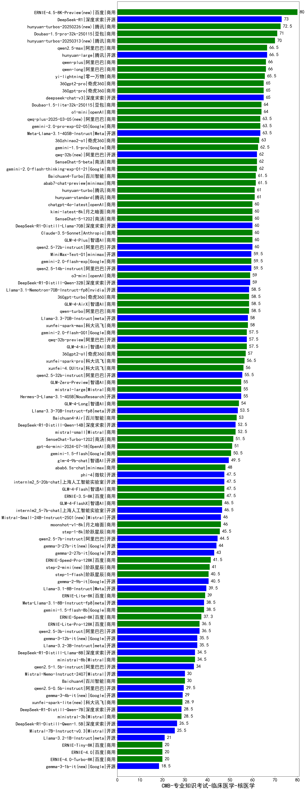

| 类别 | 大模型                         | CMB-专业知识考试-临床医学-核医学 | 排名 |
|-----|------------------------------|---------|----|
|开源|DeepSeek-R1|73.0|1|
|商用|hunyuan-turbos-20250226(new)|72.5|2|
|商用|Doubao-1.5-pro-32k-250115|71.0|3|
|商用|qwen2.5-max|66.5|4|
|开源|hunyuan-large|66.5|5|
|商用|qwen-plus|66.0|6|
|商用|qwen-long|66.0|7|
|商用|yi-lightning|65.5|8|
|开源|deepseek-chat-v3|65.0|9|
|商用|360gpt2-pro|65.0|10|
|商用|360gpt-pro|65.0|11|
|商用|Doubao-1.5-lite-32k-250115|64.0|12|
|商用|o1-mini|64.0|13|
|商用|gemini-2.0-pro-exp-02-05|63.5|14|
|开源|Meta-Llama-3.1-405B-Instruct|63.5|15|
|商用|qwq-plus-2025-03-05(new)|63.5|16|
|商用|360zhinao2-o1|63.0|17|
|商用|gemini-1.5-pro|62.5|18|
|商用|SenseChat-5-beta|62.0|19|
|商用|gemini-2.0-flash-thinking-exp-01-21|62.0|20|
|开源|qwq-32b(new)|62.0|21|
|商用|Baichuan4-Turbo|61.5|22|
|商用|abab7-chat-preview|61.5|23|
|商用|hunyuan-standard|61.0|24|
|商用|hunyuan-turbo|61.0|25|
|商用|GLM-4-Plus|60.0|26|
|开源|qwen2.5-72b-instruct|60.0|27|
|商用|kimi-latest-8k|60.0|28|
|商用|Claude-3.5-Sonnet|60.0|29|
|商用|SenseChat-5-1202|60.0|30|
|商用|chatgpt-4o-latest|60.0|31|
|开源|DeepSeek-R1-Distill-Llama-70B|60.0|32|
|开源|qwen2.5-14b-instruct|59.5|33|
|商用|gemini-2.0-flash-exp|59.5|34|
|商用|MiniMax-Text-01|59.5|35|
|商用|o3-mini|59.0|36|
|开源|DeepSeek-R1-Distill-Qwen-32B|59.0|37|
|商用|qwen-turbo|58.5|38|
|开源|Llama-3.1-Nemotron-70B-Instruct-fp8|58.5|39|
|商用|360gpt-turbo|58.5|40|
|商用|GLM-4-AirX|58.5|41|
|商用|xunfei-spark-max|58.0|42|
|开源|Llama-3.3-70B-Instruct|58.0|43|
|商用|gemini-2.0-flash-001|57.5|44|
|商用|GLM-4-Air|57.5|45|
|开源|qwq-32b-preview|57.5|46|
|商用|360gpt2-o1|57.0|47|
|商用|xunfei-spark-pro|56.5|48|
|商用|xunfei-4.0Ultra|56.0|49|
|开源|qwen2.5-32b-instruct|55.5|50|
|商用|mistral-large|55.0|51|
|商用|GLM-Zero-Preview|55.0|52|
|开源|Hermes-3-Llama-3.1-405B|55.0|53|
|商用|GLM-4-Long|54.0|54|
|开源|Llama-3.3-70B-Instruct-fp8|53.5|55|
|商用|Baichuan4-Air|53.0|56|
|商用|mistral-small|52.5|57|
|开源|DeepSeek-R1-Distill-Qwen-14B|52.5|58|
|商用|SenseChat-Turbo-1202|51.5|59|
|商用|gpt-4o-mini-2024-07-18|51.0|60|
|商用|gemini-1.5-flash|50.5|61|
|开源|glm-4-9b-chat|49.5|62|
|商用|abab6.5s-chat|48.0|63|
|商用|GLM-4-Flash|47.5|64|
|开源|phi-4|47.5|65|
|商用|ERNIE-3.5-8K|47.5|66|
|开源|internlm2_5-20b-chat|47.5|67|
|商用|GLM-4-FlashX|46.5|68|
|开源|internlm2_5-7b-chat|46.5|69|
|商用|moonshot-v1-8k|46.0|70|
|开源|Mistral-Small-24B-Instruct-2501(new)|46.0|71|
|商用|step-1-8k|45.5|72|
|开源|qwen2.5-7b-instruct|44.5|73|
|开源|gemma-3-27b-it(new)|44.0|74|
|开源|gemma-2-27b-it|43.0|75|
|商用|ERNIE-Speed-Pro-128K|41.5|76|
|商用|step-2-mini(new)|41.0|77|
|开源|gemma-2-9b-it|40.5|78|
|商用|step-1-flash|40.5|79|
|开源|Llama-3.1-8B-Instruct|39.5|80|
|商用|ERNIE-Lite-8K|39.0|81|
|商用|gemini-1.5-flash-8b|38.5|82|
|开源|Meta-Llama-3.1-8B-Instruct-fp8|38.5|83|
|商用|ERNIE-Speed-8K|37.3|84|
|商用|ERNIE-Lite-Pro-128K|36.5|85|
|开源|qwen2.5-3b-instruct|36.5|86|
|开源|Llama-3.2-3B-Instruct|35.5|87|
|开源|DeepSeek-R1-Distill-Llama-8B|34.5|88|
|商用|ministral-8b|34.5|89|
|开源|qwen2.5-1.5b-instruct|34.0|90|
|商用|Baichuan4|30.0|91|
|开源|Mistral-Nemo-Instruct-2407|30.0|92|
|开源|qwen2.5-0.5b-instruct|29.5|93|
|商用|xunfei-spark-lite(new)|28.9|94|
|开源|DeepSeek-R1-Distill-Qwen-7B|28.5|95|
|商用|ministral-3b|28.5|96|
|开源|DeepSeek-R1-Distill-Qwen-1.5B|26.5|97|
|开源|Mistral-7B-Instruct-v0.3|25.5|98|
|开源|Llama-3.2-1B-Instruct|21.0|99|
|商用|ERNIE-4.0-Turbo-8K|20.0|100|
|商用|ERNIE-4.0|20.0|101|
|商用|ERNIE-Tiny-8K|20.0|102|
|开源|Yi-1.5-34B-Chat|/|103|
|开源|Yi-1.5-9B-Chat|/|104|
|开源|qwen2.5-math-72b-instruct|/|105|

