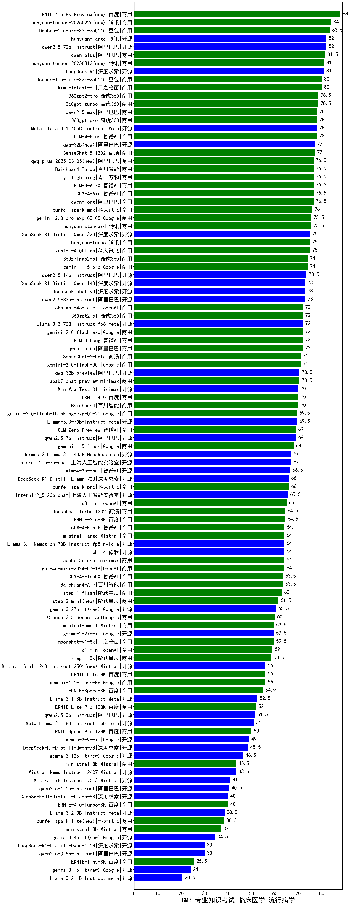

| 类别 | 大模型                         | CMB-专业知识考试-临床医学-流行病学 | 排名 |
|-----|------------------------------|---------|----|
|商用|hunyuan-turbos-20250226(new)|84.0|1|
|商用|Doubao-1.5-pro-32k-250115|83.5|2|
|开源|hunyuan-large|82.0|3|
|开源|qwen2.5-72b-instruct|82.0|4|
|商用|qwen-plus|81.5|5|
|开源|DeepSeek-R1|81.0|6|
|商用|Doubao-1.5-lite-32k-250115|80.0|7|
|商用|kimi-latest-8k|80.0|8|
|商用|360gpt2-pro|78.5|9|
|商用|360gpt-turbo|78.5|10|
|开源|Meta-Llama-3.1-405B-Instruct|78.0|11|
|商用|GLM-4-Plus|78.0|12|
|商用|qwen2.5-max|78.0|13|
|商用|360gpt-pro|78.0|14|
|商用|SenseChat-5-1202|77.0|15|
|开源|qwq-32b(new)|77.0|16|
|商用|Baichuan4-Turbo|76.5|17|
|商用|GLM-4-AirX|76.5|18|
|商用|yi-lightning|76.5|19|
|商用|qwq-plus-2025-03-05(new)|76.5|20|
|商用|qwen-long|76.5|21|
|商用|GLM-4-Air|76.5|22|
|商用|xunfei-spark-max|76.0|23|
|商用|hunyuan-standard|75.5|24|
|商用|gemini-2.0-pro-exp-02-05|75.5|25|
|开源|DeepSeek-R1-Distill-Qwen-32B|75.0|26|
|商用|hunyuan-turbo|75.0|27|
|商用|xunfei-4.0Ultra|75.0|28|
|商用|gemini-1.5-pro|74.0|29|
|商用|360zhinao2-o1|74.0|30|
|开源|qwen2.5-14b-instruct|73.5|31|
|开源|qwen2.5-32b-instruct|73.0|32|
|开源|deepseek-chat-v3|73.0|33|
|开源|DeepSeek-R1-Distill-Qwen-14B|73.0|34|
|商用|chatgpt-4o-latest|72.0|35|
|商用|GLM-4-Long|72.0|36|
|商用|360gpt2-o1|72.0|37|
|商用|gemini-2.0-flash-exp|72.0|38|
|商用|qwen-turbo|72.0|39|
|开源|Llama-3.3-70B-Instruct-fp8|72.0|40|
|商用|gemini-2.0-flash-001|71.0|41|
|商用|SenseChat-5-beta|71.0|42|
|开源|qwq-32b-preview|70.5|43|
|商用|abab7-chat-preview|70.5|44|
|商用|MiniMax-Text-01|70.0|45|
|商用|Baichuan4|70.0|46|
|商用|ERNIE-4.0|70.0|47|
|商用|gemini-2.0-flash-thinking-exp-01-21|69.5|48|
|开源|Llama-3.3-70B-Instruct|69.5|49|
|商用|GLM-Zero-Preview|69.0|50|
|开源|qwen2.5-7b-instruct|69.0|51|
|商用|gemini-1.5-flash|68.0|52|
|开源|internlm2_5-7b-chat|67.0|53|
|开源|Hermes-3-Llama-3.1-405B|67.0|54|
|开源|glm-4-9b-chat|66.5|55|
|开源|DeepSeek-R1-Distill-Llama-70B|66.0|56|
|商用|xunfei-spark-pro|66.0|57|
|开源|internlm2_5-20b-chat|65.5|58|
|商用|o3-mini|65.0|59|
|商用|SenseChat-Turbo-1202|64.5|60|
|商用|ERNIE-3.5-8K|64.5|61|
|商用|GLM-4-Flash|64.1|62|
|开源|phi-4|64.0|63|
|开源|Llama-3.1-Nemotron-70B-Instruct-fp8|64.0|64|
|商用|mistral-large|64.0|65|
|商用|abab6.5s-chat|64.0|66|
|商用|gpt-4o-mini-2024-07-18|64.0|67|
|商用|GLM-4-FlashX|63.5|68|
|商用|Baichuan4-Air|63.5|69|
|商用|step-1-flash|63.0|70|
|商用|step-2-mini(new)|61.5|71|
|开源|gemma-3-27b-it(new)|60.5|72|
|商用|Claude-3.5-Sonnet|60.0|73|
|商用|mistral-small|59.5|74|
|商用|moonshot-v1-8k|59.5|75|
|开源|gemma-2-27b-it|59.5|76|
|商用|o1-mini|59.0|77|
|商用|step-1-8k|58.5|78|
|商用|ERNIE-Lite-8K|56.0|79|
|开源|Mistral-Small-24B-Instruct-2501(new)|56.0|80|
|商用|gemini-1.5-flash-8b|56.0|81|
|商用|ERNIE-Speed-8K|54.9|82|
|开源|Llama-3.1-8B-Instruct|52.5|83|
|商用|ERNIE-Lite-Pro-128K|52.0|84|
|开源|qwen2.5-3b-instruct|51.5|85|
|开源|Meta-Llama-3.1-8B-Instruct-fp8|51.0|86|
|商用|ERNIE-Speed-Pro-128K|50.0|87|
|开源|gemma-2-9b-it|49.0|88|
|开源|DeepSeek-R1-Distill-Qwen-7B|48.5|89|
|开源|Mistral-Nemo-Instruct-2407|43.5|90|
|商用|ministral-8b|43.5|91|
|开源|Mistral-7B-Instruct-v0.3|41.0|92|
|开源|qwen2.5-1.5b-instruct|40.5|93|
|开源|DeepSeek-R1-Distill-Llama-8B|40.0|94|
|商用|ERNIE-4.0-Turbo-8K|40.0|95|
|开源|Llama-3.2-3B-Instruct|38.5|96|
|商用|xunfei-spark-lite(new)|38.3|97|
|商用|ministral-3b|37.0|98|
|开源|DeepSeek-R1-Distill-Qwen-1.5B|30.0|99|
|开源|qwen2.5-0.5b-instruct|30.0|100|
|商用|ERNIE-Tiny-8K|25.5|101|
|开源|Llama-3.2-1B-Instruct|20.5|102|
|开源|Yi-1.5-34B-Chat|/|103|
|开源|Yi-1.5-9B-Chat|/|104|
|开源|qwen2.5-math-72b-instruct|/|105|

