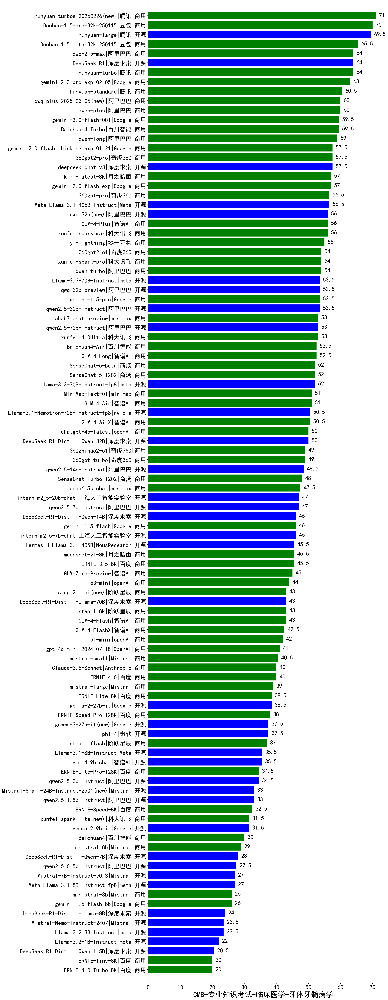

| 类别 | 大模型                         | CMB-专业知识考试-临床医学-牙体牙髓病学 | 排名 |
|-----|------------------------------|---------|----|
|商用|ERNIE-4.5-8K-Preview(new)|81.0|1|
|商用|hunyuan-turbos-20250226(new)|71.0|2|
|商用|Doubao-1.5-pro-32k-250115|70.0|3|
|开源|hunyuan-large|69.5|4|
|商用|Doubao-1.5-lite-32k-250115|65.5|5|
|商用|hunyuan-turbos-20250313(new)|65.0|6|
|开源|DeepSeek-R1|64.0|7|
|商用|qwen2.5-max|64.0|8|
|商用|hunyuan-turbo|64.0|9|
|商用|gemini-2.0-pro-exp-02-05|63.0|10|
|商用|hunyuan-standard|60.5|11|
|商用|qwen-plus|60.0|12|
|商用|qwq-plus-2025-03-05(new)|60.0|13|
|商用|Baichuan4-Turbo|59.5|14|
|商用|gemini-2.0-flash-001|59.5|15|
|商用|qwen-long|59.0|16|
|商用|360gpt2-pro|57.5|17|
|开源|deepseek-chat-v3|57.5|18|
|商用|gemini-2.0-flash-thinking-exp-01-21|57.5|19|
|商用|kimi-latest-8k|57.0|20|
|商用|gemini-2.0-flash-exp|57.0|21|
|商用|360gpt-pro|56.5|22|
|开源|Meta-Llama-3.1-405B-Instruct|56.5|23|
|商用|xunfei-spark-max|56.0|24|
|商用|GLM-4-Plus|56.0|25|
|开源|qwq-32b(new)|56.0|26|
|商用|yi-lightning|55.0|27|
|商用|360gpt2-o1|54.0|28|
|商用|qwen-turbo|54.0|29|
|商用|xunfei-spark-pro|54.0|30|
|开源|qwen2.5-32b-instruct|53.5|31|
|商用|gemini-1.5-pro|53.5|32|
|开源|qwq-32b-preview|53.5|33|
|开源|Llama-3.3-70B-Instruct|53.5|34|
|商用|abab7-chat-preview|53.0|35|
|商用|xunfei-4.0Ultra|53.0|36|
|开源|qwen2.5-72b-instruct|53.0|37|
|商用|Baichuan4-Air|52.5|38|
|商用|GLM-4-Long|52.5|39|
|开源|Llama-3.3-70B-Instruct-fp8|52.0|40|
|商用|SenseChat-5-beta|52.0|41|
|商用|SenseChat-5-1202|52.0|42|
|开源|MiniMax-Text-01|51.0|43|
|商用|GLM-4-Air|51.0|44|
|开源|Llama-3.1-Nemotron-70B-Instruct-fp8|50.5|45|
|商用|GLM-4-AirX|50.5|46|
|开源|DeepSeek-R1-Distill-Qwen-32B|50.0|47|
|商用|chatgpt-4o-latest|50.0|48|
|商用|360zhinao2-o1|49.0|49|
|商用|360gpt-turbo|49.0|50|
|开源|qwen2.5-14b-instruct|48.5|51|
|商用|SenseChat-Turbo-1202|48.0|52|
|商用|abab6.5s-chat|47.5|53|
|开源|qwen2.5-7b-instruct|47.0|54|
|开源|internlm2_5-20b-chat|47.0|55|
|商用|gemini-1.5-flash|46.0|56|
|开源|DeepSeek-R1-Distill-Qwen-14B|46.0|57|
|开源|internlm2_5-7b-chat|46.0|58|
|商用|ERNIE-3.5-8K|45.5|59|
|商用|moonshot-v1-8k|45.5|60|
|开源|Hermes-3-Llama-3.1-405B|45.5|61|
|商用|GLM-Zero-Preview|45.0|62|
|商用|o3-mini|44.0|63|
|开源|DeepSeek-R1-Distill-Llama-70B|43.0|64|
|商用|step-2-mini(new)|43.0|65|
|商用|step-1-8k|43.0|66|
|商用|GLM-4-Flash|43.0|67|
|商用|GLM-4-FlashX|42.5|68|
|商用|o1-mini|42.0|69|
|商用|gpt-4o-mini-2024-07-18|41.0|70|
|商用|mistral-small|40.5|71|
|商用|Claude-3.5-Sonnet|40.0|72|
|商用|ERNIE-4.0|40.0|73|
|商用|mistral-large|39.0|74|
|开源|gemma-2-27b-it|38.5|75|
|商用|ERNIE-Lite-8K|38.5|76|
|商用|ERNIE-Speed-Pro-128K|38.0|77|
|开源|gemma-3-27b-it(new)|37.5|78|
|开源|phi-4|37.5|79|
|商用|step-1-flash|37.0|80|
|开源|glm-4-9b-chat|35.5|81|
|开源|Llama-3.1-8B-Instruct|35.5|82|
|开源|gemma-3-12b-it(new)|35.0|83|
|开源|qwen2.5-3b-instruct|34.5|84|
|商用|ERNIE-Lite-Pro-128K|34.5|85|
|开源|Mistral-Small-24B-Instruct-2501(new)|33.0|86|
|开源|qwen2.5-1.5b-instruct|33.0|87|
|商用|ERNIE-Speed-8K|32.5|88|
|开源|gemma-2-9b-it|31.5|89|
|商用|xunfei-spark-lite(new)|31.5|90|
|商用|Baichuan4|30.0|91|
|商用|ministral-8b|29.0|92|
|开源|DeepSeek-R1-Distill-Qwen-7B|28.0|93|
|开源|qwen2.5-0.5b-instruct|27.5|94|
|开源|Meta-Llama-3.1-8B-Instruct-fp8|27.0|95|
|开源|Mistral-7B-Instruct-v0.3|27.0|96|
|商用|gemini-1.5-flash-8b|26.0|97|
|商用|ministral-3b|26.0|98|
|开源|gemma-3-4b-it(new)|24.5|99|
|开源|DeepSeek-R1-Distill-Llama-8B|24.0|100|
|开源|Llama-3.2-3B-Instruct|23.5|101|
|开源|Mistral-Nemo-Instruct-2407|23.5|102|
|开源|Llama-3.2-1B-Instruct|22.0|103|
|开源|DeepSeek-R1-Distill-Qwen-1.5B|20.5|104|
|商用|ERNIE-Tiny-8K|20.0|105|
|商用|ERNIE-4.0-Turbo-8K|20.0|106|
|开源|gemma-3-1b-it(new)|16.5|107|
|开源|qwen2.5-math-72b-instruct|/|108|

