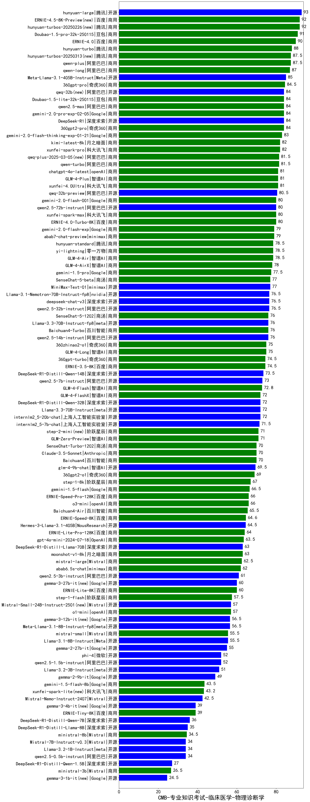

| 类别 | 大模型                         | CMB-专业知识考试-临床医学-物理诊断学 | 排名 |
|-----|------------------------------|---------|----|
|开源|hunyuan-large|93.0|1|
|商用|hunyuan-turbos-20250226(new)|92.0|2|
|商用|ERNIE-4.5-8K-Preview(new)|92.0|3|
|商用|Doubao-1.5-pro-32k-250115|91.0|4|
|商用|ERNIE-4.0|90.0|5|
|商用|hunyuan-turbo|88.0|6|
|商用|hunyuan-turbos-20250313(new)|87.5|7|
|商用|qwen-plus|87.5|8|
|商用|qwen-long|87.0|9|
|开源|Meta-Llama-3.1-405B-Instruct|85.0|10|
|商用|360gpt-pro|84.5|11|
|商用|360gpt2-pro|84.0|12|
|商用|gemini-2.0-pro-exp-02-05|84.0|13|
|开源|DeepSeek-R1|84.0|14|
|商用|Doubao-1.5-lite-32k-250115|84.0|15|
|开源|qwq-32b(new)|84.0|16|
|商用|qwen2.5-max|84.0|17|
|商用|gemini-2.0-flash-thinking-exp-01-21|83.0|18|
|商用|xunfei-spark-pro|82.0|19|
|商用|kimi-latest-8k|82.0|20|
|商用|qwq-plus-2025-03-05(new)|81.5|21|
|商用|qwen-turbo|81.5|22|
|商用|xunfei-4.0Ultra|81.0|23|
|商用|chatgpt-4o-latest|81.0|24|
|商用|GLM-4-Plus|81.0|25|
|开源|qwq-32b-preview|80.5|26|
|开源|qwen2.5-72b-instruct|80.0|27|
|商用|ERNIE-4.0-Turbo-8K|80.0|28|
|商用|gemini-2.0-flash-001|80.0|29|
|商用|xunfei-spark-max|80.0|30|
|商用|abab7-chat-preview|79.0|31|
|商用|gemini-2.0-flash-exp|79.0|32|
|商用|hunyuan-standard|78.5|33|
|商用|GLM-4-Air|78.5|34|
|商用|yi-lightning|78.5|35|
|商用|GLM-4-AirX|78.0|36|
|商用|gemini-1.5-pro|77.5|37|
|商用|SenseChat-5-beta|77.0|38|
|开源|MiniMax-Text-01|77.0|39|
|开源|deepseek-chat-v3|76.5|40|
|开源|Llama-3.1-Nemotron-70B-Instruct-fp8|76.5|41|
|开源|qwen2.5-32b-instruct|76.5|42|
|开源|qwen2.5-14b-instruct|76.0|43|
|商用|SenseChat-5-1202|76.0|44|
|开源|Llama-3.3-70B-Instruct-fp8|76.0|45|
|商用|Baichuan4-Turbo|76.0|46|
|商用|GLM-4-Long|75.0|47|
|商用|360zhinao2-o1|75.0|48|
|商用|360gpt-turbo|74.5|49|
|商用|ERNIE-3.5-8K|74.5|50|
|开源|DeepSeek-R1-Distill-Qwen-14B|73.5|51|
|开源|qwen2.5-7b-instruct|73.0|52|
|商用|GLM-4-Flash|72.8|53|
|开源|internlm2_5-20b-chat|72.0|54|
|开源|Llama-3.3-70B-Instruct|72.0|55|
|开源|DeepSeek-R1-Distill-Qwen-32B|72.0|56|
|商用|GLM-4-FlashX|72.0|57|
|开源|internlm2_5-7b-chat|71.5|58|
|商用|step-2-mini(new)|71.0|59|
|商用|GLM-Zero-Preview|71.0|60|
|商用|Baichuan4|70.0|61|
|商用|Claude-3.5-Sonnet|70.0|62|
|商用|SenseChat-Turbo-1202|70.0|63|
|开源|glm-4-9b-chat|69.5|64|
|商用|360gpt2-o1|69.0|65|
|商用|step-1-8k|67.0|66|
|商用|gemini-1.5-flash|66.5|67|
|商用|ERNIE-Speed-Pro-128K|66.0|68|
|商用|o3-mini|66.0|69|
|商用|Baichuan4-Air|65.5|70|
|商用|ERNIE-Speed-8K|64.6|71|
|开源|Hermes-3-Llama-3.1-405B|64.5|72|
|商用|ERNIE-Lite-Pro-128K|64.0|73|
|商用|gpt-4o-mini-2024-07-18|63.5|74|
|商用|moonshot-v1-8k|63.0|75|
|开源|DeepSeek-R1-Distill-Llama-70B|63.0|76|
|商用|mistral-large|62.5|77|
|商用|abab6.5s-chat|62.0|78|
|开源|qwen2.5-3b-instruct|61.0|79|
|开源|gemma-3-27b-it(new)|60.0|80|
|商用|ERNIE-Lite-8K|60.0|81|
|商用|step-1-flash|57.5|82|
|开源|Mistral-Small-24B-Instruct-2501(new)|57.0|83|
|商用|o1-mini|57.0|84|
|开源|Meta-Llama-3.1-8B-Instruct-fp8|56.5|85|
|开源|gemma-3-12b-it(new)|56.5|86|
|商用|mistral-small|55.5|87|
|开源|Llama-3.1-8B-Instruct|55.5|88|
|开源|gemma-2-27b-it|55.0|89|
|开源|phi-4|52.0|90|
|开源|qwen2.5-1.5b-instruct|52.0|91|
|开源|Llama-3.2-3B-Instruct|51.0|92|
|开源|gemma-2-9b-it|49.0|93|
|商用|gemini-1.5-flash-8b|43.5|94|
|商用|xunfei-spark-lite(new)|43.2|95|
|开源|Mistral-Nemo-Instruct-2407|42.5|96|
|开源|gemma-3-4b-it(new)|39.0|97|
|商用|ERNIE-Tiny-8K|39.0|98|
|开源|DeepSeek-R1-Distill-Qwen-7B|36.0|99|
|开源|DeepSeek-R1-Distill-Llama-8B|35.0|100|
|商用|ministral-8b|34.5|101|
|开源|qwen2.5-0.5b-instruct|34.0|102|
|开源|Llama-3.2-1B-Instruct|34.0|103|
|开源|Mistral-7B-Instruct-v0.3|34.0|104|
|开源|DeepSeek-R1-Distill-Qwen-1.5B|27.0|105|
|商用|ministral-3b|26.5|106|
|开源|gemma-3-1b-it(new)|24.5|107|
|开源|qwen2.5-math-72b-instruct|/|108|

