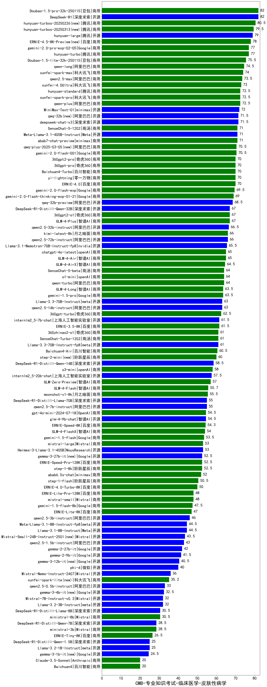

| 类别 | 大模型                         | CMB-专业知识考试-临床医学-皮肤性病学 | 排名 |
|-----|------------------------------|---------|----|
|商用|Doubao-1.5-pro-32k-250115|82.0|1|
|开源|DeepSeek-R1|82.0|2|
|商用|hunyuan-turbos-20250226(new)|80.5|3|
|开源|hunyuan-large|79.0|4|
|商用|hunyuan-turbo|77.0|5|
|商用|gemini-2.0-pro-exp-02-05|77.0|6|
|商用|Doubao-1.5-lite-32k-250115|75.5|7|
|商用|qwen-long|74.5|8|
|商用|xunfei-spark-max|74.0|9|
|商用|qwen2.5-max|73.5|10|
|商用|xunfei-4.0Ultra|73.0|11|
|商用|qwen-plus|72.5|12|
|商用|xunfei-spark-pro|72.5|13|
|商用|hunyuan-standard|72.5|14|
|商用|MiniMax-Text-01|72.0|15|
|开源|qwq-32b(new)|71.5|16|
|开源|deepseek-chat-v3|71.5|17|
|商用|abab7-chat-preview|71.0|18|
|开源|Meta-Llama-3.1-405B-Instruct|71.0|19|
|商用|SenseChat-5-1202|71.0|20|
|商用|gemini-2.0-flash-001|70.5|21|
|商用|qwq-plus-2025-03-05(new)|70.5|22|
|商用|yi-lightning|70.0|23|
|商用|ERNIE-4.0|70.0|24|
|商用|360gpt-pro|70.0|25|
|商用|Baichuan4-Turbo|70.0|26|
|商用|360gpt2-pro|70.0|27|
|商用|gemini-2.0-flash-exp|69.5|28|
|商用|gemini-2.0-flash-thinking-exp-01-21|69.0|29|
|开源|qwq-32b-preview|68.5|30|
|商用|360gpt2-o1|67.0|31|
|开源|DeepSeek-R1-Distill-Qwen-32B|67.0|32|
|商用|GLM-4-Plus|67.0|33|
|开源|qwen2.5-32b-instruct|66.5|34|
|开源|qwen2.5-72b-instruct|66.0|35|
|商用|kimi-latest-8k|66.0|36|
|开源|Llama-3.1-Nemotron-70B-Instruct-fp8|65.5|37|
|商用|GLM-4-Air|65.0|38|
|商用|chatgpt-4o-latest|65.0|39|
|商用|GLM-4-AirX|64.5|40|
|商用|qwen-turbo|64.0|41|
|商用|SenseChat-5-beta|64.0|42|
|商用|o1-mini|64.0|43|
|商用|gemini-1.5-pro|63.5|44|
|商用|GLM-4-Long|63.5|45|
|开源|qwen2.5-14b-instruct|63.0|46|
|开源|Llama-3.3-70B-Instruct|63.0|47|
|商用|360gpt-turbo|62.5|48|
|开源|internlm2_5-7b-chat|61.5|49|
|商用|ERNIE-3.5-8K|61.5|50|
|商用|360zhinao2-o1|61.0|51|
|商用|SenseChat-Turbo-1202|61.0|52|
|开源|Llama-3.3-70B-Instruct-fp8|61.0|53|
|商用|Baichuan4-Air|60.5|54|
|商用|step-2-mini(new)|60.0|55|
|开源|DeepSeek-R1-Distill-Qwen-14B|58.5|56|
|商用|o3-mini|58.0|57|
|开源|internlm2_5-20b-chat|57.5|58|
|商用|GLM-Zero-Preview|57.0|59|
|商用|GLM-4-Flash|55.7|60|
|商用|moonshot-v1-8k|55.5|61|
|开源|qwen2.5-7b-instruct|55.0|62|
|开源|DeepSeek-R1-Distill-Llama-70B|55.0|63|
|商用|gpt-4o-mini-2024-07-18|54.5|64|
|开源|glm-4-9b-chat|54.5|65|
|商用|ERNIE-Speed-8K|54.3|66|
|商用|GLM-4-FlashX|54.0|67|
|商用|gemini-1.5-flash|53.5|68|
|商用|mistral-large|53.0|69|
|开源|Hermes-3-Llama-3.1-405B|53.0|70|
|开源|gemma-3-27b-it(new)|52.5|71|
|商用|ERNIE-Speed-Pro-128K|52.5|72|
|商用|step-1-8k|52.5|73|
|商用|abab6.5s-chat|52.0|74|
|商用|step-1-flash|50.5|75|
|商用|ERNIE-4.0-Turbo-8K|50.0|76|
|商用|ERNIE-Lite-Pro-128K|48.0|77|
|商用|mistral-small|48.0|78|
|商用|gemini-1.5-flash-8b|47.5|79|
|商用|ERNIE-Lite-8K|47.0|80|
|开源|qwen2.5-3b-instruct|46.0|81|
|开源|Llama-3.1-8B-Instruct|44.5|82|
|开源|Meta-Llama-3.1-8B-Instruct-fp8|44.5|83|
|开源|Mistral-Small-24B-Instruct-2501(new)|43.5|84|
|开源|qwen2.5-1.5b-instruct|43.0|85|
|开源|gemma-2-27b-it|42.0|86|
|开源|gemma-2-9b-it|41.5|87|
|开源|phi-4|40.0|88|
|开源|Mistral-Nemo-Instruct-2407|36.0|89|
|商用|xunfei-spark-lite(new)|35.2|90|
|开源|qwen2.5-0.5b-instruct|33.0|91|
|开源|Mistral-7B-Instruct-v0.3|32.0|92|
|开源|Llama-3.2-3B-Instruct|32.0|93|
|开源|DeepSeek-R1-Distill-Llama-8B|30.5|94|
|商用|ministral-8b|30.5|95|
|商用|ministral-3b|28.5|96|
|开源|DeepSeek-R1-Distill-Qwen-7B|28.5|97|
|商用|ERNIE-Tiny-8K|26.5|98|
|开源|DeepSeek-R1-Distill-Qwen-1.5B|25.0|99|
|开源|Llama-3.2-1B-Instruct|25.0|100|
|商用|Baichuan4|20.0|101|
|商用|Claude-3.5-Sonnet|20.0|102|
|开源|Yi-1.5-34B-Chat|/|103|
|开源|Yi-1.5-9B-Chat|/|104|
|开源|qwen2.5-math-72b-instruct|/|105|

