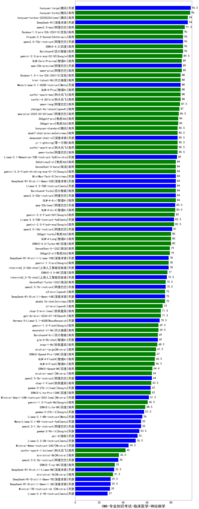

| 类别 | 大模型                         | CMB-专业知识考试-临床医学-神经病学 | 排名 |
|-----|------------------------------|---------|----|
|开源|hunyuan-large|96.5|1|
|商用|hunyuan-turbo|96.0|2|
|商用|ERNIE-4.5-8K-Preview(new)|94.0|3|
|商用|hunyuan-turbos-20250226(new)|94.0|4|
|开源|DeepSeek-R1|94.0|5|
|商用|qwen2.5-max|91.5|6|
|商用|Claude-3.5-Sonnet|90.0|7|
|开源|qwen2.5-72b-instruct|90.0|8|
|商用|Baichuan4|90.0|9|
|商用|Doubao-1.5-pro-32k-250115|90.0|10|
|商用|ERNIE-4.0|90.0|11|
|商用|gemini-2.0-pro-exp-02-05|89.5|12|
|商用|qwen-plus|89.0|13|
|开源|qwq-32b-preview|89.0|14|
|商用|GLM-Zero-Preview|89.0|15|
|商用|hunyuan-turbos-20250313(new)|89.0|16|
|商用|xunfei-spark-max|88.0|17|
|开源|Meta-Llama-3.1-405B-Instruct|88.0|18|
|商用|GLM-4-Plus|88.0|19|
|商用|xunfei-4.0Ultra|88.0|20|
|商用|Doubao-1.5-lite-32k-250115|88.0|21|
|商用|kimi-latest-8k|88.0|22|
|商用|qwen-long|87.5|23|
|商用|chatgpt-4o-latest|87.0|24|
|商用|qwq-plus-2025-03-05(new)|86.5|25|
|商用|360gpt-pro|86.0|26|
|商用|360gpt2-pro|86.0|27|
|开源|deepseek-chat-v3|85.5|28|
|商用|yi-lightning|85.5|29|
|商用|qwen-turbo|85.5|30|
|商用|hunyuan-standard|85.5|31|
|商用|abab7-chat-preview|85.5|32|
|商用|xunfei-spark-pro|85.5|33|
|开源|Llama-3.1-Nemotron-70B-Instruct-fp8|85.0|34|
|商用|Baichuan4-Turbo|84.0|35|
|商用|GLM-4-Air|84.0|36|
|开源|qwen2.5-32b-instruct|84.0|37|
|商用|360zhinao2-o1|84.0|38|
|商用|gemini-2.0-flash-thinking-exp-01-21|84.0|39|
|商用|SenseChat-5-beta|84.0|40|
|开源|DeepSeek-R1-Distill-Qwen-32B|84.0|41|
|开源|Llama-3.3-70B-Instruct|84.0|42|
|开源|MiniMax-Text-01|84.0|43|
|开源|qwq-32b(new)|83.5|44|
|商用|GLM-4-AirX|83.5|45|
|商用|gemini-2.0-flash-001|83.0|46|
|开源|Llama-3.3-70B-Instruct-fp8|82.5|47|
|商用|gemini-2.0-flash-exp|82.5|48|
|开源|qwen2.5-14b-instruct|81.0|49|
|商用|360gpt-turbo|80.0|50|
|商用|GLM-4-Long|80.0|51|
|商用|ERNIE-4.0-Turbo-8K|80.0|52|
|商用|SenseChat-5-1202|79.0|53|
|商用|360gpt2-o1|79.0|54|
|商用|gemini-1.5-pro|78.0|55|
|开源|DeepSeek-R1-Distill-Llama-70B|78.0|56|
|开源|internlm2_5-20b-chat|78.0|57|
|商用|ERNIE-3.5-8K|77.0|58|
|开源|internlm2_5-7b-chat|76.5|59|
|开源|qwen2.5-7b-instruct|75.5|60|
|商用|SenseChat-Turbo-1202|75.5|61|
|商用|abab6.5s-chat|75.0|62|
|商用|o3-mini|75.0|63|
|开源|DeepSeek-R1-Distill-Qwen-14B|75.0|64|
|商用|o1-mini|73.0|65|
|商用|step-2-mini(new)|71.5|66|
|商用|gpt-4o-mini-2024-07-18|71.5|67|
|开源|Hermes-3-Llama-3.1-405B|70.5|68|
|商用|gemini-1.5-flash|69.5|69|
|商用|moonshot-v1-8k|69.5|70|
|商用|Baichuan4-Air|69.0|71|
|开源|glm-4-9b-chat|69.0|72|
|商用|step-1-8k|68.5|73|
|商用|mistral-large|67.5|74|
|商用|ERNIE-Speed-Pro-128K|67.0|75|
|商用|GLM-4-FlashX|66.5|76|
|商用|GLM-4-Flash|66.3|77|
|商用|ERNIE-Speed-8K|64.4|78|
|开源|qwen2.5-3b-instruct|64.0|79|
|商用|mistral-small|64.0|80|
|商用|step-1-flash|63.5|81|
|商用|ERNIE-Lite-Pro-128K|63.0|82|
|开源|gemma-3-27b-it(new)|63.0|83|
|开源|Mistral-Small-24B-Instruct-2501(new)|61.5|84|
|商用|gemini-1.5-flash-8b|60.5|85|
|商用|ERNIE-Lite-8K|58.5|86|
|开源|gemma-2-27b-it|57.5|87|
|开源|Llama-3.1-8B-Instruct|56.0|88|
|开源|Meta-Llama-3.1-8B-Instruct-fp8|55.0|89|
|开源|qwen2.5-1.5b-instruct|55.0|90|
|开源|gemma-2-9b-it|53.5|91|
|开源|phi-4|52.0|92|
|开源|Llama-3.2-3B-Instruct|50.5|93|
|开源|gemma-3-12b-it(new)|50.0|94|
|开源|Mistral-Nemo-Instruct-2407|44.5|95|
|商用|xunfei-spark-lite(new)|42.0|96|
|开源|gemma-3-4b-it(new)|37.0|97|
|商用|ministral-8b|36.5|98|
|开源|qwen2.5-0.5b-instruct|36.0|99|
|商用|ERNIE-Tiny-8K|33.0|100|
|开源|DeepSeek-R1-Distill-Llama-8B|32.5|101|
|商用|ministral-3b|31.5|102|
|开源|DeepSeek-R1-Distill-Qwen-1.5B|29.5|103|
|开源|DeepSeek-R1-Distill-Qwen-7B|29.5|104|
|开源|Mistral-7B-Instruct-v0.3|29.0|105|
|开源|Llama-3.2-1B-Instruct|27.0|106|
|开源|gemma-3-1b-it(new)|27.0|107|
|开源|qwen2.5-math-72b-instruct|/|108|
|开源|Yi-1.5-34B-Chat|/|109|
|开源|Yi-1.5-9B-Chat|/|110|

