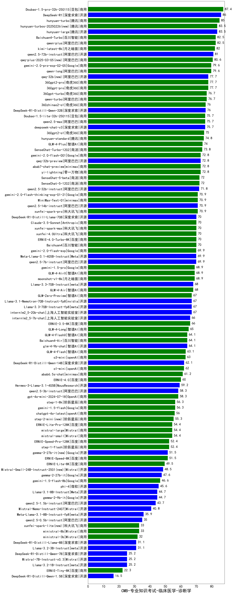

| 类别 | 大模型                         | CMB-专业知识考试-临床医学-诊断学 | 排名 |
|-----|------------------------------|---------|----|
|商用|Doubao-1.5-pro-32k-250115|87.4|1|
|开源|DeepSeek-R1|86.0|2|
|商用|hunyuan-turbo|85.0|3|
|开源|hunyuan-large|83.5|4|
|商用|hunyuan-turbos-20250226(new)|83.5|5|
|商用|Baichuan4-Turbo|82.5|6|
|商用|qwen-plus|82.5|7|
|商用|kimi-latest-8k|82.0|8|
|开源|qwen2.5-72b-instruct|81.0|9|
|商用|qwq-plus-2025-03-05(new)|80.6|10|
|商用|gemini-2.0-pro-exp-02-05|79.6|11|
|商用|qwen-long|79.6|12|
|商用|360gpt2-pro|77.7|13|
|开源|qwq-32b(new)|77.7|14|
|商用|360gpt-pro|77.7|15|
|商用|qwen-turbo|76.7|16|
|商用|360gpt-turbo|76.7|17|
|开源|DeepSeek-R1-Distill-Qwen-32B|76.0|18|
|商用|360zhinao2-o1|76.0|19|
|商用|Doubao-1.5-lite-32k-250115|75.7|20|
|商用|qwen2.5-max|75.7|21|
|开源|deepseek-chat-v3|75.7|22|
|商用|360gpt2-o1|75.0|23|
|商用|hunyuan-standard|74.8|24|
|商用|GLM-4-Plus|74.0|25|
|商用|SenseChat-Turbo-1202|73.8|26|
|商用|yi-lightning|72.8|27|
|开源|qwq-32b-preview|72.8|28|
|商用|abab7-chat-preview|72.8|29|
|商用|gemini-2.0-flash-001|72.8|30|
|商用|SenseChat-5-1202|72.0|31|
|商用|SenseChat-5-beta|72.0|32|
|开源|qwen2.5-32b-instruct|71.8|33|
|开源|qwen2.5-14b-instruct|70.9|34|
|商用|gemini-2.0-flash-thinking-exp-01-21|70.9|35|
|商用|MiniMax-Text-01|70.9|36|
|商用|xunfei-spark-pro|70.9|37|
|商用|xunfei-spark-max|70.0|38|
|商用|Baichuan4|70.0|39|
|商用|xunfei-4.0Ultra|70.0|40|
|商用|ERNIE-4.0-Turbo-8K|70.0|41|
|开源|DeepSeek-R1-Distill-Llama-70B|70.0|42|
|商用|Claude-3.5-Sonnet|70.0|43|
|开源|Meta-Llama-3.1-405B-Instruct|69.9|44|
|商用|gemini-2.0-flash-exp|69.9|45|
|开源|qwen2.5-7b-instruct|69.9|46|
|商用|GLM-4-AirX|68.9|47|
|商用|moonshot-v1-8k|68.9|48|
|商用|gemini-1.5-pro|68.9|49|
|商用|GLM-4-Air|68.0|50|
|开源|Llama-3.3-70B-Instruct|68.0|51|
|开源|Llama-3.3-70B-Instruct-fp8|67.0|52|
|开源|internlm2_5-20b-chat|67.0|53|
|开源|Llama-3.1-Nemotron-70B-Instruct-fp8|67.0|54|
|商用|GLM-Zero-Preview|67.0|55|
|商用|ERNIE-3.5-8K|66.0|56|
|开源|internlm2_5-7b-chat|66.0|57|
|商用|GLM-4-Long|65.0|58|
|开源|glm-4-9b-chat|64.1|59|
|商用|GLM-4-FlashX|64.1|60|
|商用|Baichuan4-Air|64.1|61|
|商用|GLM-4-Flash|63.1|62|
|商用|o3-mini|63.0|63|
|开源|DeepSeek-R1-Distill-Qwen-14B|62.1|64|
|商用|o1-mini|62.0|65|
|商用|abab6.5s-chat|61.2|66|
|商用|ERNIE-4.0|60.0|67|
|开源|Hermes-3-Llama-3.1-405B|59.2|68|
|商用|gpt-4o-mini-2024-07-18|58.3|69|
|开源|qwen2.5-3b-instruct|58.3|70|
|商用|step-1-8k|56.3|71|
|商用|gemini-1.5-flash|56.3|72|
|商用|chatgpt-4o-latest|56.0|73|
|商用|step-2-mini(new)|55.3|74|
|商用|mistral-small|54.4|75|
|商用|mistral-large|54.4|76|
|商用|ERNIE-Lite-Pro-128K|54.4|77|
|商用|step-1-flash|52.4|78|
|商用|ERNIE-Speed-Pro-128K|52.4|79|
|商用|ERNIE-Speed-8K|51.5|80|
|开源|gemma-3-27b-it(new)|51.5|81|
|商用|ERNIE-Lite-8K|49.5|82|
|开源|Mistral-Small-24B-Instruct-2501(new)|48.5|83|
|开源|gemma-2-27b-it|47.6|84|
|商用|gemini-1.5-flash-8b|46.6|85|
|开源|phi-4|45.6|86|
|开源|Llama-3.1-8B-Instruct|44.7|87|
|开源|gemma-2-9b-it|44.7|88|
|开源|qwen2.5-1.5b-instruct|43.7|89|
|开源|Mistral-Nemo-Instruct-2407|40.8|90|
|开源|Meta-Llama-3.1-8B-Instruct-fp8|35.9|91|
|开源|qwen2.5-0.5b-instruct|35.0|92|
|商用|ministral-8b|33.0|93|
|商用|xunfei-spark-lite(new)|33.0|94|
|商用|ministral-3b|32.0|95|
|开源|Llama-3.2-3B-Instruct|31.1|96|
|开源|DeepSeek-R1-Distill-Llama-8B|31.1|97|
|开源|Llama-3.2-1B-Instruct|25.2|98|
|开源|DeepSeek-R1-Distill-Qwen-7B|25.2|99|
|开源|Mistral-7B-Instruct-v0.3|25.2|100|
|商用|ERNIE-Tiny-8K|22.3|101|
|开源|DeepSeek-R1-Distill-Qwen-1.5B|16.5|102|
|开源|Yi-1.5-34B-Chat|/|103|
|开源|Yi-1.5-9B-Chat|/|104|
|开源|qwen2.5-math-72b-instruct|/|105|

