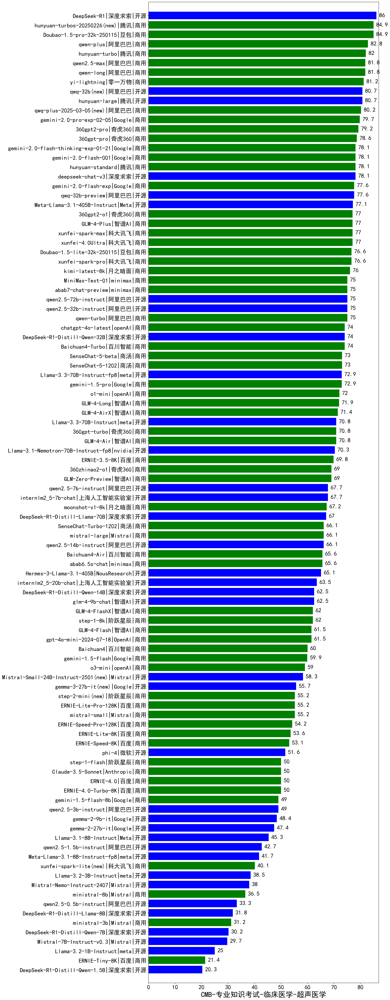

| 类别 | 大模型                         | CMB-专业知识考试-临床医学-超声医学 | 排名 |
|-----|------------------------------|---------|----|
|商用|ERNIE-4.5-8K-Preview(new)|89.0|1|
|开源|DeepSeek-R1|86.0|2|
|商用|hunyuan-turbos-20250226(new)|84.9|3|
|商用|Doubao-1.5-pro-32k-250115|84.9|4|
|商用|hunyuan-turbos-20250313(new)|84.4|5|
|商用|qwen-plus|82.8|6|
|商用|hunyuan-turbo|82.0|7|
|商用|qwen2.5-max|81.8|8|
|商用|qwen-long|81.8|9|
|商用|yi-lightning|81.2|10|
|开源|hunyuan-large|80.7|11|
|开源|qwq-32b(new)|80.7|12|
|商用|qwq-plus-2025-03-05(new)|80.2|13|
|商用|gemini-2.0-pro-exp-02-05|79.7|14|
|商用|360gpt2-pro|79.2|15|
|商用|360gpt-pro|78.6|16|
|商用|gemini-2.0-flash-thinking-exp-01-21|78.1|17|
|开源|deepseek-chat-v3|78.1|18|
|商用|hunyuan-standard|78.1|19|
|商用|gemini-2.0-flash-001|78.1|20|
|商用|gemini-2.0-flash-exp|77.6|21|
|开源|qwq-32b-preview|77.6|22|
|开源|Meta-Llama-3.1-405B-Instruct|77.1|23|
|商用|360gpt2-o1|77.0|24|
|商用|xunfei-4.0Ultra|77.0|25|
|商用|xunfei-spark-max|77.0|26|
|商用|GLM-4-Plus|77.0|27|
|商用|xunfei-spark-pro|76.6|28|
|商用|Doubao-1.5-lite-32k-250115|76.6|29|
|商用|kimi-latest-8k|76.0|30|
|开源|qwen2.5-72b-instruct|75.0|31|
|商用|qwen-turbo|75.0|32|
|商用|abab7-chat-preview|75.0|33|
|开源|qwen2.5-32b-instruct|75.0|34|
|开源|MiniMax-Text-01|75.0|35|
|商用|chatgpt-4o-latest|74.0|36|
|开源|DeepSeek-R1-Distill-Qwen-32B|74.0|37|
|商用|Baichuan4-Turbo|74.0|38|
|商用|SenseChat-5-1202|73.0|39|
|商用|SenseChat-5-beta|73.0|40|
|开源|Llama-3.3-70B-Instruct-fp8|72.9|41|
|商用|gemini-1.5-pro|72.9|42|
|商用|o1-mini|72.0|43|
|商用|GLM-4-Long|71.9|44|
|商用|GLM-4-AirX|71.4|45|
|开源|Llama-3.3-70B-Instruct|70.8|46|
|商用|360gpt-turbo|70.8|47|
|商用|GLM-4-Air|70.8|48|
|开源|Llama-3.1-Nemotron-70B-Instruct-fp8|70.3|49|
|商用|ERNIE-3.5-8K|69.8|50|
|商用|GLM-Zero-Preview|69.0|51|
|商用|360zhinao2-o1|69.0|52|
|开源|internlm2_5-7b-chat|67.7|53|
|开源|qwen2.5-7b-instruct|67.7|54|
|商用|moonshot-v1-8k|67.2|55|
|开源|DeepSeek-R1-Distill-Llama-70B|67.0|56|
|商用|SenseChat-Turbo-1202|66.1|57|
|商用|mistral-large|66.1|58|
|开源|qwen2.5-14b-instruct|66.1|59|
|商用|Baichuan4-Air|65.6|60|
|商用|abab6.5s-chat|65.6|61|
|开源|Hermes-3-Llama-3.1-405B|65.1|62|
|开源|internlm2_5-20b-chat|63.5|63|
|开源|DeepSeek-R1-Distill-Qwen-14B|62.5|64|
|开源|glm-4-9b-chat|62.5|65|
|商用|step-1-8k|62.0|66|
|商用|GLM-4-FlashX|62.0|67|
|商用|gpt-4o-mini-2024-07-18|61.5|68|
|商用|GLM-4-Flash|61.5|69|
|商用|Baichuan4|60.0|70|
|商用|gemini-1.5-flash|59.9|71|
|商用|o3-mini|59.0|72|
|开源|Mistral-Small-24B-Instruct-2501(new)|58.3|73|
|开源|gemma-3-27b-it(new)|55.7|74|
|商用|step-2-mini(new)|55.2|75|
|商用|mistral-small|55.2|76|
|商用|ERNIE-Lite-Pro-128K|55.2|77|
|商用|ERNIE-Speed-Pro-128K|54.2|78|
|商用|ERNIE-Lite-8K|53.6|79|
|商用|ERNIE-Speed-8K|53.1|80|
|开源|phi-4|51.6|81|
|商用|ERNIE-4.0|50.0|82|
|商用|ERNIE-4.0-Turbo-8K|50.0|83|
|商用|Claude-3.5-Sonnet|50.0|84|
|商用|step-1-flash|50.0|85|
|开源|gemma-3-12b-it(new)|49.5|86|
|开源|qwen2.5-3b-instruct|49.0|87|
|商用|gemini-1.5-flash-8b|49.0|88|
|开源|gemma-2-9b-it|48.4|89|
|开源|gemma-2-27b-it|47.4|90|
|开源|Llama-3.1-8B-Instruct|45.3|91|
|开源|qwen2.5-1.5b-instruct|42.7|92|
|开源|Meta-Llama-3.1-8B-Instruct-fp8|41.7|93|
|商用|xunfei-spark-lite(new)|40.1|94|
|开源|gemma-3-4b-it(new)|39.1|95|
|开源|Llama-3.2-3B-Instruct|38.5|96|
|开源|Mistral-Nemo-Instruct-2407|38.0|97|
|商用|ministral-8b|36.5|98|
|开源|qwen2.5-0.5b-instruct|33.3|99|
|开源|DeepSeek-R1-Distill-Llama-8B|31.8|100|
|商用|ministral-3b|31.2|101|
|开源|DeepSeek-R1-Distill-Qwen-7B|30.2|102|
|开源|Mistral-7B-Instruct-v0.3|29.7|103|
|开源|Llama-3.2-1B-Instruct|25.0|104|
|商用|ERNIE-Tiny-8K|21.4|105|
|开源|DeepSeek-R1-Distill-Qwen-1.5B|20.3|106|
|开源|gemma-3-1b-it(new)|17.7|107|
|开源|qwen2.5-math-72b-instruct|/|108|

