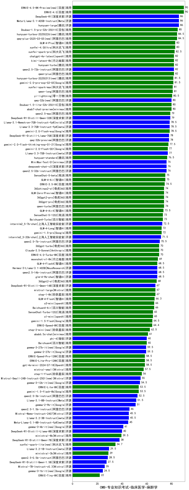

| 类别 | 大模型                         | CMB-专业知识考试-临床医学-麻醉学 | 排名 |
|-----|------------------------------|---------|----|
|商用|ERNIE-4.0|90.0|1|
|开源|hunyuan-large|86.0|2|
|开源|Meta-Llama-3.1-405B-Instruct|86.0|3|
|开源|DeepSeek-R1|86.0|4|
|商用|Doubao-1.5-pro-32k-250115|85.0|5|
|商用|qwq-plus-2025-03-05(new)|84.5|6|
|商用|hunyuan-turbos-20250226(new)|84.5|7|
|商用|xunfei-4.0Ultra|83.0|8|
|商用|GLM-4-Plus|83.0|9|
|商用|xunfei-spark-pro|82.5|10|
|开源|qwen2.5-72b-instruct|82.0|11|
|商用|kimi-latest-8k|82.0|12|
|商用|chatgpt-4o-latest|82.0|13|
|商用|qwen-plus|82.0|14|
|商用|hunyuan-turbo|82.0|15|
|商用|gemini-2.0-pro-exp-02-05|81.5|16|
|商用|qwen-long|81.0|17|
|商用|xunfei-spark-max|81.0|18|
|商用|yi-lightning|80.5|19|
|商用|abab7-chat-preview|80.0|20|
|开源|qwq-32b(new)|80.0|21|
|商用|Doubao-1.5-lite-32k-250115|80.0|22|
|商用|qwen2.5-max|79.0|23|
|开源|DeepSeek-R1-Distill-Qwen-32B|79.0|24|
|开源|Llama-3.1-Nemotron-70B-Instruct-fp8|78.5|25|
|商用|gemini-2.0-flash-exp|78.5|26|
|开源|Llama-3.3-70B-Instruct-fp8|78.5|27|
|开源|qwq-32b-preview|78.0|28|
|开源|DeepSeek-R1-Distill-Llama-70B|78.0|29|
|商用|gemini-2.0-flash-thinking-exp-01-21|77.5|30|
|商用|gemini-2.0-flash-001|77.0|31|
|开源|Llama-3.3-70B-Instruct|77.0|32|
|商用|hunyuan-standard|76.5|33|
|开源|deepseek-chat-v3|76.0|34|
|开源|qwen2.5-32b-instruct|76.0|35|
|开源|MiniMax-Text-01|76.0|36|
|商用|SenseChat-5-beta|75.0|37|
|商用|GLM-4-Air|75.0|38|
|商用|ERNIE-3.5-8K|74.5|39|
|商用|qwen-turbo|74.0|40|
|商用|360gpt-pro|74.0|41|
|商用|GLM-Zero-Preview|74.0|42|
|商用|360zhinao2-o1|74.0|43|
|商用|360gpt2-pro|74.0|44|
|商用|GLM-4-AirX|73.5|45|
|商用|Baichuan4-Turbo|73.0|46|
|商用|SenseChat-5-1202|73.0|47|
|开源|internlm2_5-7b-chat|72.5|48|
|商用|gemini-1.5-pro|72.0|49|
|商用|GLM-4-Long|72.0|50|
|开源|internlm2_5-20b-chat|71.5|51|
|开源|qwen2.5-7b-instruct|70.5|52|
|商用|ERNIE-4.0-Turbo-8K|70.0|53|
|商用|360gpt-turbo|70.0|54|
|商用|Claude-3.5-Sonnet|70.0|55|
|商用|moonshot-v1-8k|69.0|56|
|开源|glm-4-9b-chat|68.5|57|
|商用|GLM-4-FlashX|68.5|58|
|开源|qwen2.5-14b-instruct|68.5|59|
|开源|Hermes-3-Llama-3.1-405B|68.5|60|
|商用|360gpt2-o1|68.0|61|
|商用|step-1-8k|67.0|62|
|开源|DeepSeek-R1-Distill-Qwen-14B|67.0|63|
|商用|mistral-large|67.0|64|
|商用|GLM-4-Flash|66.3|65|
|商用|Baichuan4-Air|66.0|66|
|商用|o3-mini|66.0|67|
|商用|o1-mini|65.0|68|
|商用|SenseChat-Turbo-1202|65.0|69|
|商用|gemini-1.5-flash|64.5|70|
|商用|ERNIE-Speed-8K|64.4|71|
|商用|step-2-mini(new)|62.5|72|
|商用|abab6.5s-chat|61.0|73|
|商用|Baichuan4|60.0|74|
|开源|phi-4|60.0|75|
|开源|gemma-2-27b-it|59.5|76|
|开源|gemma-3-27b-it(new)|59.5|77|
|商用|ERNIE-Lite-Pro-128K|58.5|78|
|商用|ERNIE-Speed-Pro-128K|58.5|79|
|商用|gpt-4o-mini-2024-07-18|58.5|80|
|商用|mistral-small|57.5|81|
|商用|step-1-flash|56.0|82|
|开源|Mistral-Small-24B-Instruct-2501(new)|55.0|83|
|商用|gemini-1.5-flash-8b|53.5|84|
|商用|ERNIE-Lite-8K|53.5|85|
|开源|qwen2.5-3b-instruct|52.5|86|
|开源|Llama-3.1-8B-Instruct|51.5|87|
|开源|gemma-2-9b-it|51.0|88|
|开源|qwen2.5-1.5b-instruct|46.0|89|
|开源|Llama-3.2-3B-Instruct|45.5|90|
|开源|Mistral-Nemo-Instruct-2407|45.5|91|
|开源|Meta-Llama-3.1-8B-Instruct-fp8|45.0|92|
|开源|DeepSeek-R1-Distill-Llama-8B|40.0|93|
|商用|ministral-8b|39.5|94|
|开源|DeepSeek-R1-Distill-Qwen-7B|38.0|95|
|商用|xunfei-spark-lite(new)|34.7|96|
|开源|Llama-3.2-1B-Instruct|29.5|97|
|商用|ministral-3b|29.0|98|
|开源|qwen2.5-0.5b-instruct|28.5|99|
|开源|DeepSeek-R1-Distill-Qwen-1.5B|27.5|100|
|开源|Mistral-7B-Instruct-v0.3|26.0|101|
|商用|ERNIE-Tiny-8K|22.0|102|
|开源|Yi-1.5-34B-Chat|/|103|
|开源|Yi-1.5-9B-Chat|/|104|
|开源|qwen2.5-math-72b-instruct|/|105|

