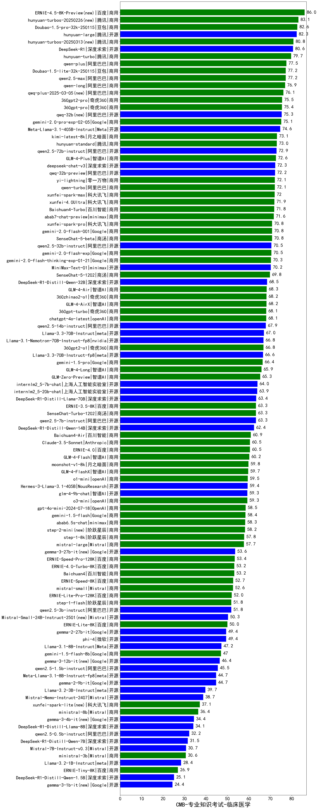

| 类别 | 大模型                         | CMB-专业知识考试-临床医学 | 排名 |
|-----|------------------------------|---------|----|
|商用|ERNIE-4.5-8K-Preview(new)|86.0|1|
|商用|hunyuan-turbos-20250226(new)|83.1|2|
|商用|Doubao-1.5-pro-32k-250115|82.6|3|
|开源|hunyuan-large|82.3|4|
|商用|hunyuan-turbos-20250313(new)|80.8|5|
|开源|DeepSeek-R1|80.6|6|
|商用|hunyuan-turbo|79.7|7|
|商用|qwen-plus|77.5|8|
|商用|Doubao-1.5-lite-32k-250115|77.2|9|
|商用|qwen2.5-max|77.2|10|
|商用|qwen-long|76.9|11|
|商用|qwq-plus-2025-03-05(new)|76.1|12|
|商用|360gpt2-pro|75.5|13|
|商用|360gpt-pro|75.4|14|
|开源|qwq-32b(new)|75.3|15|
|商用|gemini-2.0-pro-exp-02-05|75.1|16|
|开源|Meta-Llama-3.1-405B-Instruct|74.6|17|
|商用|kimi-latest-8k|73.1|18|
|商用|hunyuan-standard|73.0|19|
|开源|qwen2.5-72b-instruct|72.9|20|
|商用|GLM-4-Plus|72.6|21|
|开源|deepseek-chat-v3|72.3|22|
|开源|qwq-32b-preview|72.2|23|
|商用|qwen-turbo|72.1|24|
|商用|yi-lightning|72.1|25|
|商用|xunfei-spark-max|72.0|26|
|商用|xunfei-4.0Ultra|71.9|27|
|商用|Baichuan4-Turbo|71.8|28|
|商用|abab7-chat-preview|71.6|29|
|商用|xunfei-spark-pro|70.8|30|
|商用|gemini-2.0-flash-001|70.8|31|
|商用|SenseChat-5-beta|70.8|32|
|开源|qwen2.5-32b-instruct|70.5|33|
|商用|gemini-2.0-flash-exp|70.5|34|
|商用|gemini-2.0-flash-thinking-exp-01-21|70.3|35|
|开源|MiniMax-Text-01|70.2|36|
|商用|SenseChat-5-1202|69.8|37|
|开源|DeepSeek-R1-Distill-Qwen-32B|68.5|38|
|商用|GLM-4-Air|68.3|39|
|商用|360zhinao2-o1|68.2|40|
|商用|GLM-4-AirX|68.2|41|
|商用|360gpt-turbo|68.1|42|
|商用|chatgpt-4o-latest|68.1|43|
|开源|qwen2.5-14b-instruct|67.9|44|
|开源|Llama-3.3-70B-Instruct|67.0|45|
|开源|Llama-3.1-Nemotron-70B-Instruct-fp8|66.8|46|
|商用|360gpt2-o1|66.8|47|
|开源|Llama-3.3-70B-Instruct-fp8|66.6|48|
|商用|gemini-1.5-pro|66.4|49|
|商用|GLM-4-Long|65.9|50|
|商用|GLM-Zero-Preview|65.3|51|
|开源|internlm2_5-7b-chat|64.0|52|
|开源|internlm2_5-20b-chat|63.9|53|
|开源|DeepSeek-R1-Distill-Llama-70B|63.4|54|
|商用|ERNIE-3.5-8K|63.3|55|
|商用|SenseChat-Turbo-1202|63.3|56|
|开源|qwen2.5-7b-instruct|63.3|57|
|开源|DeepSeek-R1-Distill-Qwen-14B|62.4|58|
|商用|Baichuan4-Air|60.9|59|
|商用|ERNIE-4.0|60.5|60|
|商用|Claude-3.5-Sonnet|60.5|61|
|商用|GLM-4-Flash|60.2|62|
|商用|moonshot-v1-8k|59.8|63|
|商用|GLM-4-FlashX|59.7|64|
|商用|o1-mini|59.5|65|
|开源|Hermes-3-Llama-3.1-405B|59.4|66|
|开源|glm-4-9b-chat|59.3|67|
|商用|o3-mini|59.3|68|
|商用|gpt-4o-mini-2024-07-18|58.5|69|
|商用|gemini-1.5-flash|58.4|70|
|商用|abab6.5s-chat|58.3|71|
|商用|step-2-mini(new)|58.2|72|
|商用|step-1-8k|57.8|73|
|商用|mistral-large|57.7|74|
|开源|gemma-3-27b-it(new)|53.6|75|
|商用|ERNIE-Speed-Pro-128K|53.4|76|
|商用|ERNIE-4.0-Turbo-8K|53.2|77|
|商用|Baichuan4|53.2|78|
|商用|ERNIE-Speed-8K|52.7|79|
|商用|mistral-small|52.6|80|
|商用|ERNIE-Lite-Pro-128K|52.0|81|
|商用|step-1-flash|51.8|82|
|开源|qwen2.5-3b-instruct|51.8|83|
|开源|Mistral-Small-24B-Instruct-2501(new)|50.3|84|
|商用|ERNIE-Lite-8K|50.0|85|
|开源|gemma-2-27b-it|49.4|86|
|开源|phi-4|49.4|87|
|开源|Llama-3.1-8B-Instruct|47.2|88|
|商用|gemini-1.5-flash-8b|47.0|89|
|开源|gemma-3-12b-it(new)|46.4|90|
|开源|qwen2.5-1.5b-instruct|45.5|91|
|开源|Meta-Llama-3.1-8B-Instruct-fp8|44.7|92|
|开源|gemma-2-9b-it|44.7|93|
|开源|Llama-3.2-3B-Instruct|39.7|94|
|开源|Mistral-Nemo-Instruct-2407|38.7|95|
|商用|xunfei-spark-lite(new)|37.1|96|
|商用|ministral-8b|36.4|97|
|开源|gemma-3-4b-it(new)|34.4|98|
|开源|DeepSeek-R1-Distill-Llama-8B|34.1|99|
|开源|qwen2.5-0.5b-instruct|32.2|100|
|开源|DeepSeek-R1-Distill-Qwen-7B|31.5|101|
|开源|Mistral-7B-Instruct-v0.3|30.7|102|
|商用|ministral-3b|30.6|103|
|开源|Llama-3.2-1B-Instruct|28.4|104|
|商用|ERNIE-Tiny-8K|26.9|105|
|开源|DeepSeek-R1-Distill-Qwen-1.5B|25.1|106|
|开源|gemma-3-1b-it(new)|24.4|107|
|开源|qwen2.5-math-72b-instruct|/|108|

