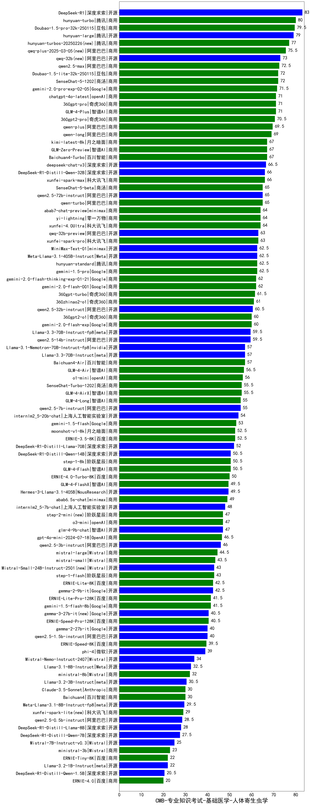

| 类别 | 大模型                         | CMB-专业知识考试-基础医学-人体寄生虫学 | 排名 |
|-----|------------------------------|---------|----|
|开源|DeepSeek-R1|83.0|1|
|商用|hunyuan-turbo|80.0|2|
|商用|Doubao-1.5-pro-32k-250115|79.5|3|
|商用|hunyuan-large|79.0|4|
|商用|hunyuan-turbos-20250226(new)|77.0|5|
|商用|qwq-plus-2025-03-05(new)|75.5|6|
|开源|qwq-32b(new)|73.0|7|
|商用|qwen2.5-max|72.5|8|
|商用|SenseChat-5-1202|72.0|9|
|商用|Doubao-1.5-lite-32k-250115|72.0|10|
|商用|gemini-2.0-pro-exp-02-05|71.5|11|
|商用|360gpt-pro|71.0|12|
|商用|GLM-4-Plus|71.0|13|
|商用|chatgpt-4o-latest|71.0|14|
|商用|360gpt2-pro|70.5|15|
|商用|qwen-plus|69.5|16|
|商用|qwen-long|69.0|17|
|商用|kimi-latest-8k|67.0|18|
|商用|Baichuan4-Turbo|67.0|19|
|商用|GLM-Zero-Preview|67.0|20|
|开源|deepseek-chat-v3|66.5|21|
|开源|DeepSeek-R1-Distill-Qwen-32B|66.0|22|
|商用|xunfei-spark-max|66.0|23|
|开源|qwen2.5-72b-instruct|65.0|24|
|商用|SenseChat-5-beta|65.0|25|
|商用|qwen-turbo|65.0|26|
|商用|abab7-chat-preview|64.0|27|
|商用|yi-lightning|64.0|28|
|商用|xunfei-4.0Ultra|64.0|29|
|开源|qwq-32b-preview|63.0|30|
|商用|xunfei-spark-pro|63.0|31|
|商用|gemini-1.5-pro|62.5|32|
|商用|hunyuan-standard|62.5|33|
|商用|MiniMax-Text-01|62.5|34|
|开源|Meta-Llama-3.1-405B-Instruct|62.5|35|
|商用|gemini-2.0-flash-thinking-exp-01-21|62.0|36|
|商用|gemini-2.0-flash-001|62.0|37|
|商用|360gpt-turbo|61.5|38|
|商用|360zhinao2-o1|61.0|39|
|开源|qwen2.5-32b-instruct|60.5|40|
|商用|gemini-2.0-flash-exp|60.0|41|
|商用|360gpt2-o1|60.0|42|
|开源|qwen2.5-14b-instruct|59.5|43|
|开源|Llama-3.3-70B-Instruct-fp8|59.5|44|
|开源|Llama-3.1-Nemotron-70B-Instruct-fp8|57.0|45|
|开源|Llama-3.3-70B-Instruct|57.0|46|
|商用|Baichuan4-Air|57.0|47|
|商用|GLM-4-Air|56.5|48|
|商用|o1-mini|56.0|49|
|商用|GLM-4-AirX|55.5|50|
|商用|SenseChat-Turbo-1202|55.5|51|
|开源|qwen2.5-7b-instruct|55.0|52|
|商用|GLM-4-Long|55.0|53|
|开源|internlm2_5-20b-chat|54.0|54|
|商用|gemini-1.5-flash|53.0|55|
|商用|moonshot-v1-8k|52.5|56|
|商用|ERNIE-3.5-8K|52.5|57|
|开源|DeepSeek-R1-Distill-Llama-70B|52.0|58|
|开源|DeepSeek-R1-Distill-Qwen-14B|50.5|59|
|商用|step-1-8k|50.5|60|
|商用|GLM-4-Flash|50.5|61|
|商用|ERNIE-4.0-Turbo-8K|50.0|62|
|开源|Hermes-3-Llama-3.1-405B|49.5|63|
|商用|GLM-4-FlashX|49.5|64|
|商用|abab6.5s-chat|49.0|65|
|开源|internlm2_5-7b-chat|48.0|66|
|商用|o3-mini|47.0|67|
|商用|step-2-mini(new)|47.0|68|
|开源|glm-4-9b-chat|47.0|69|
|商用|gpt-4o-mini-2024-07-18|46.5|70|
|开源|qwen2.5-3b-instruct|46.0|71|
|商用|mistral-large|44.5|72|
|商用|mistral-small|43.5|73|
|商用|step-1-flash|43.0|74|
|开源|Mistral-Small-24B-Instruct-2501(new)|43.0|75|
|开源|gemma-2-9b-it|42.5|76|
|商用|ERNIE-Lite-8K|42.5|77|
|商用|gemini-1.5-flash-8b|41.5|78|
|商用|ERNIE-Lite-Pro-128K|41.5|79|
|开源|gemma-3-27b-it(new)|40.5|80|
|商用|ERNIE-Speed-Pro-128K|40.5|81|
|开源|gemma-2-27b-it|40.0|82|
|开源|qwen2.5-1.5b-instruct|40.0|83|
|商用|ERNIE-Speed-8K|39.5|84|
|开源|phi-4|39.0|85|
|开源|Mistral-Nemo-Instruct-2407|34.0|86|
|开源|Llama-3.1-8B-Instruct|32.5|87|
|商用|ministral-8b|32.0|88|
|开源|Llama-3.2-3B-Instruct|30.5|89|
|商用|Baichuan4|30.0|90|
|商用|Claude-3.5-Sonnet|30.0|91|
|开源|Meta-Llama-3.1-8B-Instruct-fp8|29.5|92|
|商用|xunfei-spark-lite(new)|29.0|93|
|开源|qwen2.5-0.5b-instruct|28.5|94|
|开源|DeepSeek-R1-Distill-Llama-8B|28.0|95|
|开源|DeepSeek-R1-Distill-Qwen-7B|27.5|96|
|开源|Mistral-7B-Instruct-v0.3|25.0|97|
|商用|ministral-3b|23.0|98|
|开源|Llama-3.2-1B-Instruct|22.0|99|
|商用|ERNIE-Tiny-8K|22.0|100|
|开源|DeepSeek-R1-Distill-Qwen-1.5B|20.5|101|
|商用|ERNIE-4.0|20.0|102|
|开源|Yi-1.5-34B-Chat|/|103|
|开源|Yi-1.5-9B-Chat|/|104|
|开源|qwen2.5-math-72b-instruct|/|105|

