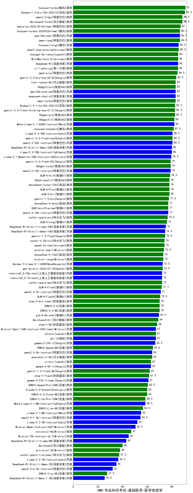

| 类别 | 大模型                         | CMB-专业知识考试-基础医学-医学免疫学 | 排名 |
|-----|------------------------------|---------|----|
|商用|hunyuan-turbo|91.0|1|
|商用|Doubao-1.5-pro-32k-250115|90.5|2|
|商用|Baichuan4-Turbo|88.5|3|
|商用|qwen2.5-max|88.5|4|
|商用|qwq-plus-2025-03-05(new)|87.0|5|
|商用|qwen-long|86.5|6|
|开源|qwq-32b(new)|86.5|7|
|商用|hunyuan-turbos-20250226(new)|86.5|8|
|商用|abab7-chat-preview|85.5|9|
|商用|hunyuan-large|85.5|10|
|开源|DeepSeek-R1|85.0|11|
|商用|chatgpt-4o-latest|85.0|12|
|商用|yi-lightning|85.0|13|
|商用|MiniMax-Text-01|85.0|14|
|商用|qwen-plus|84.5|15|
|商用|gemini-2.0-pro-exp-02-05|83.5|16|
|商用|360gpt2-pro|83.0|17|
|开源|qwq-32b-preview|83.0|18|
|商用|qwen-turbo|83.0|19|
|开源|deepseek-chat-v3|83.0|20|
|商用|kimi-latest-8k|83.0|21|
|商用|360gpt-pro|82.5|22|
|商用|gemini-2.0-flash-thinking-exp-01-21|82.5|23|
|商用|Doubao-1.5-lite-32k-250115|82.5|24|
|开源|Meta-Llama-3.1-405B-Instruct|82.0|25|
|商用|360gpt2-o1|82.0|26|
|商用|hunyuan-standard|81.5|27|
|开源|qwen2.5-32b-instruct|80.5|28|
|商用|gemini-2.0-flash-exp|80.5|29|
|开源|Llama-3.3-70B-Instruct|80.5|30|
|开源|Llama-3.3-70B-Instruct-fp8|80.0|31|
|开源|DeepSeek-R1-Distill-Qwen-32B|80.0|32|
|开源|Llama-3.1-Nemotron-70B-Instruct-fp8|79.5|33|
|商用|gemini-2.0-flash-001|79.0|34|
|开源|qwen2.5-72b-instruct|79.0|35|
|商用|360gpt-turbo|79.0|36|
|商用|GLM-4-AirX|78.5|37|
|商用|GLM-4-Plus|78.0|38|
|商用|360zhinao2-o1|78.0|39|
|商用|SenseChat-Turbo-1202|78.0|40|
|商用|GLM-4-Air|78.0|41|
|商用|gemini-1.5-pro|77.5|42|
|开源|qwen2.5-14b-instruct|77.0|43|
|商用|SenseChat-5-beta|77.0|44|
|商用|GLM-Zero-Preview|77.0|45|
|商用|xunfei-spark-pro|76.5|46|
|商用|GLM-4-Long|76.0|47|
|开源|DeepSeek-R1-Distill-Llama-70B|75.0|48|
|商用|gemini-1.5-flash|74.5|49|
|开源|DeepSeek-R1-Distill-Qwen-14B|74.5|50|
|商用|xunfei-4.0Ultra|74.0|51|
|商用|abab6.5s-chat|74.0|52|
|商用|mistral-small|73.5|53|
|商用|SenseChat-5-1202|73.0|54|
|商用|mistral-large|73.0|55|
|开源|Hermes-3-Llama-3.1-405B|72.5|56|
|商用|gpt-4o-mini-2024-07-18|72.5|57|
|商用|xunfei-spark-max|72.0|58|
|开源|internlm2_5-7b-chat|72.0|59|
|开源|internlm2_5-20b-chat|72.0|60|
|商用|GLM-4-Flash|71.7|61|
|开源|qwen2.5-7b-instruct|71.0|62|
|商用|GLM-4-FlashX|70.5|63|
|商用|step-2-mini(new)|70.0|64|
|商用|ERNIE-3.5-8K|70.0|65|
|商用|ERNIE-4.0|70.0|66|
|开源|glm-4-9b-chat|69.5|67|
|商用|Baichuan4-Air|69.0|68|
|商用|step-1-8k|68.0|69|
|开源|Mistral-Small-24B-Instruct-2501(new)|67.0|70|
|开源|phi-4|67.0|71|
|商用|o3-mini|67.0|72|
|开源|gemma-2-27b-it|66.5|73|
|商用|ERNIE-Speed-8K|64.6|74|
|开源|qwen2.5-3b-instruct|64.0|75|
|商用|moonshot-v1-8k|64.0|76|
|商用|o1-mini|63.0|77|
|开源|gemma-2-9b-it|63.0|78|
|商用|gemini-1.5-flash-8b|62.0|79|
|商用|step-1-flash|61.5|80|
|开源|gemma-3-27b-it(new)|61.0|81|
|商用|ERNIE-Speed-Pro-128K|60.5|82|
|商用|Claude-3.5-Sonnet|60.0|83|
|商用|ERNIE-4.0-Turbo-8K|60.0|84|
|商用|ERNIE-Lite-Pro-128K|58.5|85|
|开源|Meta-Llama-3.1-8B-Instruct-fp8|58.5|86|
|商用|ERNIE-Lite-8K|56.5|87|
|开源|Llama-3.1-8B-Instruct|55.0|88|
|开源|qwen2.5-1.5b-instruct|54.5|89|
|开源|Llama-3.2-3B-Instruct|52.0|90|
|开源|Mistral-Nemo-Instruct-2407|50.5|91|
|商用|ministral-8b|47.0|92|
|开源|Mistral-7B-Instruct-v0.3|45.0|93|
|开源|DeepSeek-R1-Distill-Llama-8B|43.0|94|
|商用|Baichuan4|40.0|95|
|商用|ministral-3b|38.0|96|
|商用|xunfei-spark-lite(new)|37.3|97|
|开源|Llama-3.2-1B-Instruct|36.5|98|
|开源|DeepSeek-R1-Distill-Qwen-7B|35.0|99|
|开源|qwen2.5-0.5b-instruct|32.0|100|
|商用|ERNIE-Tiny-8K|27.5|101|
|开源|DeepSeek-R1-Distill-Qwen-1.5B|25.5|102|
|开源|Yi-1.5-34B-Chat|/|103|
|开源|Yi-1.5-9B-Chat|/|104|
|开源|qwen2.5-math-72b-instruct|/|105|

