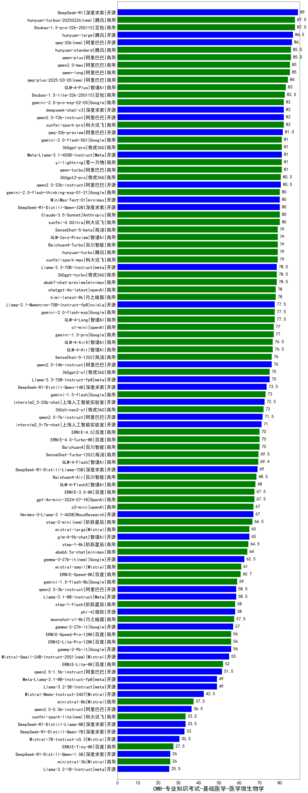

| 类别 | 大模型                         | CMB-专业知识考试-基础医学-医学微生物学 | 排名 |
|-----|------------------------------|---------|----|
|商用|ERNIE-4.5-8K-Preview(new)|93.0|1|
|开源|DeepSeek-R1|89.0|2|
|商用|hunyuan-turbos-20250226(new)|87.5|3|
|商用|Doubao-1.5-pro-32k-250115|87.5|4|
|开源|hunyuan-large|86.5|5|
|开源|qwq-32b(new)|86.0|6|
|商用|hunyuan-standard|85.5|7|
|商用|qwen-plus|85.5|8|
|商用|qwen2.5-max|85.0|9|
|商用|qwen-long|85.0|10|
|商用|hunyuan-turbos-20250313(new)|84.5|11|
|商用|qwq-plus-2025-03-05(new)|84.0|12|
|商用|GLM-4-Plus|83.0|13|
|商用|Doubao-1.5-lite-32k-250115|82.5|14|
|开源|qwen2.5-72b-instruct|82.0|15|
|商用|xunfei-spark-pro|82.0|16|
|商用|gemini-2.0-pro-exp-02-05|82.0|17|
|开源|deepseek-chat-v3|82.0|18|
|开源|qwq-32b-preview|81.5|19|
|商用|gemini-2.0-flash-001|81.0|20|
|商用|360gpt-pro|81.0|21|
|开源|Meta-Llama-3.1-405B-Instruct|81.0|22|
|商用|qwen-turbo|81.0|23|
|商用|yi-lightning|81.0|24|
|开源|qwen2.5-32b-instruct|80.5|25|
|商用|360gpt2-pro|80.5|26|
|商用|Claude-3.5-Sonnet|80.0|27|
|商用|xunfei-4.0Ultra|80.0|28|
|开源|DeepSeek-R1-Distill-Qwen-32B|80.0|29|
|开源|MiniMax-Text-01|80.0|30|
|商用|gemini-2.0-flash-thinking-exp-01-21|80.0|31|
|商用|xunfei-spark-max|79.0|32|
|商用|hunyuan-turbo|79.0|33|
|商用|SenseChat-5-beta|79.0|34|
|商用|GLM-Zero-Preview|79.0|35|
|商用|Baichuan4-Turbo|79.0|36|
|商用|360gpt-turbo|78.5|37|
|商用|abab7-chat-preview|78.5|38|
|开源|Llama-3.3-70B-Instruct|78.5|39|
|商用|chatgpt-4o-latest|78.0|40|
|商用|kimi-latest-8k|78.0|41|
|商用|gemini-2.0-flash-exp|77.5|42|
|商用|GLM-4-Long|77.5|43|
|开源|Llama-3.1-Nemotron-70B-Instruct-fp8|77.5|44|
|商用|gemini-1.5-pro|77.0|45|
|商用|o1-mini|77.0|46|
|商用|GLM-4-Air|76.5|47|
|商用|GLM-4-AirX|76.5|48|
|商用|SenseChat-5-1202|76.0|49|
|开源|qwen2.5-14b-instruct|76.0|50|
|商用|360gpt2-o1|75.0|51|
|开源|Llama-3.3-70B-Instruct-fp8|75.0|52|
|开源|DeepSeek-R1-Distill-Qwen-14B|73.5|53|
|商用|gemini-1.5-flash|73.0|54|
|开源|internlm2_5-20b-chat|72.5|55|
|商用|360zhinao2-o1|72.0|56|
|开源|qwen2.5-7b-instruct|71.5|57|
|开源|internlm2_5-7b-chat|71.0|58|
|商用|ERNIE-4.0|70.0|59|
|商用|ERNIE-4.0-Turbo-8K|70.0|60|
|商用|Baichuan4|70.0|61|
|商用|SenseChat-Turbo-1202|69.5|62|
|商用|GLM-4-Flash|69.4|63|
|开源|DeepSeek-R1-Distill-Llama-70B|69.0|64|
|商用|Baichuan4-Air|68.5|65|
|商用|GLM-4-FlashX|68.0|66|
|商用|gpt-4o-mini-2024-07-18|67.5|67|
|商用|ERNIE-3.5-8K|67.5|68|
|商用|o3-mini|67.0|69|
|开源|Hermes-3-Llama-3.1-405B|67.0|70|
|商用|step-2-mini(new)|66.5|71|
|开源|glm-4-9b-chat|65.0|72|
|商用|mistral-large|65.0|73|
|商用|step-1-8k|64.5|74|
|商用|abab6.5s-chat|64.0|75|
|开源|gemma-3-27b-it(new)|62.5|76|
|商用|mistral-small|61.0|77|
|商用|ERNIE-Speed-8K|60.7|78|
|商用|gemini-1.5-flash-8b|59.0|79|
|开源|Llama-3.1-8B-Instruct|58.5|80|
|开源|qwen2.5-3b-instruct|58.5|81|
|开源|gemma-3-12b-it(new)|58.0|82|
|商用|step-1-flash|58.0|83|
|开源|phi-4|58.0|84|
|商用|moonshot-v1-8k|57.5|85|
|开源|gemma-2-27b-it|57.0|86|
|商用|ERNIE-Speed-Pro-128K|56.0|87|
|开源|gemma-2-9b-it|56.0|88|
|商用|ERNIE-Lite-Pro-128K|56.0|89|
|开源|Mistral-Small-24B-Instruct-2501(new)|55.0|90|
|商用|ERNIE-Lite-8K|52.0|91|
|开源|qwen2.5-1.5b-instruct|51.5|92|
|开源|Meta-Llama-3.1-8B-Instruct-fp8|49.0|93|
|开源|Llama-3.2-3B-Instruct|49.0|94|
|开源|Mistral-Nemo-Instruct-2407|42.5|95|
|商用|ministral-8b|37.5|96|
|开源|qwen2.5-0.5b-instruct|36.5|97|
|开源|gemma-3-4b-it(new)|35.5|98|
|商用|xunfei-spark-lite(new)|33.5|99|
|开源|DeepSeek-R1-Distill-Llama-8B|33.5|100|
|开源|DeepSeek-R1-Distill-Qwen-7B|33.0|101|
|开源|Mistral-7B-Instruct-v0.3|30.5|102|
|商用|ERNIE-Tiny-8K|27.5|103|
|商用|ministral-3b|26.0|104|
|开源|DeepSeek-R1-Distill-Qwen-1.5B|26.0|105|
|开源|Llama-3.2-1B-Instruct|25.5|106|
|开源|gemma-3-1b-it(new)|25.5|107|
|开源|qwen2.5-math-72b-instruct|/|108|

