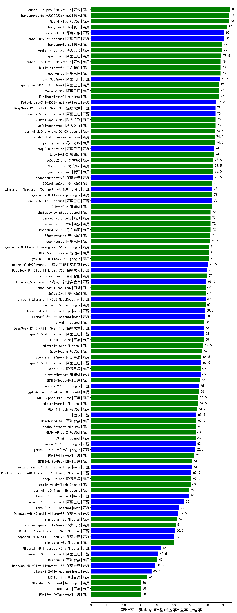

| 类别 | 大模型                         | CMB-专业知识考试-基础医学-医学心理学 | 排名 |
|-----|------------------------------|---------|----|
|商用|Doubao-1.5-pro-32k-250115|84.0|1|
|商用|hunyuan-turbos-20250226(new)|83.0|2|
|商用|GLM-4-Plus|83.0|3|
|商用|hunyuan-turbo|82.0|4|
|开源|qwen2.5-72b-instruct|80.0|5|
|开源|DeepSeek-R1|80.0|6|
|商用|xunfei-4.0Ultra|79.0|7|
|开源|hunyuan-large|79.0|8|
|商用|qwen-long|78.5|9|
|商用|Doubao-1.5-lite-32k-250115|78.0|10|
|商用|qwen-plus|78.0|11|
|商用|kimi-latest-8k|78.0|12|
|开源|qwq-32b(new)|77.5|13|
|商用|qwq-plus-2025-03-05(new)|77.0|14|
|开源|MiniMax-Text-01|77.0|15|
|商用|qwen2.5-max|77.0|16|
|开源|Meta-Llama-3.1-405B-Instruct|75.5|17|
|开源|qwen2.5-32b-instruct|75.0|18|
|开源|DeepSeek-R1-Distill-Qwen-32B|75.0|19|
|商用|xunfei-spark-pro|75.0|20|
|商用|xunfei-spark-max|75.0|21|
|商用|gemini-2.0-pro-exp-02-05|74.5|22|
|商用|abab7-chat-preview|74.5|23|
|商用|yi-lightning|74.5|24|
|商用|GLM-4-AirX|74.0|25|
|开源|qwq-32b-preview|74.0|26|
|商用|hunyuan-standard|73.5|27|
|商用|360gpt-pro|73.5|28|
|商用|360gpt2-pro|73.5|29|
|开源|deepseek-chat-v3|73.5|30|
|商用|gemini-2.0-flash-exp|73.0|31|
|开源|qwen2.5-14b-instruct|73.0|32|
|商用|GLM-4-Air|73.0|33|
|开源|Llama-3.1-Nemotron-70B-Instruct-fp8|73.0|34|
|商用|360zhinao2-o1|73.0|35|
|商用|moonshot-v1-8k|72.0|36|
|商用|SenseChat-5-beta|72.0|37|
|商用|SenseChat-5-1202|72.0|38|
|商用|chatgpt-4o-latest|72.0|39|
|商用|360gpt-turbo|71.5|40|
|商用|qwen-turbo|71.5|41|
|商用|gemini-2.0-flash-001|71.0|42|
|商用|gemini-2.0-flash-thinking-exp-01-21|71.0|43|
|商用|GLM-Zero-Preview|71.0|44|
|开源|internlm2_5-20b-chat|70.5|45|
|商用|Baichuan4-Turbo|70.0|46|
|开源|DeepSeek-R1-Distill-Llama-70B|70.0|47|
|开源|internlm2_5-7b-chat|69.5|48|
|商用|gemini-1.5-pro|69.0|49|
|商用|SenseChat-Turbo-1202|69.0|50|
|商用|360gpt2-o1|69.0|51|
|开源|Hermes-3-Llama-3.1-405B|69.0|52|
|开源|Llama-3.3-70B-Instruct-fp8|68.5|53|
|开源|Llama-3.3-70B-Instruct|68.5|54|
|商用|o1-mini|68.0|55|
|商用|ERNIE-3.5-8K|68.0|56|
|开源|DeepSeek-R1-Distill-Qwen-14B|68.0|57|
|开源|qwen2.5-7b-instruct|68.0|58|
|商用|mistral-large|67.5|59|
|商用|GLM-4-Long|67.0|60|
|商用|step-2-mini(new)|66.5|61|
|开源|qwen2.5-3b-instruct|66.5|62|
|商用|step-1-8k|66.0|63|
|开源|glm-4-9b-chat|66.0|64|
|商用|ERNIE-Speed-8K|65.7|65|
|商用|gpt-4o-mini-2024-07-18|65.0|66|
|开源|gemma-2-27b-it|65.0|67|
|商用|mistral-small|64.5|68|
|商用|ERNIE-Speed-Pro-128K|64.5|69|
|商用|GLM-4-Flash|63.7|70|
|商用|Baichuan4-Air|63.5|71|
|商用|abab6.5s-chat|63.5|72|
|开源|phi-4|63.5|73|
|商用|o3-mini|63.0|74|
|开源|gemma-2-9b-it|63.0|75|
|商用|GLM-4-FlashX|63.0|76|
|开源|gemma-3-27b-it(new)|62.5|77|
|商用|ERNIE-Lite-8K|62.0|78|
|商用|ERNIE-Lite-Pro-128K|61.0|79|
|开源|Meta-Llama-3.1-8B-Instruct-fp8|61.0|80|
|商用|step-1-flash|60.5|81|
|开源|Mistral-Small-24B-Instruct-2501(new)|60.5|82|
|商用|gemini-1.5-flash|60.0|83|
|商用|gemini-1.5-flash-8b|59.0|84|
|开源|Llama-3.1-8B-Instruct|59.0|85|
|开源|qwen2.5-1.5b-instruct|56.0|86|
|开源|Llama-3.2-3B-Instruct|53.0|87|
|开源|DeepSeek-R1-Distill-Llama-8B|52.5|88|
|商用|ministral-8b|52.0|89|
|商用|xunfei-spark-lite(new)|51.0|90|
|开源|Mistral-Nemo-Instruct-2407|50.5|91|
|商用|ministral-3b|50.0|92|
|开源|DeepSeek-R1-Distill-Qwen-7B|50.0|93|
|开源|Mistral-7B-Instruct-v0.3|42.0|94|
|开源|qwen2.5-0.5b-instruct|40.5|95|
|商用|Baichuan4|40.0|96|
|开源|DeepSeek-R1-Distill-Qwen-1.5B|38.5|97|
|开源|Llama-3.2-1B-Instruct|36.5|98|
|商用|ERNIE-Tiny-8K|34.0|99|
|商用|ERNIE-4.0-Turbo-8K|30.0|100|
|商用|ERNIE-4.0|30.0|101|
|商用|Claude-3.5-Sonnet|30.0|102|
|开源|Yi-1.5-34B-Chat|/|103|
|开源|Yi-1.5-9B-Chat|/|104|
|开源|qwen2.5-math-72b-instruct|/|105|

