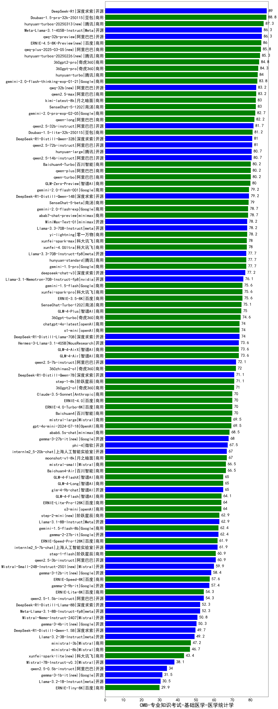

| 类别 | 大模型                         | CMB-专业知识考试-基础医学-医学统计学 | 排名 |
|-----|------------------------------|---------|----|
|开源|DeepSeek-R1|89.0|1|
|商用|Doubao-1.5-pro-32k-250115|88.8|2|
|开源|qwq-32b-preview|86.3|3|
|开源|Meta-Llama-3.1-405B-Instruct|86.3|4|
|商用|qwq-plus-2025-03-05(new)|85.8|5|
|商用|hunyuan-turbos-20250226(new)|85.3|6|
|商用|360gpt2-pro|84.8|7|
|商用|360gpt-pro|84.3|8|
|商用|hunyuan-turbo|84.0|9|
|商用|gemini-2.0-flash-thinking-exp-01-21|83.8|10|
|商用|qwen2.5-max|83.2|11|
|开源|qwq-32b(new)|83.2|12|
|商用|SenseChat-5-1202|83.0|13|
|商用|kimi-latest-8k|83.0|14|
|商用|gemini-2.0-pro-exp-02-05|82.7|15|
|商用|qwen-long|82.2|16|
|开源|qwen2.5-32b-instruct|81.7|17|
|商用|Doubao-1.5-lite-32k-250115|81.2|18|
|开源|DeepSeek-R1-Distill-Qwen-32B|81.0|19|
|开源|qwen2.5-72b-instruct|81.0|20|
|开源|qwen2.5-14b-instruct|80.7|21|
|开源|hunyuan-large|80.7|22|
|商用|qwen-plus|80.2|23|
|商用|qwen-turbo|80.2|24|
|商用|Baichuan4-Turbo|80.2|25|
|商用|GLM-Zero-Preview|80.0|26|
|开源|DeepSeek-R1-Distill-Qwen-14B|79.2|27|
|商用|gemini-2.0-flash-001|79.2|28|
|商用|SenseChat-5-beta|79.0|29|
|商用|gemini-2.0-flash-exp|78.7|30|
|商用|abab7-chat-preview|78.7|31|
|商用|yi-lightning|78.2|32|
|开源|Llama-3.3-70B-Instruct|78.2|33|
|开源|MiniMax-Text-01|78.2|34|
|商用|xunfei-spark-max|78.0|35|
|商用|xunfei-4.0Ultra|78.0|36|
|商用|gemini-1.5-pro|77.7|37|
|商用|hunyuan-standard|77.7|38|
|开源|Llama-3.3-70B-Instruct-fp8|77.7|39|
|开源|deepseek-chat-v3|77.2|40|
|开源|Llama-3.1-Nemotron-70B-Instruct-fp8|76.1|41|
|商用|gemini-1.5-flash|75.6|42|
|商用|ERNIE-3.5-8K|75.6|43|
|商用|xunfei-spark-pro|75.6|44|
|商用|SenseChat-Turbo-1202|75.1|45|
|商用|GLM-4-Plus|75.0|46|
|商用|360gpt-turbo|74.6|47|
|开源|DeepSeek-R1-Distill-Llama-70B|74.0|48|
|商用|chatgpt-4o-latest|74.0|49|
|商用|o1-mini|74.0|50|
|商用|GLM-4-Air|73.6|51|
|商用|GLM-4-AirX|73.6|52|
|开源|Hermes-3-Llama-3.1-405B|73.6|53|
|开源|qwen2.5-7b-instruct|72.1|54|
|商用|360zhinao2-o1|72.0|55|
|开源|DeepSeek-R1-Distill-Qwen-7B|71.1|56|
|商用|step-1-8k|71.1|57|
|商用|360gpt2-o1|71.0|58|
|商用|ERNIE-4.0-Turbo-8K|70.0|59|
|商用|Baichuan4|70.0|60|
|商用|ERNIE-4.0|70.0|61|
|商用|Claude-3.5-Sonnet|70.0|62|
|商用|mistral-large|69.5|63|
|商用|gpt-4o-mini-2024-07-18|69.5|64|
|商用|abab6.5s-chat|68.5|65|
|开源|gemma-3-27b-it(new)|68.0|66|
|开源|phi-4|67.5|67|
|开源|internlm2_5-20b-chat|67.0|68|
|商用|moonshot-v1-8k|67.0|69|
|商用|Baichuan4-Air|66.5|70|
|商用|mistral-small|66.5|71|
|商用|GLM-4-Long|65.0|72|
|开源|glm-4-9b-chat|65.0|73|
|商用|GLM-4-FlashX|65.0|74|
|商用|GLM-4-Flash|64.1|75|
|商用|ERNIE-Lite-Pro-128K|64.0|76|
|商用|o3-mini|64.0|77|
|开源|Llama-3.1-8B-Instruct|62.9|78|
|商用|step-2-mini(new)|62.9|79|
|商用|gemini-1.5-flash-8b|62.4|80|
|开源|gemma-2-27b-it|62.4|81|
|商用|ERNIE-Speed-Pro-128K|61.9|82|
|开源|internlm2_5-7b-chat|61.9|83|
|开源|qwen2.5-3b-instruct|60.9|84|
|商用|step-1-flash|60.9|85|
|开源|Mistral-Small-24B-Instruct-2501(new)|59.9|86|
|商用|ERNIE-Speed-8K|57.6|87|
|开源|gemma-2-9b-it|57.4|88|
|开源|qwen2.5-1.5b-instruct|54.3|89|
|商用|ERNIE-Lite-8K|54.3|90|
|开源|Meta-Llama-3.1-8B-Instruct-fp8|52.3|91|
|开源|DeepSeek-R1-Distill-Llama-8B|52.3|92|
|开源|Mistral-Nemo-Instruct-2407|50.8|93|
|开源|DeepSeek-R1-Distill-Qwen-1.5B|49.7|94|
|开源|Llama-3.2-3B-Instruct|49.2|95|
|商用|ministral-3b|47.2|96|
|商用|ministral-8b|46.7|97|
|商用|xunfei-spark-lite(new)|43.4|98|
|开源|Mistral-7B-Instruct-v0.3|38.1|99|
|开源|qwen2.5-0.5b-instruct|34.0|100|
|开源|Llama-3.2-1B-Instruct|30.5|101|
|商用|ERNIE-Tiny-8K|29.9|102|
|开源|Yi-1.5-34B-Chat|/|103|
|开源|Yi-1.5-9B-Chat|/|104|
|开源|qwen2.5-math-72b-instruct|/|105|

