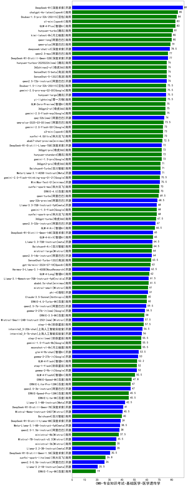

| 类别 | 大模型                         | CMB-专业知识考试-基础医学-医学遗传学 | 排名 |
|-----|------------------------------|---------|----|
|商用|ERNIE-4.5-8K-Preview(new)|90.0|1|
|开源|DeepSeek-R1|89.0|2|
|商用|chatgpt-4o-latest|85.0|3|
|商用|Doubao-1.5-pro-32k-250115|84.0|4|
|商用|GLM-4-Plus|83.0|5|
|商用|o1-mini|83.0|6|
|商用|hunyuan-turbo|81.0|7|
|商用|kimi-latest-8k|80.0|8|
|商用|qwen-long|80.0|9|
|商用|qwen-plus|79.0|10|
|开源|deepseek-chat-v3|78.5|11|
|开源|DeepSeek-R1-Distill-Qwen-32B|77.0|12|
|商用|qwen2.5-max|77.0|13|
|开源|qwen2.5-72b-instruct|76.0|14|
|商用|SenseChat-5-beta|76.0|15|
|商用|hunyuan-turbos-20250313(new)|76.0|16|
|商用|hunyuan-turbos-20250226(new)|76.0|17|
|商用|360zhinao2-o1|76.0|18|
|商用|SenseChat-5-1202|76.0|19|
|商用|gemini-2.0-pro-exp-02-05|75.5|20|
|开源|hunyuan-large|75.5|21|
|商用|Doubao-1.5-lite-32k-250115|75.5|22|
|商用|yi-lightning|75.5|23|
|商用|gemini-2.0-flash-exp|75.0|24|
|商用|GLM-Zero-Preview|75.0|25|
|商用|360gpt2-o1|75.0|26|
|开源|qwq-32b(new)|74.0|27|
|商用|qwq-plus-2025-03-05(new)|73.5|28|
|商用|xunfei-4.0Ultra|73.0|29|
|商用|gemini-2.0-flash-001|73.0|30|
|商用|o3-mini|73.0|31|
|商用|abab7-chat-preview|72.5|32|
|商用|360gpt-pro|72.0|33|
|开源|DeepSeek-R1-Distill-Llama-70B|72.0|34|
|商用|gemini-1.5-pro|72.0|35|
|商用|hunyuan-standard|72.0|36|
|开源|Meta-Llama-3.1-405B-Instruct|71.0|37|
|商用|Baichuan4-Turbo|71.0|38|
|商用|360gpt2-pro|71.0|39|
|商用|gemini-2.0-flash-thinking-exp-01-21|70.5|40|
|开源|MiniMax-Text-01|70.5|41|
|商用|ERNIE-4.0|70.0|42|
|商用|xunfei-spark-max|70.0|43|
|商用|qwen-turbo|69.5|44|
|开源|qwq-32b-preview|68.5|45|
|开源|Llama-3.3-70B-Instruct-fp8|68.0|46|
|商用|xunfei-spark-pro|68.0|47|
|商用|gemini-1.5-flash|68.0|48|
|商用|360gpt-turbo|67.5|49|
|开源|qwen2.5-32b-instruct|67.0|50|
|商用|GLM-4-Air|66.5|51|
|商用|GLM-4-AirX|65.0|52|
|开源|DeepSeek-R1-Distill-Qwen-14B|65.0|53|
|开源|Llama-3.3-70B-Instruct|64.5|54|
|商用|Baichuan4-Air|64.5|55|
|商用|mistral-large|64.0|56|
|开源|qwen2.5-14b-instruct|64.0|57|
|商用|SenseChat-Turbo-1202|63.5|58|
|商用|gpt-4o-mini-2024-07-18|63.0|59|
|开源|Hermes-3-Llama-3.1-405B|62.5|60|
|商用|GLM-4-Long|62.0|61|
|开源|Llama-3.1-Nemotron-70B-Instruct-fp8|61.5|62|
|商用|abab6.5s-chat|61.5|63|
|商用|mistral-small|61.0|64|
|开源|phi-4|61.0|65|
|商用|ERNIE-4.0-Turbo-8K|60.0|66|
|商用|Claude-3.5-Sonnet|60.0|67|
|开源|qwen2.5-7b-instruct|59.5|68|
|开源|gemma-3-27b-it(new)|58.5|69|
|商用|ERNIE-3.5-8K|58.0|70|
|商用|step-1-8k|57.5|71|
|开源|Mistral-Small-24B-Instruct-2501(new)|57.5|72|
|开源|internlm2_5-20b-chat|56.5|73|
|开源|internlm2_5-7b-chat|56.0|74|
|商用|step-2-mini(new)|55.5|75|
|商用|moonshot-v1-8k|55.5|76|
|商用|gemini-1.5-flash-8b|55.5|77|
|开源|glm-4-9b-chat|53.5|78|
|开源|gemma-2-27b-it|53.0|79|
|商用|GLM-4-Flash|52.2|80|
|商用|step-1-flash|52.0|81|
|开源|gemma-2-9b-it|52.0|82|
|开源|gemma-3-12b-it(new)|51.5|83|
|商用|GLM-4-FlashX|50.5|84|
|商用|ERNIE-Speed-8K|47.8|85|
|开源|qwen2.5-3b-instruct|47.0|86|
|商用|ERNIE-Lite-Pro-128K|47.0|87|
|商用|ERNIE-Lite-8K|45.5|88|
|商用|ERNIE-Speed-Pro-128K|45.5|89|
|开源|Llama-3.1-8B-Instruct|42.5|90|
|开源|DeepSeek-R1-Distill-Qwen-7B|41.0|91|
|开源|Mistral-Nemo-Instruct-2407|40.5|92|
|商用|Baichuan4|40.0|93|
|开源|DeepSeek-R1-Distill-Llama-8B|39.0|94|
|开源|Meta-Llama-3.1-8B-Instruct-fp8|38.5|95|
|开源|qwen2.5-1.5b-instruct|38.0|96|
|商用|ministral-8b|37.5|97|
|开源|Mistral-7B-Instruct-v0.3|35.5|98|
|商用|ministral-3b|35.0|99|
|开源|Llama-3.2-3B-Instruct|35.0|100|
|开源|DeepSeek-R1-Distill-Qwen-1.5B|30.5|101|
|开源|gemma-3-4b-it(new)|30.0|102|
|商用|xunfei-spark-lite(new)|26.8|103|
|开源|qwen2.5-0.5b-instruct|26.0|104|
|开源|Llama-3.2-1B-Instruct|20.5|105|
|开源|gemma-3-1b-it(new)|20.0|106|
|商用|ERNIE-Tiny-8K|19.0|107|
|开源|qwen2.5-math-72b-instruct|/|108|

