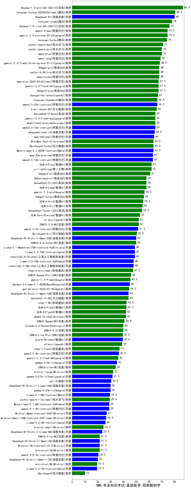

| 类别 | 大模型                         | CMB-专业知识考试-基础医学-局部解剖学 | 排名 |
|-----|------------------------------|---------|----|
|商用|Doubao-1.5-pro-32k-250115|86.5|1|
|商用|ERNIE-4.5-8K-Preview(new)|85.0|2|
|商用|hunyuan-turbos-20250226(new)|80.5|3|
|商用|hunyuan-turbos-20250313(new)|80.5|4|
|开源|DeepSeek-R1|80.0|5|
|开源|hunyuan-large|78.0|6|
|商用|Doubao-1.5-lite-32k-250115|76.0|7|
|商用|gemini-2.0-pro-exp-02-05|74.5|8|
|商用|qwen2.5-max|74.5|9|
|商用|hunyuan-turbo|74.0|10|
|商用|xunfei-spark-max|71.0|11|
|商用|qwen-plus|70.0|12|
|商用|xunfei-spark-pro|70.0|13|
|商用|qwen-long|69.0|14|
|商用|gemini-2.0-flash-thinking-exp-01-21|68.5|15|
|商用|xunfei-4.0Ultra|68.0|16|
|商用|360gpt-pro|68.0|17|
|商用|qwen-turbo|68.0|18|
|商用|qwq-plus-2025-03-05(new)|67.5|19|
|商用|360gpt2-pro|67.5|20|
|商用|gemini-2.0-flash-001|67.5|21|
|商用|chatgpt-4o-latest|67.0|22|
|商用|hunyuan-standard|66.5|23|
|开源|qwen2.5-32b-instruct|66.5|24|
|商用|kimi-latest-8k|66.0|25|
|商用|gemini-2.0-flash-exp|65.0|26|
|开源|qwen2.5-72b-instruct|65.0|27|
|商用|SenseChat-5-beta|65.0|28|
|商用|abab7-chat-preview|65.0|29|
|开源|deepseek-chat-v3|64.5|30|
|开源|qwq-32b(new)|64.0|31|
|开源|Meta-Llama-3.1-405B-Instruct|63.5|32|
|开源|MiniMax-Text-01|63.5|33|
|商用|Baichuan4-Turbo|63.5|34|
|开源|qwen2.5-14b-instruct|63.0|35|
|开源|qwq-32b-preview|63.0|36|
|商用|yi-lightning|62.0|37|
|商用|GLM-4-Plus|62.0|38|
|商用|360gpt2-o1|61.0|39|
|商用|SenseChat-5-1202|58.0|40|
|商用|GLM-4-Long|58.0|41|
|商用|360zhinao2-o1|58.0|42|
|商用|gemini-1.5-pro|56.5|43|
|商用|360gpt-turbo|56.0|44|
|商用|GLM-4-AirX|55.5|45|
|商用|GLM-4-Air|55.0|46|
|商用|SenseChat-Turbo-1202|54.5|47|
|商用|GLM-Zero-Preview|53.0|48|
|商用|o1-mini|52.0|49|
|商用|ERNIE-3.5-8K|52.0|50|
|开源|qwen2.5-7b-instruct|51.5|51|
|商用|Baichuan4-Air|50.5|52|
|开源|DeepSeek-R1-Distill-Qwen-32B|50.0|53|
|商用|ERNIE-4.0-Turbo-8K|50.0|54|
|开源|internlm2_5-7b-chat|49.0|55|
|开源|Llama-3.3-70B-Instruct|49.0|56|
|开源|Llama-3.1-Nemotron-70B-Instruct-fp8|49.0|57|
|开源|internlm2_5-20b-chat|48.0|58|
|开源|Llama-3.3-70B-Instruct-fp8|48.0|59|
|商用|step-2-mini(new)|47.5|60|
|商用|ERNIE-Speed-Pro-128K|46.0|61|
|商用|gemini-1.5-flash|45.5|62|
|开源|Hermes-3-Llama-3.1-405B|45.0|63|
|商用|gpt-4o-mini-2024-07-18|44.5|64|
|商用|moonshot-v1-8k|44.0|65|
|开源|DeepSeek-R1-Distill-Qwen-14B|44.0|66|
|商用|step-1-8k|42.5|67|
|商用|GLM-4-Flash|42.3|68|
|商用|abab6.5s-chat|42.0|69|
|商用|GLM-4-FlashX|42.0|70|
|商用|ERNIE-Speed-8K|40.8|71|
|商用|Claude-3.5-Sonnet|40.0|72|
|商用|ERNIE-4.0|40.0|73|
|开源|glm-4-9b-chat|39.5|74|
|商用|ERNIE-Lite-Pro-128K|39.5|75|
|商用|o3-mini|39.0|76|
|商用|step-1-flash|37.0|77|
|开源|qwen2.5-3b-instruct|36.5|78|
|商用|gemini-1.5-flash-8b|36.0|79|
|开源|gemma-2-9b-it|35.0|80|
|商用|ERNIE-Lite-8K|34.0|81|
|开源|gemma-3-12b-it(new)|32.0|82|
|商用|mistral-large|32.0|83|
|开源|gemma-3-27b-it(new)|31.5|84|
|开源|phi-4|30.5|85|
|开源|gemma-2-27b-it|30.0|86|
|开源|DeepSeek-R1-Distill-Llama-70B|30.0|87|
|开源|Llama-3.1-8B-Instruct|29.5|88|
|商用|xunfei-spark-lite(new)|29.4|89|
|开源|Meta-Llama-3.1-8B-Instruct-fp8|29.0|90|
|开源|qwen2.5-1.5b-instruct|29.0|91|
|开源|Mistral-Nemo-Instruct-2407|27.0|92|
|开源|Mistral-Small-24B-Instruct-2501(new)|26.5|93|
|开源|Llama-3.2-3B-Instruct|26.0|94|
|商用|mistral-small|24.5|95|
|开源|DeepSeek-R1-Distill-Llama-8B|23.5|96|
|商用|ministral-3b|21.5|97|
|商用|ERNIE-Tiny-8K|21.5|98|
|开源|gemma-3-4b-it(new)|21.5|99|
|开源|DeepSeek-R1-Distill-Qwen-7B|21.5|100|
|开源|Mistral-7B-Instruct-v0.3|21.5|101|
|开源|qwen2.5-0.5b-instruct|20.5|102|
|开源|DeepSeek-R1-Distill-Qwen-1.5B|20.0|103|
|开源|Llama-3.2-1B-Instruct|19.5|104|
|商用|ministral-8b|19.5|105|
|开源|gemma-3-1b-it(new)|18.5|106|
|商用|Baichuan4|10.0|107|
|开源|qwen2.5-math-72b-instruct|/|108|

