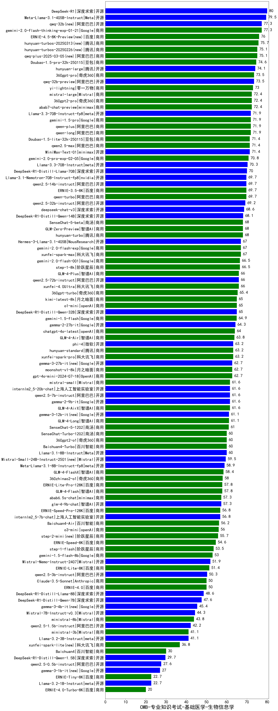

| 类别 | 大模型                         | CMB-专业知识考试-基础医学-生物信息学 | 排名 |
|-----|------------------------------|---------|----|
|开源|DeepSeek-R1|80.0|1|
|开源|Meta-Llama-3.1-405B-Instruct|79.5|2|
|商用|gemini-2.0-flash-thinking-exp-01-21|77.3|3|
|开源|qwq-32b(new)|77.3|4|
|商用|qwq-plus-2025-03-05(new)|75.1|5|
|商用|hunyuan-turbos-20250226(new)|75.1|6|
|商用|Doubao-1.5-pro-32k-250115|74.6|7|
|开源|hunyuan-large|74.1|8|
|开源|qwq-32b-preview|73.5|9|
|商用|360gpt-pro|73.5|10|
|商用|yi-lightning|73.0|11|
|商用|360gpt2-pro|72.4|12|
|商用|abab7-chat-preview|72.4|13|
|商用|mistral-large|72.4|14|
|开源|Llama-3.3-70B-Instruct-fp8|71.9|15|
|商用|qwen-plus|71.9|16|
|商用|qwen-long|71.9|17|
|商用|gemini-1.5-pro|71.9|18|
|商用|qwen2.5-max|71.4|19|
|商用|Doubao-1.5-lite-32k-250115|71.4|20|
|商用|MiniMax-Text-01|71.4|21|
|商用|gemini-2.0-pro-exp-02-05|70.8|22|
|开源|Llama-3.3-70B-Instruct|70.3|23|
|开源|DeepSeek-R1-Distill-Llama-70B|70.0|24|
|开源|Llama-3.1-Nemotron-70B-Instruct-fp8|69.7|25|
|开源|qwen2.5-14b-instruct|69.7|26|
|商用|qwen-turbo|69.7|27|
|商用|ERNIE-3.5-8K|69.7|28|
|开源|qwen2.5-32b-instruct|69.2|29|
|开源|deepseek-chat-v3|68.6|30|
|开源|DeepSeek-R1-Distill-Qwen-14B|68.1|31|
|商用|hunyuan-turbo|68.0|32|
|商用|GLM-Zero-Preview|68.0|33|
|商用|SenseChat-5-beta|68.0|34|
|开源|Hermes-3-Llama-3.1-405B|67.0|35|
|商用|gemini-2.0-flash-exp|67.0|36|
|商用|xunfei-spark-max|67.0|37|
|商用|gemini-2.0-flash-001|66.5|38|
|商用|step-1-8k|66.5|39|
|商用|GLM-4-Plus|66.0|40|
|开源|qwen2.5-72b-instruct|66.0|41|
|商用|xunfei-4.0Ultra|66.0|42|
|商用|360gpt-turbo|65.4|43|
|商用|o1-mini|65.0|44|
|开源|DeepSeek-R1-Distill-Qwen-32B|65.0|45|
|商用|kimi-latest-8k|65.0|46|
|商用|gemini-1.5-flash|64.9|47|
|开源|gemma-2-27b-it|64.3|48|
|商用|chatgpt-4o-latest|64.0|49|
|商用|GLM-4-Air|63.8|50|
|开源|phi-4|63.2|51|
|商用|xunfei-spark-pro|63.2|52|
|商用|hunyuan-standard|63.2|53|
|商用|moonshot-v1-8k|62.7|54|
|开源|gemma-3-27b-it(new)|62.7|55|
|商用|gpt-4o-mini-2024-07-18|62.7|56|
|商用|mistral-small|61.6|57|
|商用|GLM-4-AirX|61.6|58|
|开源|gemma-2-9b-it|61.6|59|
|开源|qwen2.5-7b-instruct|61.6|60|
|开源|internlm2_5-20b-chat|61.6|61|
|商用|GLM-4-Long|61.1|62|
|商用|SenseChat-5-1202|61.0|63|
|商用|Baichuan4-Turbo|60.0|64|
|商用|SenseChat-Turbo-1202|60.0|65|
|商用|360gpt2-o1|60.0|66|
|开源|Llama-3.1-8B-Instruct|60.0|67|
|开源|Mistral-Small-24B-Instruct-2501(new)|59.5|68|
|开源|Meta-Llama-3.1-8B-Instruct-fp8|58.9|69|
|商用|GLM-4-FlashX|58.4|70|
|商用|360zhinao2-o1|58.0|71|
|商用|GLM-4-Flash|57.8|72|
|商用|ERNIE-Lite-Pro-128K|57.8|73|
|开源|glm-4-9b-chat|57.3|74|
|商用|abab6.5s-chat|57.3|75|
|商用|ERNIE-Speed-Pro-128K|56.8|76|
|开源|internlm2_5-7b-chat|56.8|77|
|商用|Baichuan4-Air|56.2|78|
|商用|o3-mini|56.0|79|
|商用|step-2-mini(new)|55.7|80|
|商用|ERNIE-Speed-8K|54.6|81|
|商用|step-1-flash|53.5|82|
|商用|gemini-1.5-flash-8b|53.0|83|
|开源|Mistral-Nemo-Instruct-2407|51.9|84|
|商用|ERNIE-Lite-8K|51.4|85|
|开源|qwen2.5-3b-instruct|50.3|86|
|商用|Claude-3.5-Sonnet|50.0|87|
|商用|ERNIE-4.0|50.0|88|
|开源|DeepSeek-R1-Distill-Llama-8B|48.6|89|
|开源|DeepSeek-R1-Distill-Qwen-7B|47.6|90|
|开源|Mistral-7B-Instruct-v0.3|44.3|91|
|商用|ministral-8b|43.8|92|
|开源|qwen2.5-1.5b-instruct|42.2|93|
|商用|ministral-3b|41.1|94|
|开源|Llama-3.2-3B-Instruct|41.1|95|
|商用|xunfei-spark-lite(new)|36.8|96|
|商用|Baichuan4|30.0|97|
|开源|DeepSeek-R1-Distill-Qwen-1.5B|29.7|98|
|开源|qwen2.5-0.5b-instruct|27.6|99|
|商用|ERNIE-Tiny-8K|22.7|100|
|开源|Llama-3.2-1B-Instruct|22.7|101|
|商用|ERNIE-4.0-Turbo-8K|20.0|102|
|开源|Yi-1.5-34B-Chat|/|103|
|开源|Yi-1.5-9B-Chat|/|104|
|开源|qwen2.5-math-72b-instruct|/|105|

