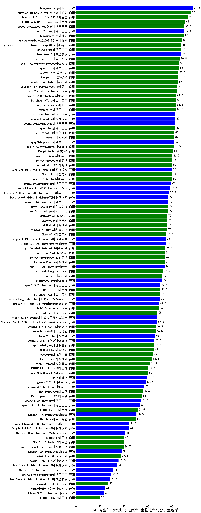

| 类别 | 大模型                         | CMB-专业知识考试-基础医学-生物化学与分子生物学 | 排名 |
|-----|------------------------------|---------|----|
|开源|hunyuan-large|97.5|1|
|商用|hunyuan-turbos-20250226(new)|96.0|2|
|商用|Doubao-1.5-pro-32k-250115|93.5|3|
|商用|ERNIE-4.5-8K-Preview(new)|91.0|4|
|开源|qwq-32b(new)|90.5|5|
|商用|qwq-plus-2025-03-05(new)|90.5|6|
|商用|hunyuan-turbo|90.0|7|
|商用|hunyuan-turbos-20250313(new)|88.5|8|
|商用|qwen2.5-max|88.0|9|
|开源|DeepSeek-R1|88.0|10|
|商用|gemini-2.0-flash-thinking-exp-01-21|88.0|11|
|商用|yi-lightning|86.5|12|
|商用|gemini-2.0-pro-exp-02-05|86.0|13|
|商用|qwen-plus|86.0|14|
|商用|360gpt2-pro|85.5|15|
|商用|360gpt-pro|85.5|16|
|商用|chatgpt-4o-latest|85.0|17|
|商用|abab7-chat-preview|84.0|18|
|商用|Doubao-1.5-lite-32k-250115|84.0|19|
|商用|gemini-2.0-flash-exp|83.5|20|
|商用|Baichuan4-Turbo|83.5|21|
|商用|qwen-turbo|83.5|22|
|商用|hunyuan-standard|83.5|23|
|开源|qwen2.5-32b-instruct|83.0|24|
|商用|qwen-long|83.0|25|
|开源|deepseek-chat-v3|83.0|26|
|开源|MiniMax-Text-01|83.0|27|
|商用|o1-mini|82.0|28|
|开源|qwq-32b-preview|82.0|29|
|商用|kimi-latest-8k|82.0|30|
|商用|gemini-2.0-flash-001|81.5|31|
|商用|360gpt-turbo|81.0|32|
|商用|gemini-1.5-pro|80.5|33|
|商用|GLM-4-Plus|80.0|34|
|商用|SenseChat-5-1202|80.0|35|
|商用|gemini-1.5-flash|80.0|36|
|开源|DeepSeek-R1-Distill-Qwen-32B|80.0|37|
|商用|SenseChat-5-beta|80.0|38|
|开源|qwen2.5-72b-instruct|79.0|39|
|开源|Meta-Llama-3.1-405B-Instruct|78.5|40|
|开源|Llama-3.1-Nemotron-70B-Instruct-fp8|77.5|41|
|商用|xunfei-spark-pro|77.0|42|
|商用|xunfei-spark-max|77.0|43|
|开源|qwen2.5-14b-instruct|77.0|44|
|开源|DeepSeek-R1-Distill-Llama-70B|77.0|45|
|商用|GLM-4-Air|76.0|46|
|商用|360gpt2-o1|76.0|47|
|商用|xunfei-4.0Ultra|76.0|48|
|商用|GLM-4-Long|76.0|49|
|商用|GLM-4-AirX|75.5|50|
|开源|Llama-3.3-70B-Instruct-fp8|75.0|51|
|开源|DeepSeek-R1-Distill-Qwen-14B|75.0|52|
|商用|gpt-4o-mini-2024-07-18|74.5|53|
|开源|Llama-3.3-70B-Instruct|74.0|54|
|商用|GLM-Zero-Preview|74.0|55|
|商用|360zhinao2-o1|74.0|56|
|商用|SenseChat-Turbo-1202|74.0|57|
|商用|mistral-large|72.5|58|
|商用|o3-mini|72.0|59|
|开源|gemma-2-27b-it|72.0|60|
|开源|qwen2.5-7b-instruct|70.5|61|
|商用|ERNIE-3.5-8K|70.5|62|
|开源|internlm2_5-20b-chat|70.0|63|
|商用|Baichuan4-Air|70.0|64|
|开源|Hermes-3-Llama-3.1-405B|69.5|65|
|商用|abab6.5s-chat|69.5|66|
|开源|internlm2_5-7b-chat|68.0|67|
|商用|mistral-small|68.0|68|
|开源|Mistral-Small-24B-Instruct-2501(new)|67.5|69|
|商用|moonshot-v1-8k|66.5|70|
|商用|gemini-1.5-flash-8b|66.5|71|
|开源|glm-4-9b-chat|66.0|72|
|开源|gemma-3-27b-it(new)|65.5|73|
|商用|step-2-mini(new)|65.5|74|
|商用|GLM-4-Flash|65.0|75|
|商用|step-1-8k|64.5|76|
|商用|GLM-4-FlashX|63.5|77|
|商用|step-1-flash|61.5|78|
|商用|ERNIE-Lite-Pro-128K|60.5|79|
|商用|Claude-3.5-Sonnet|60.0|80|
|开源|phi-4|59.5|81|
|开源|gemma-2-9b-it|58.5|82|
|开源|gemma-3-12b-it(new)|57.0|83|
|商用|ERNIE-Speed-8K|55.6|84|
|商用|ERNIE-Speed-Pro-128K|55.0|85|
|开源|qwen2.5-3b-instruct|54.5|86|
|开源|qwen2.5-1.5b-instruct|53.5|87|
|商用|ERNIE-Lite-8K|51.5|88|
|开源|Llama-3.1-8B-Instruct|50.5|89|
|商用|Baichuan4|50.0|90|
|开源|Meta-Llama-3.1-8B-Instruct-fp8|44.5|91|
|开源|DeepSeek-R1-Distill-Llama-8B|44.0|92|
|开源|Mistral-Nemo-Instruct-2407|41.0|93|
|商用|ERNIE-4.0|40.0|94|
|商用|ERNIE-4.0-Turbo-8K|40.0|95|
|商用|xunfei-spark-lite(new)|39.7|96|
|开源|Llama-3.2-3B-Instruct|38.5|97|
|商用|ministral-8b|37.5|98|
|开源|gemma-3-4b-it(new)|35.5|99|
|开源|DeepSeek-R1-Distill-Qwen-7B|34.0|100|
|开源|Mistral-7B-Instruct-v0.3|31.0|101|
|开源|qwen2.5-0.5b-instruct|29.5|102|
|开源|DeepSeek-R1-Distill-Qwen-1.5B|28.5|103|
|商用|ministral-3b|27.0|104|
|开源|gemma-3-1b-it(new)|24.0|105|
|开源|Llama-3.2-1B-Instruct|23.0|106|
|商用|ERNIE-Tiny-8K|20.0|107|
|开源|qwen2.5-math-72b-instruct|/|108|

