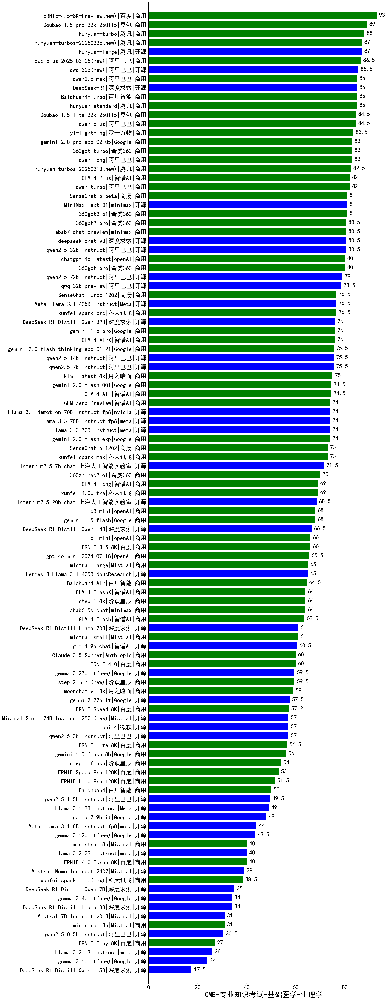

| 类别 | 大模型                         | CMB-专业知识考试-基础医学-生理学 | 排名 |
|-----|------------------------------|---------|----|
|商用|Doubao-1.5-pro-32k-250115|89.0|1|
|商用|hunyuan-turbo|88.0|2|
|开源|hunyuan-large|87.0|3|
|商用|hunyuan-turbos-20250226(new)|87.0|4|
|商用|qwq-plus-2025-03-05(new)|86.5|5|
|开源|qwq-32b(new)|85.5|6|
|商用|hunyuan-standard|85.0|7|
|开源|DeepSeek-R1|85.0|8|
|商用|Baichuan4-Turbo|85.0|9|
|商用|qwen2.5-max|85.0|10|
|商用|Doubao-1.5-lite-32k-250115|84.5|11|
|商用|qwen-plus|84.5|12|
|商用|yi-lightning|83.5|13|
|商用|qwen-long|83.0|14|
|商用|gemini-2.0-pro-exp-02-05|83.0|15|
|商用|360gpt-turbo|83.0|16|
|商用|qwen-turbo|82.0|17|
|商用|GLM-4-Plus|82.0|18|
|商用|360gpt2-o1|81.0|19|
|开源|MiniMax-Text-01|81.0|20|
|商用|SenseChat-5-beta|81.0|21|
|开源|qwen2.5-32b-instruct|80.5|22|
|商用|abab7-chat-preview|80.5|23|
|商用|360gpt2-pro|80.5|24|
|开源|deepseek-chat-v3|80.5|25|
|商用|chatgpt-4o-latest|80.0|26|
|商用|360gpt-pro|80.0|27|
|开源|qwen2.5-72b-instruct|79.0|28|
|开源|qwq-32b-preview|78.5|29|
|商用|SenseChat-Turbo-1202|76.5|30|
|开源|Meta-Llama-3.1-405B-Instruct|76.5|31|
|商用|xunfei-spark-pro|76.5|32|
|商用|gemini-1.5-pro|76.0|33|
|开源|DeepSeek-R1-Distill-Qwen-32B|76.0|34|
|商用|GLM-4-AirX|76.0|35|
|开源|qwen2.5-14b-instruct|75.5|36|
|商用|gemini-2.0-flash-thinking-exp-01-21|75.5|37|
|开源|qwen2.5-7b-instruct|75.5|38|
|商用|kimi-latest-8k|75.0|39|
|商用|GLM-4-Air|74.5|40|
|商用|gemini-2.0-flash-001|74.5|41|
|开源|Llama-3.3-70B-Instruct-fp8|74.0|42|
|开源|Llama-3.1-Nemotron-70B-Instruct-fp8|74.0|43|
|商用|gemini-2.0-flash-exp|74.0|44|
|商用|GLM-Zero-Preview|74.0|45|
|开源|Llama-3.3-70B-Instruct|74.0|46|
|商用|SenseChat-5-1202|73.0|47|
|商用|xunfei-spark-max|73.0|48|
|开源|internlm2_5-7b-chat|71.5|49|
|商用|360zhinao2-o1|70.0|50|
|商用|GLM-4-Long|69.0|51|
|商用|xunfei-4.0Ultra|69.0|52|
|开源|internlm2_5-20b-chat|68.5|53|
|商用|o3-mini|68.0|54|
|商用|gemini-1.5-flash|68.0|55|
|开源|DeepSeek-R1-Distill-Qwen-14B|66.5|56|
|商用|o1-mini|66.0|57|
|商用|ERNIE-3.5-8K|66.0|58|
|商用|gpt-4o-mini-2024-07-18|65.5|59|
|开源|Hermes-3-Llama-3.1-405B|65.0|60|
|商用|mistral-large|65.0|61|
|商用|Baichuan4-Air|64.5|62|
|商用|GLM-4-FlashX|64.0|63|
|商用|abab6.5s-chat|64.0|64|
|商用|step-1-8k|64.0|65|
|商用|GLM-4-Flash|63.5|66|
|商用|mistral-small|61.0|67|
|开源|DeepSeek-R1-Distill-Llama-70B|61.0|68|
|开源|glm-4-9b-chat|60.5|69|
|商用|Claude-3.5-Sonnet|60.0|70|
|商用|ERNIE-4.0|60.0|71|
|开源|gemma-3-27b-it(new)|59.5|72|
|商用|step-2-mini(new)|59.5|73|
|商用|moonshot-v1-8k|59.0|74|
|开源|gemma-2-27b-it|57.5|75|
|商用|ERNIE-Speed-8K|57.2|76|
|开源|qwen2.5-3b-instruct|57.0|77|
|开源|Mistral-Small-24B-Instruct-2501(new)|57.0|78|
|开源|phi-4|57.0|79|
|商用|ERNIE-Lite-8K|56.5|80|
|商用|gemini-1.5-flash-8b|56.0|81|
|商用|step-1-flash|54.0|82|
|商用|ERNIE-Speed-Pro-128K|53.0|83|
|商用|ERNIE-Lite-Pro-128K|51.5|84|
|商用|Baichuan4|50.0|85|
|开源|qwen2.5-1.5b-instruct|49.5|86|
|开源|Llama-3.1-8B-Instruct|49.0|87|
|开源|gemma-2-9b-it|48.0|88|
|开源|Meta-Llama-3.1-8B-Instruct-fp8|44.0|89|
|开源|Llama-3.2-3B-Instruct|40.0|90|
|商用|ministral-8b|40.0|91|
|商用|ERNIE-4.0-Turbo-8K|40.0|92|
|开源|Mistral-Nemo-Instruct-2407|39.0|93|
|商用|xunfei-spark-lite(new)|38.5|94|
|开源|DeepSeek-R1-Distill-Qwen-7B|35.0|95|
|开源|DeepSeek-R1-Distill-Llama-8B|34.0|96|
|开源|Mistral-7B-Instruct-v0.3|31.0|97|
|商用|ministral-3b|31.0|98|
|开源|qwen2.5-0.5b-instruct|30.5|99|
|商用|ERNIE-Tiny-8K|27.0|100|
|开源|Llama-3.2-1B-Instruct|26.0|101|
|开源|DeepSeek-R1-Distill-Qwen-1.5B|17.5|102|
|开源|Yi-1.5-34B-Chat|/|103|
|开源|Yi-1.5-9B-Chat|/|104|
|开源|qwen2.5-math-72b-instruct|/|105|

