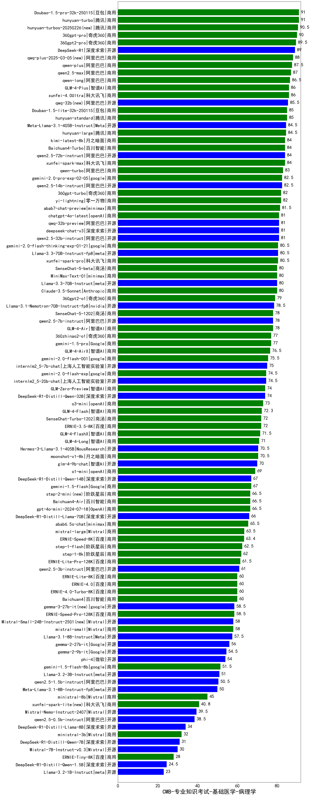

| 类别 | 大模型                         | CMB-专业知识考试-基础医学-病理学 | 排名 |
|-----|------------------------------|---------|----|
|商用|hunyuan-turbo|91.0|1|
|商用|Doubao-1.5-pro-32k-250115|91.0|2|
|商用|hunyuan-turbos-20250226(new)|90.5|3|
|商用|360gpt-pro|90.0|4|
|商用|360gpt2-pro|89.5|5|
|开源|DeepSeek-R1|89.0|6|
|商用|qwq-plus-2025-03-05(new)|88.0|7|
|商用|qwen-plus|87.5|8|
|商用|qwen2.5-max|87.0|9|
|商用|qwen-long|86.5|10|
|商用|xunfei-4.0Ultra|86.0|11|
|商用|GLM-4-Plus|86.0|12|
|开源|qwq-32b(new)|85.5|13|
|商用|hunyuan-standard|85.0|14|
|商用|Doubao-1.5-lite-32k-250115|85.0|15|
|开源|Meta-Llama-3.1-405B-Instruct|84.5|16|
|开源|hunyuan-large|84.5|17|
|商用|Baichuan4-Turbo|84.0|18|
|商用|kimi-latest-8k|84.0|19|
|商用|xunfei-spark-max|84.0|20|
|开源|qwen2.5-72b-instruct|84.0|21|
|商用|qwen-turbo|83.0|22|
|开源|qwen2.5-14b-instruct|82.5|23|
|商用|gemini-2.0-pro-exp-02-05|82.5|24|
|商用|yi-lightning|82.0|25|
|商用|360gpt-turbo|82.0|26|
|商用|abab7-chat-preview|81.5|27|
|开源|qwq-32b-preview|81.0|28|
|商用|chatgpt-4o-latest|81.0|29|
|开源|deepseek-chat-v3|81.0|30|
|开源|qwen2.5-32b-instruct|81.0|31|
|商用|xunfei-spark-pro|80.5|32|
|开源|Llama-3.3-70B-Instruct-fp8|80.5|33|
|商用|gemini-2.0-flash-thinking-exp-01-21|80.5|34|
|商用|Claude-3.5-Sonnet|80.0|35|
|商用|SenseChat-5-beta|80.0|36|
|开源|MiniMax-Text-01|80.0|37|
|开源|Llama-3.3-70B-Instruct|80.0|38|
|商用|360gpt2-o1|79.0|39|
|开源|Llama-3.1-Nemotron-70B-Instruct-fp8|78.5|40|
|开源|qwen2.5-7b-instruct|78.0|41|
|商用|SenseChat-5-1202|78.0|42|
|商用|GLM-4-Air|78.0|43|
|商用|gemini-1.5-pro|77.0|44|
|商用|360zhinao2-o1|77.0|45|
|商用|GLM-4-AirX|76.5|46|
|商用|gemini-2.0-flash-001|75.5|47|
|开源|internlm2_5-7b-chat|75.0|48|
|开源|internlm2_5-20b-chat|74.5|49|
|商用|gemini-2.0-flash-exp|74.5|50|
|开源|DeepSeek-R1-Distill-Qwen-32B|74.0|51|
|商用|GLM-Zero-Preview|74.0|52|
|商用|o3-mini|73.0|53|
|商用|GLM-4-Flash|72.3|54|
|商用|ERNIE-3.5-8K|72.0|55|
|商用|SenseChat-Turbo-1202|72.0|56|
|商用|GLM-4-FlashX|71.5|57|
|商用|GLM-4-Long|71.0|58|
|开源|Hermes-3-Llama-3.1-405B|70.5|59|
|商用|moonshot-v1-8k|70.5|60|
|开源|glm-4-9b-chat|70.0|61|
|商用|o1-mini|69.0|62|
|商用|gemini-1.5-flash|67.0|63|
|开源|DeepSeek-R1-Distill-Qwen-14B|67.0|64|
|商用|Baichuan4-Air|66.5|65|
|商用|gpt-4o-mini-2024-07-18|66.5|66|
|商用|step-2-mini(new)|66.5|67|
|开源|DeepSeek-R1-Distill-Llama-70B|66.0|68|
|商用|abab6.5s-chat|65.5|69|
|商用|mistral-large|63.5|70|
|商用|ERNIE-Speed-8K|63.4|71|
|商用|step-1-flash|62.5|72|
|商用|step-1-8k|62.0|73|
|商用|ERNIE-Lite-Pro-128K|61.5|74|
|开源|qwen2.5-3b-instruct|61.0|75|
|商用|Baichuan4|60.0|76|
|商用|ERNIE-Lite-8K|60.0|77|
|商用|ERNIE-4.0-Turbo-8K|60.0|78|
|商用|ERNIE-4.0|60.0|79|
|开源|gemma-3-27b-it(new)|58.5|80|
|商用|ERNIE-Speed-Pro-128K|58.5|81|
|商用|mistral-small|58.0|82|
|开源|Mistral-Small-24B-Instruct-2501(new)|58.0|83|
|开源|Llama-3.1-8B-Instruct|57.5|84|
|开源|gemma-2-27b-it|56.0|85|
|开源|gemma-2-9b-it|54.5|86|
|开源|phi-4|54.0|87|
|商用|gemini-1.5-flash-8b|51.5|88|
|开源|Llama-3.2-3B-Instruct|51.0|89|
|开源|qwen2.5-1.5b-instruct|50.5|90|
|开源|Meta-Llama-3.1-8B-Instruct-fp8|50.0|91|
|商用|ministral-8b|45.0|92|
|商用|xunfei-spark-lite(new)|40.8|93|
|开源|Mistral-Nemo-Instruct-2407|39.5|94|
|开源|qwen2.5-0.5b-instruct|38.5|95|
|开源|DeepSeek-R1-Distill-Llama-8B|34.0|96|
|商用|ministral-3b|32.0|97|
|开源|DeepSeek-R1-Distill-Qwen-7B|31.0|98|
|开源|Mistral-7B-Instruct-v0.3|30.0|99|
|商用|ERNIE-Tiny-8K|28.0|100|
|开源|DeepSeek-R1-Distill-Qwen-1.5B|24.5|101|
|开源|Llama-3.2-1B-Instruct|23.0|102|
|开源|Yi-1.5-34B-Chat|/|103|
|开源|Yi-1.5-9B-Chat|/|104|
|开源|qwen2.5-math-72b-instruct|/|105|

