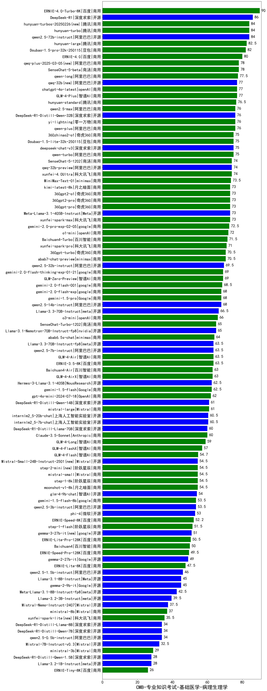

| 类别 | 大模型                         | CMB-专业知识考试-基础医学-病理生理学 | 排名 |
|-----|------------------------------|---------|----|
|商用|ERNIE-4.0-Turbo-8K|90.0|1|
|开源|DeepSeek-R1|86.0|2|
|开源|qwen2.5-72b-instruct|84.0|3|
|商用|hunyuan-turbos-20250226(new)|84.0|4|
|商用|hunyuan-turbo|84.0|5|
|开源|hunyuan-large|82.5|6|
|商用|Doubao-1.5-pro-32k-250115|82.0|7|
|商用|ERNIE-4.0|80.0|8|
|商用|qwq-plus-2025-03-05(new)|78.0|9|
|商用|SenseChat-5-beta|78.0|10|
|商用|qwen-long|77.5|11|
|商用|chatgpt-4o-latest|77.0|12|
|开源|qwq-32b(new)|77.0|13|
|商用|GLM-4-Plus|77.0|14|
|商用|hunyuan-standard|76.5|15|
|商用|yi-lightning|76.0|16|
|商用|qwen2.5-max|76.0|17|
|开源|DeepSeek-R1-Distill-Qwen-32B|76.0|18|
|商用|qwen-plus|76.0|19|
|商用|qwen-turbo|75.0|20|
|开源|deepseek-chat-v3|75.0|21|
|商用|Doubao-1.5-lite-32k-250115|75.0|22|
|商用|360zhinao2-o1|75.0|23|
|开源|qwq-32b-preview|74.0|24|
|商用|xunfei-4.0Ultra|74.0|25|
|商用|SenseChat-5-1202|74.0|26|
|开源|MiniMax-Text-01|73.5|27|
|开源|Meta-Llama-3.1-405B-Instruct|73.0|28|
|商用|360gpt-pro|73.0|29|
|商用|xunfei-spark-max|73.0|30|
|商用|kimi-latest-8k|73.0|31|
|商用|360gpt2-pro|73.0|32|
|商用|360gpt2-o1|73.0|33|
|商用|gemini-2.0-pro-exp-02-05|72.5|34|
|商用|o1-mini|72.0|35|
|商用|Baichuan4-Turbo|71.5|36|
|商用|xunfei-spark-pro|71.0|37|
|商用|abab7-chat-preview|70.5|38|
|商用|360gpt-turbo|70.5|39|
|开源|qwen2.5-32b-instruct|69.5|40|
|商用|gemini-2.0-flash-thinking-exp-01-21|69.0|41|
|商用|GLM-Zero-Preview|69.0|42|
|商用|gemini-2.0-flash-001|68.5|43|
|商用|gemini-2.0-flash-exp|68.0|44|
|开源|qwen2.5-14b-instruct|68.0|45|
|商用|gemini-1.5-pro|68.0|46|
|开源|Llama-3.3-70B-Instruct|66.5|47|
|商用|o3-mini|66.0|48|
|开源|Llama-3.1-Nemotron-70B-Instruct-fp8|65.0|49|
|商用|SenseChat-Turbo-1202|65.0|50|
|商用|abab6.5s-chat|64.0|51|
|商用|ERNIE-3.5-8K|63.5|52|
|开源|qwen2.5-7b-instruct|63.5|53|
|商用|GLM-4-Air|63.5|54|
|开源|Llama-3.3-70B-Instruct-fp8|63.5|55|
|商用|Baichuan4-Air|63.0|56|
|商用|GLM-4-AirX|63.0|57|
|商用|gemini-1.5-flash|62.5|58|
|开源|Hermes-3-Llama-3.1-405B|62.5|59|
|商用|gpt-4o-mini-2024-07-18|62.0|60|
|商用|mistral-large|61.0|61|
|开源|DeepSeek-R1-Distill-Qwen-14B|61.0|62|
|开源|internlm2_5-20b-chat|60.5|63|
|开源|internlm2_5-7b-chat|60.5|64|
|开源|DeepSeek-R1-Distill-Llama-70B|60.0|65|
|商用|Claude-3.5-Sonnet|60.0|66|
|商用|GLM-4-Long|59.0|67|
|商用|GLM-4-FlashX|57.0|68|
|商用|GLM-4-Flash|54.7|69|
|商用|step-2-mini(new)|54.5|70|
|开源|Mistral-Small-24B-Instruct-2501(new)|54.5|71|
|商用|moonshot-v1-8k|54.5|72|
|商用|step-1-8k|54.5|73|
|商用|mistral-small|54.5|74|
|开源|glm-4-9b-chat|54.0|75|
|开源|qwen2.5-3b-instruct|53.5|76|
|商用|gemini-1.5-flash-8b|53.5|77|
|开源|phi-4|53.0|78|
|商用|ERNIE-Speed-8K|52.2|79|
|商用|step-1-flash|51.5|80|
|开源|gemma-3-27b-it(new)|51.0|81|
|商用|ERNIE-Lite-Pro-128K|50.5|82|
|商用|Baichuan4|50.0|83|
|商用|ERNIE-Speed-Pro-128K|49.5|84|
|开源|gemma-2-27b-it|49.0|85|
|商用|ERNIE-Lite-8K|47.5|86|
|开源|qwen2.5-1.5b-instruct|46.0|87|
|开源|gemma-2-9b-it|45.0|88|
|开源|Llama-3.1-8B-Instruct|45.0|89|
|开源|Meta-Llama-3.1-8B-Instruct-fp8|42.5|90|
|开源|Llama-3.2-3B-Instruct|39.5|91|
|开源|Mistral-Nemo-Instruct-2407|37.5|92|
|商用|ministral-8b|37.0|93|
|商用|xunfei-spark-lite(new)|35.5|94|
|开源|DeepSeek-R1-Distill-Llama-8B|34.0|95|
|开源|qwen2.5-0.5b-instruct|34.0|96|
|开源|DeepSeek-R1-Distill-Qwen-7B|34.0|97|
|开源|Mistral-7B-Instruct-v0.3|32.5|98|
|商用|ministral-3b|29.0|99|
|开源|Llama-3.2-1B-Instruct|28.0|100|
|开源|DeepSeek-R1-Distill-Qwen-1.5B|28.0|101|
|商用|ERNIE-Tiny-8K|26.0|102|
|开源|Yi-1.5-34B-Chat|/|103|
|开源|Yi-1.5-9B-Chat|/|104|
|开源|qwen2.5-math-72b-instruct|/|105|

