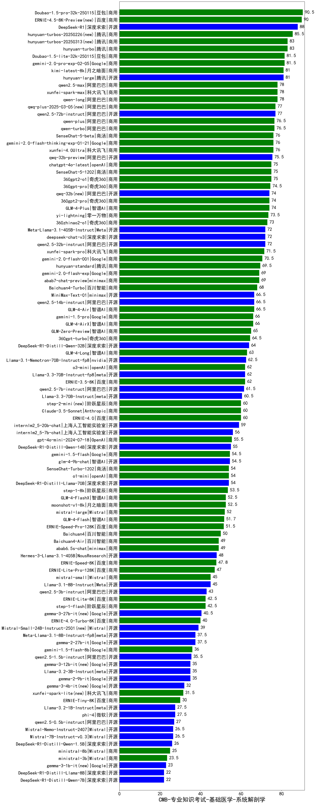

| 类别 | 大模型                         | CMB-专业知识考试-基础医学-系统解剖学 | 排名 |
|-----|------------------------------|---------|----|
|商用|Doubao-1.5-pro-32k-250115|90.5|1|
|商用|ERNIE-4.5-8K-Preview(new)|90.0|2|
|开源|DeepSeek-R1|88.0|3|
|商用|hunyuan-turbos-20250226(new)|85.5|4|
|商用|hunyuan-turbo|83.0|5|
|商用|hunyuan-turbos-20250313(new)|83.0|6|
|商用|gemini-2.0-pro-exp-02-05|81.5|7|
|商用|Doubao-1.5-lite-32k-250115|81.5|8|
|商用|kimi-latest-8k|81.0|9|
|开源|hunyuan-large|81.0|10|
|商用|qwen-long|78.0|11|
|商用|xunfei-spark-max|78.0|12|
|商用|qwen2.5-max|78.0|13|
|开源|qwen2.5-72b-instruct|77.0|14|
|商用|qwq-plus-2025-03-05(new)|77.0|15|
|商用|qwen-turbo|76.5|16|
|商用|qwen-plus|76.5|17|
|商用|SenseChat-5-beta|76.0|18|
|商用|gemini-2.0-flash-thinking-exp-01-21|76.0|19|
|商用|xunfei-4.0Ultra|76.0|20|
|开源|qwq-32b-preview|75.5|21|
|商用|SenseChat-5-1202|75.0|22|
|商用|360gpt2-o1|75.0|23|
|商用|chatgpt-4o-latest|75.0|24|
|商用|360gpt-pro|74.5|25|
|商用|GLM-4-Plus|74.0|26|
|商用|360gpt2-pro|74.0|27|
|开源|qwq-32b(new)|74.0|28|
|商用|yi-lightning|73.5|29|
|商用|360zhinao2-o1|73.0|30|
|开源|Meta-Llama-3.1-405B-Instruct|72.0|31|
|开源|qwen2.5-32b-instruct|72.0|32|
|开源|deepseek-chat-v3|72.0|33|
|商用|xunfei-spark-pro|71.5|34|
|商用|gemini-2.0-flash-001|70.5|35|
|商用|hunyuan-standard|69.5|36|
|商用|abab7-chat-preview|69.0|37|
|商用|gemini-2.0-flash-exp|69.0|38|
|商用|Baichuan4-Turbo|68.0|39|
|开源|MiniMax-Text-01|66.5|40|
|开源|qwen2.5-14b-instruct|66.5|41|
|商用|GLM-4-Air|66.5|42|
|商用|gemini-1.5-pro|66.0|43|
|商用|GLM-4-AirX|66.0|44|
|商用|GLM-Zero-Preview|65.0|45|
|商用|360gpt-turbo|64.5|46|
|开源|DeepSeek-R1-Distill-Qwen-32B|64.0|47|
|商用|GLM-4-Long|63.0|48|
|开源|Llama-3.1-Nemotron-70B-Instruct-fp8|62.5|49|
|商用|ERNIE-3.5-8K|62.0|50|
|商用|o3-mini|62.0|51|
|开源|Llama-3.3-70B-Instruct-fp8|62.0|52|
|开源|qwen2.5-7b-instruct|61.5|53|
|开源|Llama-3.3-70B-Instruct|60.5|54|
|商用|Claude-3.5-Sonnet|60.0|55|
|商用|ERNIE-4.0|60.0|56|
|商用|step-2-mini(new)|60.0|57|
|开源|internlm2_5-20b-chat|59.0|58|
|开源|internlm2_5-7b-chat|56.0|59|
|商用|gpt-4o-mini-2024-07-18|55.5|60|
|开源|DeepSeek-R1-Distill-Qwen-14B|55.0|61|
|开源|glm-4-9b-chat|54.5|62|
|商用|gemini-1.5-flash|54.5|63|
|商用|SenseChat-Turbo-1202|54.0|64|
|商用|o1-mini|54.0|65|
|开源|DeepSeek-R1-Distill-Llama-70B|54.0|66|
|商用|step-1-8k|53.5|67|
|商用|GLM-4-FlashX|52.5|68|
|商用|moonshot-v1-8k|52.5|69|
|商用|mistral-large|52.0|70|
|商用|GLM-4-Flash|51.7|71|
|商用|ERNIE-Speed-Pro-128K|51.5|72|
|商用|Baichuan4|50.0|73|
|商用|abab6.5s-chat|49.0|74|
|商用|Baichuan4-Air|49.0|75|
|开源|Hermes-3-Llama-3.1-405B|48.0|76|
|商用|ERNIE-Speed-8K|47.8|77|
|商用|ERNIE-Lite-Pro-128K|47.0|78|
|商用|mistral-small|45.0|79|
|开源|Llama-3.1-8B-Instruct|45.0|80|
|开源|qwen2.5-3b-instruct|43.0|81|
|商用|ERNIE-Lite-8K|42.5|82|
|商用|step-1-flash|42.5|83|
|开源|gemma-3-27b-it(new)|40.5|84|
|商用|ERNIE-4.0-Turbo-8K|40.0|85|
|开源|Mistral-Small-24B-Instruct-2501(new)|39.0|86|
|开源|gemma-2-27b-it|37.5|87|
|开源|Meta-Llama-3.1-8B-Instruct-fp8|37.5|88|
|商用|gemini-1.5-flash-8b|36.0|89|
|开源|qwen2.5-1.5b-instruct|35.5|90|
|开源|gemma-2-9b-it|35.0|91|
|开源|Llama-3.2-3B-Instruct|35.0|92|
|开源|gemma-3-12b-it(new)|35.0|93|
|开源|gemma-3-4b-it(new)|32.0|94|
|商用|xunfei-spark-lite(new)|31.5|95|
|商用|ERNIE-Tiny-8K|30.0|96|
|开源|phi-4|27.5|97|
|开源|Llama-3.2-1B-Instruct|27.5|98|
|开源|qwen2.5-0.5b-instruct|27.0|99|
|开源|Mistral-7B-Instruct-v0.3|26.5|100|
|开源|Mistral-Nemo-Instruct-2407|26.5|101|
|开源|DeepSeek-R1-Distill-Qwen-1.5B|26.0|102|
|商用|ministral-8b|25.0|103|
|商用|ministral-3b|23.5|104|
|开源|gemma-3-1b-it(new)|23.0|105|
|开源|DeepSeek-R1-Distill-Qwen-7B|22.0|106|
|开源|DeepSeek-R1-Distill-Llama-8B|22.0|107|
|开源|qwen2.5-math-72b-instruct|/|108|

