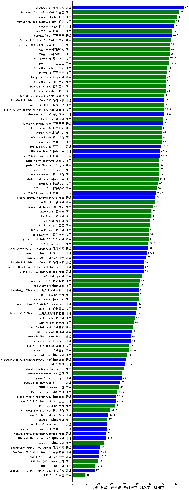

| 类别 | 大模型                         | CMB-专业知识考试-基础医学-组织学与胚胎学 | 排名 |
|-----|------------------------------|---------|----|
|开源|DeepSeek-R1|86.0|1|
|商用|Doubao-1.5-pro-32k-250115|82.0|2|
|商用|hunyuan-turbo|81.0|3|
|商用|hunyuan-turbos-20250226(new)|79.0|4|
|开源|hunyuan-large|78.5|5|
|商用|qwen2.5-max|77.0|6|
|开源|qwq-32b(new)|76.5|7|
|商用|Doubao-1.5-lite-32k-250115|76.0|8|
|商用|360gpt-pro|75.0|9|
|商用|360gpt2-pro|75.0|10|
|商用|qwq-plus-2025-03-05(new)|75.0|11|
|商用|qwen-long|74.5|12|
|商用|yi-lightning|74.5|13|
|商用|SenseChat-5-beta|73.0|14|
|商用|qwen-plus|73.0|15|
|商用|chatgpt-4o-latest|72.0|16|
|商用|Baichuan4-Turbo|72.0|17|
|商用|hunyuan-standard|72.0|18|
|商用|SenseChat-5-1202|72.0|19|
|商用|gemini-2.0-pro-exp-02-05|71.0|20|
|开源|DeepSeek-R1-Distill-Qwen-32B|71.0|21|
|商用|xunfei-4.0Ultra|71.0|22|
|商用|gemini-2.0-flash-thinking-exp-01-21|70.5|23|
|开源|deepseek-chat-v3|70.5|24|
|开源|qwen2.5-72b-instruct|70.0|25|
|商用|GLM-4-Plus|70.0|26|
|商用|xunfei-spark-max|69.0|27|
|商用|qwen-turbo|69.0|28|
|商用|kimi-latest-8k|69.0|29|
|商用|360gpt-turbo|69.0|30|
|开源|qwq-32b-preview|68.5|31|
|开源|MiniMax-Text-01|67.5|32|
|开源|qwen2.5-32b-instruct|67.5|33|
|商用|xunfei-spark-pro|67.0|34|
|商用|gemini-1.5-pro|67.0|35|
|商用|gemini-2.0-flash-exp|67.0|36|
|商用|gemini-2.0-flash-001|67.0|37|
|商用|abab7-chat-preview|66.5|38|
|商用|360gpt2-o1|66.0|39|
|商用|360zhinao2-o1|65.0|40|
|开源|qwen2.5-14b-instruct|64.5|41|
|开源|Meta-Llama-3.1-405B-Instruct|64.0|42|
|商用|GLM-4-Air|64.0|43|
|商用|SenseChat-Turbo-1202|62.0|44|
|商用|GLM-4-AirX|61.0|45|
|商用|GLM-4-Long|61.0|46|
|商用|Baichuan4|60.0|47|
|商用|o1-mini|60.0|48|
|商用|gpt-4o-mini-2024-07-18|59.0|49|
|商用|GLM-Zero-Preview|59.0|50|
|商用|Baichuan4-Air|59.0|51|
|商用|gemini-1.5-flash|58.5|52|
|开源|DeepSeek-R1-Distill-Llama-70B|58.0|53|
|开源|qwen2.5-7b-instruct|57.5|54|
|开源|Llama-3.3-70B-Instruct|57.0|55|
|开源|Llama-3.1-Nemotron-70B-Instruct-fp8|55.0|56|
|开源|Llama-3.3-70B-Instruct-fp8|55.0|57|
|开源|DeepSeek-R1-Distill-Qwen-14B|55.0|58|
|商用|o3-mini|54.0|59|
|商用|moonshot-v1-8k|52.0|60|
|商用|mistral-large|51.5|61|
|商用|ERNIE-3.5-8K|51.0|62|
|商用|abab6.5s-chat|51.0|63|
|开源|internlm2_5-20b-chat|51.0|64|
|商用|step-1-8k|50.0|65|
|开源|Hermes-3-Llama-3.1-405B|50.0|66|
|开源|internlm2_5-7b-chat|49.0|67|
|商用|GLM-4-FlashX|48.0|68|
|商用|GLM-4-Flash|47.5|69|
|商用|step-2-mini(new)|47.0|70|
|开源|glm-4-9b-chat|46.0|71|
|开源|gemma-2-27b-it|45.0|72|
|开源|gemma-3-27b-it(new)|45.0|73|
|商用|gemini-1.5-flash-8b|44.0|74|
|商用|step-1-flash|43.5|75|
|商用|mistral-small|42.0|76|
|开源|Mistral-Small-24B-Instruct-2501(new)|41.0|77|
|开源|phi-4|40.5|78|
|商用|Claude-3.5-Sonnet|40.0|79|
|商用|ERNIE-Speed-Pro-128K|38.5|80|
|开源|gemma-2-9b-it|38.0|81|
|开源|qwen2.5-3b-instruct|37.0|82|
|商用|ERNIE-Lite-8K|36.0|83|
|商用|ERNIE-Lite-Pro-128K|34.5|84|
|开源|Mistral-Nemo-Instruct-2407|33.5|85|
|开源|qwen2.5-1.5b-instruct|33.5|86|
|商用|ERNIE-Speed-8K|33.2|87|
|商用|xunfei-spark-lite(new)|28.7|88|
|开源|Llama-3.1-8B-Instruct|27.5|89|
|开源|qwen2.5-0.5b-instruct|27.0|90|
|开源|Llama-3.2-3B-Instruct|27.0|91|
|商用|ministral-8b|27.0|92|
|开源|Meta-Llama-3.1-8B-Instruct-fp8|26.0|93|
|开源|Mistral-7B-Instruct-v0.3|25.5|94|
|商用|ministral-3b|24.0|95|
|开源|DeepSeek-R1-Distill-Llama-8B|21.5|96|
|开源|DeepSeek-R1-Distill-Qwen-7B|20.5|97|
|开源|Llama-3.2-1B-Instruct|20.5|98|
|商用|ERNIE-4.0-Turbo-8K|20.0|99|
|商用|ERNIE-Tiny-8K|17.5|100|
|开源|DeepSeek-R1-Distill-Qwen-1.5B|17.0|101|
|商用|ERNIE-4.0|10.0|102|
|开源|Yi-1.5-34B-Chat|/|103|
|开源|Yi-1.5-9B-Chat|/|104|
|开源|qwen2.5-math-72b-instruct|/|105|

