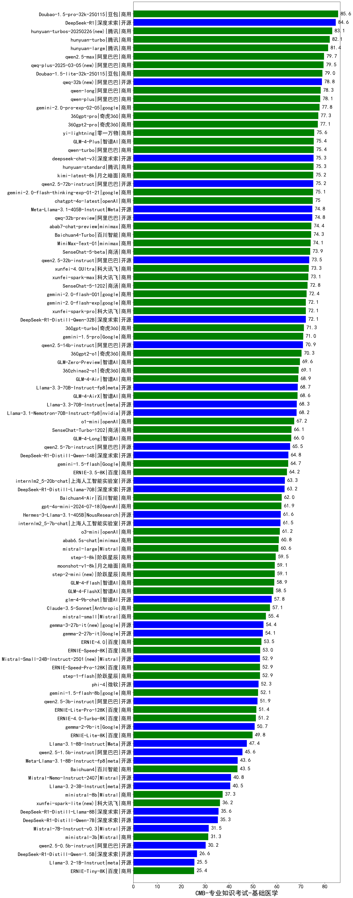

| 类别 | 大模型                         | CMB-专业知识考试-基础医学 | 排名 |
|-----|------------------------------|---------|----|
|商用|Doubao-1.5-pro-32k-250115|85.6|1|
|开源|DeepSeek-R1|84.6|2|
|商用|hunyuan-turbos-20250226(new)|83.1|3|
|商用|hunyuan-turbo|82.1|4|
|开源|hunyuan-large|81.4|5|
|商用|qwen2.5-max|79.7|6|
|商用|qwq-plus-2025-03-05(new)|79.5|7|
|商用|Doubao-1.5-lite-32k-250115|79.0|8|
|开源|qwq-32b(new)|78.8|9|
|商用|qwen-long|78.3|10|
|商用|qwen-plus|78.1|11|
|商用|gemini-2.0-pro-exp-02-05|77.8|12|
|商用|360gpt-pro|77.3|13|
|商用|360gpt2-pro|77.1|14|
|商用|yi-lightning|75.6|15|
|商用|GLM-4-Plus|75.4|16|
|商用|qwen-turbo|75.4|17|
|开源|deepseek-chat-v3|75.3|18|
|商用|hunyuan-standard|75.3|19|
|开源|qwen2.5-72b-instruct|75.2|20|
|商用|kimi-latest-8k|75.2|21|
|商用|gemini-2.0-flash-thinking-exp-01-21|75.1|22|
|商用|chatgpt-4o-latest|75.0|23|
|开源|Meta-Llama-3.1-405B-Instruct|74.8|24|
|开源|qwq-32b-preview|74.8|25|
|商用|abab7-chat-preview|74.4|26|
|商用|Baichuan4-Turbo|74.3|27|
|开源|MiniMax-Text-01|74.1|28|
|商用|SenseChat-5-beta|73.9|29|
|开源|qwen2.5-32b-instruct|73.5|30|
|商用|xunfei-4.0Ultra|73.3|31|
|商用|xunfei-spark-max|73.1|32|
|商用|SenseChat-5-1202|72.8|33|
|商用|gemini-2.0-flash-001|72.4|34|
|商用|gemini-2.0-flash-exp|72.1|35|
|商用|xunfei-spark-pro|72.1|36|
|开源|DeepSeek-R1-Distill-Qwen-32B|72.1|37|
|商用|360gpt-turbo|71.3|38|
|商用|gemini-1.5-pro|71.0|39|
|开源|qwen2.5-14b-instruct|70.9|40|
|商用|360gpt2-o1|70.3|41|
|商用|GLM-Zero-Preview|69.6|42|
|商用|360zhinao2-o1|69.1|43|
|商用|GLM-4-Air|68.9|44|
|开源|Llama-3.3-70B-Instruct-fp8|68.7|45|
|商用|GLM-4-AirX|68.6|46|
|开源|Llama-3.3-70B-Instruct|68.3|47|
|开源|Llama-3.1-Nemotron-70B-Instruct-fp8|68.2|48|
|商用|o1-mini|67.2|49|
|商用|SenseChat-Turbo-1202|66.1|50|
|商用|GLM-4-Long|66.0|51|
|开源|qwen2.5-7b-instruct|65.5|52|
|开源|DeepSeek-R1-Distill-Qwen-14B|64.8|53|
|商用|gemini-1.5-flash|64.7|54|
|商用|ERNIE-3.5-8K|64.2|55|
|开源|internlm2_5-20b-chat|63.3|56|
|开源|DeepSeek-R1-Distill-Llama-70B|63.2|57|
|商用|Baichuan4-Air|62.0|58|
|商用|gpt-4o-mini-2024-07-18|61.9|59|
|开源|Hermes-3-Llama-3.1-405B|61.6|60|
|开源|internlm2_5-7b-chat|61.5|61|
|商用|o3-mini|61.2|62|
|商用|abab6.5s-chat|60.8|63|
|商用|mistral-large|60.6|64|
|商用|step-1-8k|59.5|65|
|商用|moonshot-v1-8k|59.1|66|
|商用|step-2-mini(new)|59.1|67|
|商用|GLM-4-Flash|58.9|68|
|商用|GLM-4-FlashX|58.5|69|
|开源|glm-4-9b-chat|57.8|70|
|商用|Claude-3.5-Sonnet|57.1|71|
|商用|mistral-small|55.4|72|
|开源|gemma-3-27b-it(new)|54.4|73|
|开源|gemma-2-27b-it|54.1|74|
|商用|ERNIE-4.0|53.5|75|
|商用|ERNIE-Speed-8K|53.0|76|
|开源|Mistral-Small-24B-Instruct-2501(new)|52.9|77|
|商用|ERNIE-Speed-Pro-128K|52.9|78|
|商用|step-1-flash|52.9|79|
|开源|phi-4|52.3|80|
|商用|gemini-1.5-flash-8b|52.1|81|
|开源|qwen2.5-3b-instruct|51.9|82|
|商用|ERNIE-Lite-Pro-128K|51.4|83|
|商用|ERNIE-4.0-Turbo-8K|51.2|84|
|开源|gemma-2-9b-it|50.7|85|
|商用|ERNIE-Lite-8K|49.8|86|
|开源|Llama-3.1-8B-Instruct|47.4|87|
|开源|qwen2.5-1.5b-instruct|45.6|88|
|开源|Meta-Llama-3.1-8B-Instruct-fp8|43.6|89|
|商用|Baichuan4|43.5|90|
|开源|Mistral-Nemo-Instruct-2407|40.8|91|
|开源|Llama-3.2-3B-Instruct|40.5|92|
|商用|ministral-8b|37.3|93|
|商用|xunfei-spark-lite(new)|36.2|94|
|开源|DeepSeek-R1-Distill-Llama-8B|35.6|95|
|开源|DeepSeek-R1-Distill-Qwen-7B|35.3|96|
|开源|Mistral-7B-Instruct-v0.3|31.5|97|
|商用|ministral-3b|31.3|98|
|开源|qwen2.5-0.5b-instruct|30.2|99|
|开源|DeepSeek-R1-Distill-Qwen-1.5B|26.6|100|
|开源|Llama-3.2-1B-Instruct|25.5|101|
|商用|ERNIE-Tiny-8K|25.4|102|
|开源|Yi-1.5-34B-Chat|/|103|
|开源|Yi-1.5-9B-Chat|/|104|
|开源|qwen2.5-math-72b-instruct|/|105|

