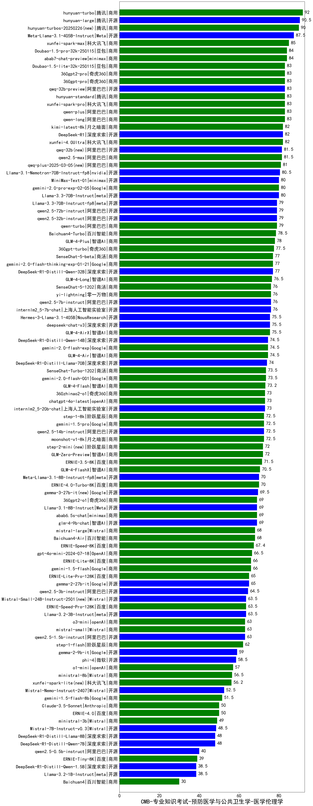

| 类别 | 大模型                         | CMB-专业知识考试-预防医学与公共卫生学-医学伦理学 | 排名 |
|-----|------------------------------|---------|----|
|商用|hunyuan-turbo|92.0|1|
|商用|ERNIE-4.5-8K-Preview(new)|91.0|2|
|开源|hunyuan-large|90.5|3|
|商用|hunyuan-turbos-20250226(new)|90.0|4|
|开源|Meta-Llama-3.1-405B-Instruct|87.5|5|
|商用|hunyuan-turbos-20250313(new)|86.5|6|
|商用|xunfei-spark-max|85.0|7|
|商用|Doubao-1.5-pro-32k-250115|84.0|8|
|商用|abab7-chat-preview|84.0|9|
|商用|qwen-long|83.0|10|
|商用|hunyuan-standard|83.0|11|
|开源|qwq-32b-preview|83.0|12|
|商用|xunfei-spark-pro|83.0|13|
|商用|qwen-plus|83.0|14|
|商用|360gpt-pro|83.0|15|
|商用|Doubao-1.5-lite-32k-250115|83.0|16|
|商用|360gpt2-pro|83.0|17|
|开源|DeepSeek-R1|82.0|18|
|商用|xunfei-4.0Ultra|82.0|19|
|商用|kimi-latest-8k|82.0|20|
|开源|qwq-32b(new)|81.5|21|
|商用|qwen2.5-max|81.5|22|
|商用|qwq-plus-2025-03-05(new)|81.0|23|
|开源|Llama-3.1-Nemotron-70B-Instruct-fp8|80.5|24|
|开源|Llama-3.3-70B-Instruct|80.0|25|
|商用|gemini-2.0-pro-exp-02-05|80.0|26|
|开源|MiniMax-Text-01|80.0|27|
|商用|qwen-turbo|79.0|28|
|开源|qwen2.5-32b-instruct|79.0|29|
|开源|Llama-3.3-70B-Instruct-fp8|79.0|30|
|开源|qwen2.5-72b-instruct|79.0|31|
|商用|Baichuan4-Turbo|78.5|32|
|商用|GLM-4-Plus|78.0|33|
|商用|360gpt-turbo|77.5|34|
|开源|DeepSeek-R1-Distill-Qwen-32B|77.0|35|
|商用|gemini-2.0-flash-thinking-exp-01-21|77.0|36|
|商用|SenseChat-5-beta|77.0|37|
|商用|GLM-4-Long|76.5|38|
|商用|yi-lightning|76.0|39|
|商用|SenseChat-5-1202|76.0|40|
|开源|internlm2_5-7b-chat|76.0|41|
|开源|qwen2.5-7b-instruct|76.0|42|
|开源|Hermes-3-Llama-3.1-405B|75.5|43|
|商用|GLM-4-AirX|75.5|44|
|开源|deepseek-chat-v3|75.5|45|
|商用|GLM-4-Air|74.5|46|
|商用|gemini-2.0-flash-exp|74.5|47|
|开源|DeepSeek-R1-Distill-Qwen-14B|74.5|48|
|开源|DeepSeek-R1-Distill-Llama-70B|74.0|49|
|商用|SenseChat-Turbo-1202|73.5|50|
|商用|gemini-2.0-flash-001|73.5|51|
|商用|GLM-4-Flash|73.2|52|
|开源|internlm2_5-20b-chat|73.0|53|
|商用|360zhinao2-o1|73.0|54|
|商用|chatgpt-4o-latest|73.0|55|
|商用|moonshot-v1-8k|72.5|56|
|开源|qwen2.5-14b-instruct|72.5|57|
|商用|gemini-1.5-pro|72.5|58|
|商用|step-1-8k|72.5|59|
|商用|GLM-Zero-Preview|72.0|60|
|商用|step-2-mini(new)|72.0|61|
|商用|ERNIE-3.5-8K|71.5|62|
|商用|GLM-4-FlashX|70.5|63|
|商用|ERNIE-4.0-Turbo-8K|70.0|64|
|开源|Meta-Llama-3.1-8B-Instruct-fp8|70.0|65|
|开源|gemma-3-27b-it(new)|69.5|66|
|开源|glm-4-9b-chat|69.0|67|
|商用|360gpt2-o1|69.0|68|
|开源|Llama-3.1-8B-Instruct|69.0|69|
|商用|abab6.5s-chat|69.0|70|
|商用|mistral-large|68.0|71|
|商用|Baichuan4-Air|68.0|72|
|商用|ERNIE-Speed-8K|67.4|73|
|商用|gpt-4o-mini-2024-07-18|66.5|74|
|商用|ERNIE-Lite-8K|66.0|75|
|商用|gemini-1.5-flash|66.0|76|
|开源|gemma-2-27b-it|65.0|77|
|商用|ERNIE-Lite-Pro-128K|65.0|78|
|开源|qwen2.5-3b-instruct|64.5|79|
|开源|Llama-3.2-3B-Instruct|63.5|80|
|商用|ERNIE-Speed-Pro-128K|63.5|81|
|开源|Mistral-Small-24B-Instruct-2501(new)|63.5|82|
|开源|qwen2.5-1.5b-instruct|63.0|83|
|商用|mistral-small|63.0|84|
|商用|o3-mini|63.0|85|
|商用|step-1-flash|62.0|86|
|开源|gemma-3-12b-it(new)|62.0|87|
|开源|gemma-2-9b-it|59.0|88|
|开源|phi-4|58.5|89|
|开源|gemma-3-4b-it(new)|57.5|90|
|商用|o1-mini|57.0|91|
|商用|ministral-8b|56.5|92|
|商用|xunfei-spark-lite(new)|56.2|93|
|开源|Mistral-Nemo-Instruct-2407|52.5|94|
|商用|gemini-1.5-flash-8b|51.5|95|
|商用|Claude-3.5-Sonnet|50.0|96|
|商用|ERNIE-4.0|50.0|97|
|商用|ministral-3b|49.0|98|
|开源|Mistral-7B-Instruct-v0.3|48.5|99|
|开源|DeepSeek-R1-Distill-Qwen-7B|48.0|100|
|开源|DeepSeek-R1-Distill-Llama-8B|48.0|101|
|开源|qwen2.5-0.5b-instruct|40.0|102|
|商用|ERNIE-Tiny-8K|39.0|103|
|开源|Llama-3.2-1B-Instruct|38.5|104|
|开源|DeepSeek-R1-Distill-Qwen-1.5B|38.5|105|
|开源|gemma-3-1b-it(new)|35.0|106|
|商用|Baichuan4|30.0|107|
|开源|qwen2.5-math-72b-instruct|/|108|
|开源|Yi-1.5-34B-Chat|/|109|
|开源|Yi-1.5-9B-Chat|/|110|

