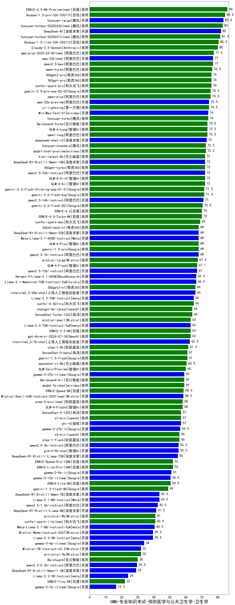

| 类别 | 大模型                         | CMB-专业知识考试-预防医学与公共卫生学-卫生学 | 排名 |
|-----|------------------------------|---------|----|
|商用|ERNIE-4.5-8K-Preview(new)|86.0|1|
|商用|Doubao-1.5-pro-32k-250115|84.5|2|
|开源|hunyuan-large|83.5|3|
|商用|hunyuan-turbos-20250226(new)|83.0|4|
|开源|DeepSeek-R1|82.0|5|
|商用|hunyuan-turbos-20250313(new)|81.5|6|
|商用|Doubao-1.5-lite-32k-250115|80.5|7|
|商用|Claude-3.5-Sonnet|80.0|8|
|商用|qwq-plus-2025-03-05(new)|77.5|9|
|商用|qwen2.5-max|77.0|10|
|开源|qwq-32b(new)|77.0|11|
|商用|qwen-turbo|76.5|12|
|商用|360gpt2-pro|76.0|13|
|商用|360gpt-pro|76.0|14|
|商用|xunfei-spark-pro|76.0|15|
|商用|qwen-plus|75.5|16|
|商用|gemini-2.0-pro-exp-02-05|75.5|17|
|商用|yi-lightning|74.5|18|
|开源|qwq-32b-preview|74.5|19|
|开源|MiniMax-Text-01|74.0|20|
|商用|hunyuan-turbo|74.0|21|
|商用|qwen-long|73.5|22|
|商用|Baichuan4-Turbo|73.5|23|
|商用|GLM-4-Long|73.5|24|
|开源|deepseek-chat-v3|73.0|25|
|商用|abab7-chat-preview|72.5|26|
|商用|hunyuan-standard|72.5|27|
|开源|qwen2.5-32b-instruct|72.0|28|
|商用|360gpt-turbo|72.0|29|
|开源|DeepSeek-R1-Distill-Qwen-14B|72.0|30|
|商用|GLM-4-AirX|72.0|31|
|商用|GLM-4-Air|72.0|32|
|商用|kimi-latest-8k|72.0|33|
|商用|gemini-2.0-flash-thinking-exp-01-21|71.5|34|
|商用|gemini-2.0-flash-exp|71.5|35|
|开源|qwen2.5-14b-instruct|71.0|36|
|商用|gemini-2.0-flash-001|70.5|37|
|商用|ERNIE-4.0-Turbo-8K|70.0|38|
|商用|ERNIE-4.0|70.0|39|
|商用|xunfei-spark-max|69.0|40|
|商用|GLM-4-Plus|68.0|41|
|开源|Meta-Llama-3.1-405B-Instruct|68.0|42|
|商用|gemini-1.5-pro|68.0|43|
|开源|qwen2.5-7b-instruct|68.0|44|
|商用|360zhinao2-o1|68.0|45|
|开源|DeepSeek-R1-Distill-Qwen-32B|68.0|46|
|商用|mistral-large|67.5|47|
|商用|GLM-4-Flash|67.1|48|
|开源|qwen2.5-72b-instruct|67.0|49|
|开源|Hermes-3-Llama-3.1-405B|66.5|50|
|开源|Llama-3.1-Nemotron-70B-Instruct-fp8|66.5|51|
|开源|internlm2_5-20b-chat|66.0|52|
|商用|360gpt2-o1|66.0|53|
|商用|xunfei-4.0Ultra|65.0|54|
|开源|Llama-3.3-70B-Instruct|65.0|55|
|商用|SenseChat-Turbo-1202|64.0|56|
|商用|chatgpt-4o-latest|64.0|57|
|商用|mistral-small|63.0|58|
|商用|ERNIE-3.5-8K|63.0|59|
|商用|gpt-4o-mini-2024-07-18|63.0|60|
|开源|Llama-3.3-70B-Instruct-fp8|63.0|61|
|开源|internlm2_5-7b-chat|62.5|62|
|商用|step-1-8k|61.5|63|
|商用|SenseChat-5-beta|61.0|64|
|商用|gemini-1.5-flash|61.0|65|
|商用|moonshot-v1-8k|60.5|66|
|商用|GLM-Zero-Preview|60.0|67|
|开源|gemma-3-27b-it(new)|59.0|68|
|商用|abab6.5s-chat|59.0|69|
|商用|Baichuan4-Air|59.0|70|
|商用|ERNIE-Speed-8K|58.6|71|
|开源|Mistral-Small-24B-Instruct-2501(new)|58.5|72|
|商用|step-2-mini(new)|58.0|73|
|商用|GLM-4-FlashX|58.0|74|
|商用|o1-mini|57.0|75|
|商用|SenseChat-5-1202|57.0|76|
|开源|phi-4|57.0|77|
|开源|gemma-2-27b-it|56.5|78|
|商用|step-1-flash|56.0|79|
|商用|o3-mini|56.0|80|
|开源|glm-4-9b-chat|55.5|81|
|开源|qwen2.5-3b-instruct|55.5|82|
|开源|DeepSeek-R1-Distill-Llama-70B|55.0|83|
|商用|ERNIE-Speed-Pro-128K|52.0|84|
|商用|ERNIE-Lite-Pro-128K|52.0|85|
|开源|gemma-2-9b-it|51.0|86|
|商用|ERNIE-Lite-8K|50.5|87|
|开源|gemma-3-12b-it(new)|50.5|88|
|商用|gemini-1.5-flash-8b|49.0|89|
|开源|Llama-3.1-8B-Instruct|43.5|90|
|开源|DeepSeek-R1-Distill-Qwen-7B|43.5|91|
|开源|qwen2.5-1.5b-instruct|42.5|92|
|开源|DeepSeek-R1-Distill-Llama-8B|41.5|93|
|商用|ministral-8b|41.0|94|
|商用|xunfei-spark-lite(new)|40.9|95|
|开源|Meta-Llama-3.1-8B-Instruct-fp8|40.5|96|
|开源|Mistral-Nemo-Instruct-2407|39.5|97|
|开源|Llama-3.2-3B-Instruct|39.5|98|
|开源|gemma-3-4b-it(new)|34.0|99|
|商用|ministral-3b|32.0|100|
|开源|Mistral-7B-Instruct-v0.3|32.0|101|
|商用|Baichuan4|30.0|102|
|开源|qwen2.5-0.5b-instruct|29.5|103|
|开源|DeepSeek-R1-Distill-Qwen-1.5B|29.0|104|
|开源|Llama-3.2-1B-Instruct|24.0|105|
|商用|ERNIE-Tiny-8K|22.0|106|
|开源|gemma-3-1b-it(new)|16.5|107|
|开源|qwen2.5-math-72b-instruct|/|108|

