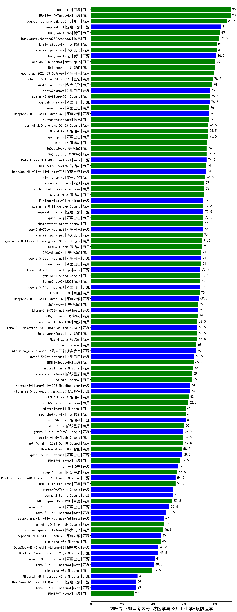

| 类别 | 大模型                         | CMB-专业知识考试-预防医学与公共卫生学-预防医学 | 排名 |
|-----|------------------------------|---------|----|
|商用|ERNIE-4.0-Turbo-8K|90.0|1|
|商用|ERNIE-4.0|90.0|2|
|商用|Doubao-1.5-pro-32k-250115|87.5|3|
|开源|DeepSeek-R1|84.0|4|
|商用|hunyuan-turbo|83.0|5|
|商用|hunyuan-turbos-20250226(new)|82.5|6|
|商用|kimi-latest-8k|81.0|7|
|商用|xunfei-spark-max|81.0|8|
|开源|hunyuan-large|80.5|9|
|商用|Baichuan4|80.0|10|
|商用|Claude-3.5-Sonnet|80.0|11|
|商用|qwq-plus-2025-03-05(new)|79.0|12|
|商用|Doubao-1.5-lite-32k-250115|78.5|13|
|商用|xunfei-4.0Ultra|78.0|14|
|开源|qwq-32b-preview|76.5|15|
|开源|qwq-32b(new)|76.5|16|
|商用|gemini-2.0-flash-001|76.5|17|
|开源|DeepSeek-R1-Distill-Qwen-32B|76.0|18|
|商用|qwen2.5-max|76.0|19|
|商用|hunyuan-standard|76.0|20|
|商用|gemini-2.0-pro-exp-02-05|75.5|21|
|商用|GLM-4-AirX|75.5|22|
|商用|qwen-plus|75.5|23|
|商用|GLM-4-Air|75.0|24|
|商用|360gpt-pro|74.5|25|
|商用|360gpt2-pro|74.5|26|
|开源|Meta-Llama-3.1-405B-Instruct|74.5|27|
|商用|GLM-Zero-Preview|74.0|28|
|开源|DeepSeek-R1-Distill-Llama-70B|74.0|29|
|商用|yi-lightning|73.5|30|
|商用|SenseChat-5-beta|73.0|31|
|商用|GLM-4-Plus|73.0|32|
|商用|abab7-chat-preview|73.0|33|
|开源|MiniMax-Text-01|72.5|34|
|开源|deepseek-chat-v3|72.5|35|
|商用|qwen-long|72.5|36|
|商用|gemini-2.0-flash-exp|72.5|37|
|商用|xunfei-spark-pro|72.0|38|
|开源|qwen2.5-72b-instruct|72.0|39|
|商用|chatgpt-4o-latest|72.0|40|
|商用|gemini-2.0-flash-thinking-exp-01-21|71.5|41|
|商用|GLM-4-Flash|71.3|42|
|开源|qwen2.5-32b-instruct|71.0|43|
|商用|qwen-turbo|71.0|44|
|商用|360zhinao2-o1|71.0|45|
|开源|Llama-3.3-70B-Instruct-fp8|70.5|46|
|商用|gemini-1.5-pro|70.5|47|
|开源|qwen2.5-14b-instruct|70.0|48|
|商用|ERNIE-3.5-8K|70.0|49|
|商用|SenseChat-5-1202|70.0|50|
|开源|DeepSeek-R1-Distill-Qwen-14B|69.5|51|
|商用|360gpt2-o1|69.0|52|
|开源|Llama-3.3-70B-Instruct|69.0|53|
|商用|360gpt-turbo|69.0|54|
|商用|SenseChat-Turbo-1202|68.5|55|
|商用|Baichuan4-Turbo|68.5|56|
|开源|Llama-3.1-Nemotron-70B-Instruct-fp8|68.5|57|
|商用|GLM-4-Long|68.5|58|
|商用|o1-mini|68.0|59|
|开源|internlm2_5-20b-chat|68.0|60|
|开源|qwen2.5-7b-instruct|66.5|61|
|商用|ERNIE-Speed-8K|66.2|62|
|商用|mistral-large|66.0|63|
|商用|o3-mini|65.0|64|
|商用|step-2-mini(new)|65.0|65|
|开源|internlm2_5-7b-chat|64.0|66|
|开源|Hermes-3-Llama-3.1-405B|64.0|67|
|商用|GLM-4-FlashX|63.0|68|
|商用|abab6.5s-chat|62.5|69|
|商用|moonshot-v1-8k|61.0|70|
|开源|glm-4-9b-chat|61.0|71|
|商用|mistral-small|61.0|72|
|商用|step-1-8k|60.0|73|
|商用|gpt-4o-mini-2024-07-18|59.5|74|
|开源|gemma-3-27b-it(new)|59.5|75|
|商用|gemini-1.5-flash|59.5|76|
|商用|Baichuan4-Air|58.5|77|
|开源|qwen2.5-3b-instruct|58.5|78|
|商用|ERNIE-Lite-8K|57.5|79|
|开源|phi-4|56.0|80|
|商用|step-1-flash|55.5|81|
|开源|Mistral-Small-24B-Instruct-2501(new)|54.5|82|
|商用|ERNIE-Lite-Pro-128K|54.5|83|
|开源|gemma-2-27b-it|53.0|84|
|开源|gemma-2-9b-it|53.0|85|
|商用|ERNIE-Speed-Pro-128K|52.5|86|
|开源|qwen2.5-1.5b-instruct|50.5|87|
|开源|Llama-3.1-8B-Instruct|48.5|88|
|商用|gemini-1.5-flash-8b|47.0|89|
|开源|Meta-Llama-3.1-8B-Instruct-fp8|47.0|90|
|商用|xunfei-spark-lite(new)|46.3|91|
|商用|ministral-8b|45.0|92|
|开源|DeepSeek-R1-Distill-Qwen-7B|45.0|93|
|开源|Mistral-Nemo-Instruct-2407|43.5|94|
|开源|DeepSeek-R1-Distill-Llama-8B|43.5|95|
|开源|qwen2.5-0.5b-instruct|41.0|96|
|开源|Llama-3.2-3B-Instruct|40.5|97|
|商用|ministral-3b|39.5|98|
|开源|Mistral-7B-Instruct-v0.3|30.0|99|
|开源|Llama-3.2-1B-Instruct|29.0|100|
|开源|DeepSeek-R1-Distill-Qwen-1.5B|29.0|101|
|商用|ERNIE-Tiny-8K|27.5|102|
|开源|Yi-1.5-34B-Chat|/|103|
|开源|Yi-1.5-9B-Chat|/|104|
|开源|qwen2.5-math-72b-instruct|/|105|

