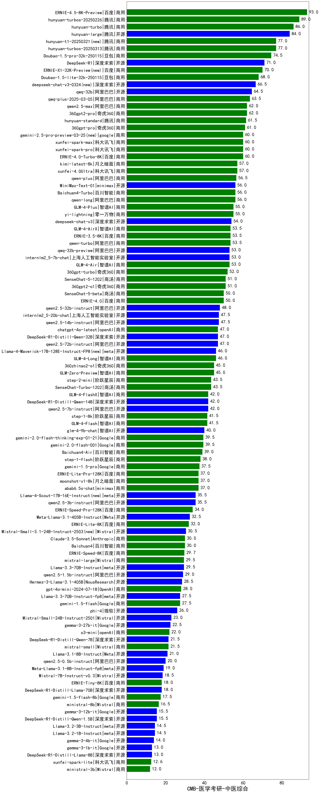

| 类别 | 大模型                         | CMB-医学考研-中医综合 | 排名 |
|-----|------------------------------|---------|----|
|商用|ERNIE-4.5-8K-Preview(new)|93.0|1|
|商用|hunyuan-turbos-20250226|89.0|2|
|商用|hunyuan-turbo|86.0|3|
|开源|hunyuan-large|84.0|4|
|商用|hunyuan-t1-20250321(new)|77.0|5|
|商用|hunyuan-turbos-20250313(new)|77.0|6|
|商用|Doubao-1.5-pro-32k-250115|74.5|7|
|开源|DeepSeek-R1|71.0|8|
|商用|Doubao-1.5-lite-32k-250115|68.0|9|
|开源|deepseek-chat-v3-0324(new)|66.5|10|
|开源|qwq-32b|64.5|11|
|商用|qwq-plus-2025-03-05|63.5|12|
|商用|360gpt2-pro|62.0|13|
|商用|qwen2.5-max|62.0|14|
|商用|hunyuan-standard|61.5|15|
|商用|360gpt-pro|61.0|16|
|商用|xunfei-spark-max|60.0|17|
|商用|xunfei-spark-pro|60.0|18|
|商用|ERNIE-4.0-Turbo-8K|60.0|19|
|商用|gemini-2.0-pro-exp-02-05|58.5|20|
|商用|xunfei-4.0Ultra|57.0|21|
|商用|kimi-latest-8k|57.0|22|
|商用|qwen-plus|56.5|23|
|开源|MiniMax-Text-01|56.0|24|
|商用|Baichuan4-Turbo|56.0|25|
|商用|qwen-long|56.0|26|
|商用|GLM-4-Plus|55.0|27|
|商用|yi-lightning|55.0|28|
|商用|abab7-chat-preview|54.5|29|
|开源|deepseek-chat-v3|54.0|30|
|商用|GLM-4-AirX|53.5|31|
|商用|qwen-turbo|53.5|32|
|商用|ERNIE-3.5-8K|53.5|33|
|开源|qwq-32b-preview|53.0|34|
|开源|internlm2_5-7b-chat|53.0|35|
|商用|GLM-4-Air|53.0|36|
|商用|360gpt-turbo|52.0|37|
|商用|360gpt2-o1|51.0|38|
|商用|SenseChat-5-1202|51.0|39|
|商用|SenseChat-5-beta|50.0|40|
|商用|ERNIE-4.0|50.0|41|
|开源|qwen2.5-32b-instruct|48.0|42|
|开源|internlm2_5-20b-chat|47.5|43|
|开源|qwen2.5-14b-instruct|47.5|44|
|开源|qwen2.5-72b-instruct|47.0|45|
|开源|DeepSeek-R1-Distill-Qwen-32B|47.0|46|
|商用|chatgpt-4o-latest|47.0|47|
|商用|GLM-4-Long|46.0|48|
|商用|GLM-Zero-Preview|45.0|49|
|商用|360zhinao2-o1|45.0|50|
|商用|step-2-mini|43.5|51|
|商用|SenseChat-Turbo-1202|43.5|52|
|商用|GLM-4-FlashX|42.0|53|
|开源|qwen2.5-7b-instruct|42.0|54|
|开源|DeepSeek-R1-Distill-Qwen-14B|42.0|55|
|商用|step-1-8k|41.5|56|
|商用|GLM-4-Flash|41.5|57|
|商用|gemini-2.0-flash-exp|41.5|58|
|开源|glm-4-9b-chat|40.0|59|
|商用|gemini-2.0-flash-001|39.5|60|
|商用|gemini-2.0-flash-thinking-exp-01-21|39.5|61|
|商用|Baichuan4-Air|39.0|62|
|商用|step-1-flash|38.0|63|
|商用|gemini-1.5-pro|37.5|64|
|商用|moonshot-v1-8k|37.0|65|
|商用|ERNIE-Lite-Pro-128K|37.0|66|
|商用|abab6.5s-chat|37.0|67|
|开源|qwen2.5-3b-instruct|35.5|68|
|商用|ERNIE-Speed-Pro-128K|34.0|69|
|开源|Meta-Llama-3.1-405B-Instruct|32.5|70|
|商用|ERNIE-Lite-8K|32.0|71|
|商用|Claude-3.5-Sonnet|30.0|72|
|商用|Baichuan4|30.0|73|
|商用|ERNIE-Speed-8K|29.7|74|
|商用|mistral-large|29.5|75|
|开源|Llama-3.3-70B-Instruct|29.5|76|
|开源|qwen2.5-1.5b-instruct|29.0|77|
|开源|Hermes-3-Llama-3.1-405B|28.5|78|
|商用|gpt-4o-mini-2024-07-18|28.0|79|
|开源|Llama-3.1-Nemotron-70B-Instruct-fp8|28.0|80|
|开源|Llama-3.3-70B-Instruct-fp8|27.5|81|
|商用|gemini-1.5-flash|27.5|82|
|开源|phi-4|26.0|83|
|商用|o1-mini|26.0|84|
|开源|Mistral-Small-24B-Instruct-2501(new)|23.0|85|
|开源|gemma-3-27b-it(new)|22.5|86|
|商用|o3-mini|22.0|87|
|商用|mistral-small|21.5|88|
|开源|DeepSeek-R1-Distill-Qwen-7B|21.5|89|
|开源|Llama-3.1-8B-Instruct|21.0|90|
|开源|qwen2.5-0.5b-instruct|20.0|91|
|开源|gemma-2-27b-it|20.0|92|
|开源|Meta-Llama-3.1-8B-Instruct-fp8|19.0|93|
|开源|Mistral-7B-Instruct-v0.3|18.5|94|
|开源|DeepSeek-R1-Distill-Llama-70B|18.0|95|
|商用|ERNIE-Tiny-8K|18.0|96|
|开源|Mistral-Nemo-Instruct-2407|18.0|97|
|开源|gemma-2-9b-it|17.5|98|
|商用|gemini-1.5-flash-8b|17.5|99|
|商用|ministral-8b|16.5|100|
|开源|gemma-3-12b-it(new)|15.5|101|
|开源|DeepSeek-R1-Distill-Qwen-1.5B|15.5|102|
|开源|Llama-3.2-3B-Instruct|14.5|103|
|开源|Llama-3.2-1B-Instruct|14.5|104|
|开源|gemma-3-4b-it(new)|14.0|105|
|开源|gemma-3-1b-it(new)|13.0|106|
|开源|DeepSeek-R1-Distill-Llama-8B|13.0|107|
|商用|xunfei-spark-lite|12.6|108|
|商用|ministral-3b|12.0|109|
|开源|qwen2.5-math-72b-instruct|/|110|

