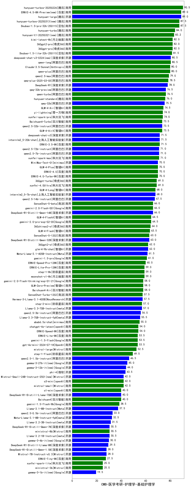

| 类别 | 大模型                         | CMB-医学考研-护理学-基础护理学 | 排名 |
|-----|------------------------------|---------|----|
|商用|hunyuan-turbos-20250226(new)|90.5|1|
|开源|hunyuan-large|89.0|2|
|商用|ERNIE-4.5-8K-Preview(new)|89.0|3|
|商用|hunyuan-turbos-20250313(new)|87.5|4|
|商用|Doubao-1.5-pro-32k-250115|87.5|5|
|商用|hunyuan-turbo|84.0|6|
|商用|360gpt-pro|82.0|7|
|商用|360gpt2-pro|82.0|8|
|商用|kimi-latest-8k|82.0|9|
|商用|Doubao-1.5-lite-32k-250115|81.5|10|
|商用|qwen-long|80.5|11|
|商用|qwen-plus|80.0|12|
|商用|Claude-3.5-Sonnet|80.0|13|
|商用|qwen2.5-max|79.0|14|
|商用|qwq-plus-2025-03-05(new)|78.5|15|
|开源|DeepSeek-R1|78.0|16|
|商用|qwen-turbo|76.5|17|
|开源|qwq-32b-preview|76.5|18|
|商用|hunyuan-standard|76.0|19|
|开源|qwq-32b(new)|75.5|20|
|商用|GLM-4-Air|74.5|21|
|商用|yi-lightning|74.0|22|
|商用|xunfei-spark-pro|74.0|23|
|商用|Baichuan4-Turbo|73.5|24|
|开源|qwen2.5-32b-instruct|73.5|25|
|商用|GLM-4-AirX|73.5|26|
|开源|internlm2_5-20b-chat|71.5|27|
|商用|ERNIE-3.5-8K|71.5|28|
|商用|abab7-chat-preview|71.5|29|
|开源|deepseek-chat-v3|71.5|30|
|商用|xunfei-spark-max|71.0|31|
|开源|qwen2.5-7b-instruct|71.0|32|
|开源|qwen2.5-72b-instruct|71.0|33|
|商用|GLM-4-Plus|70.0|34|
|开源|MiniMax-Text-01|70.0|35|
|商用|ERNIE-4.0-Turbo-8K|70.0|36|
|商用|ERNIE-4.0|70.0|37|
|商用|360gpt-turbo|69.0|38|
|商用|xunfei-4.0Ultra|69.0|39|
|商用|GLM-4-Long|68.0|40|
|开源|internlm2_5-7b-chat|68.0|41|
|开源|qwen2.5-14b-instruct|67.5|42|
|商用|gemini-2.0-flash-exp|67.0|43|
|商用|gemini-2.0-flash-001|66.0|44|
|开源|DeepSeek-R1-Distill-Qwen-14B|66.0|45|
|商用|SenseChat-5-beta|66.0|46|
|商用|GLM-4-FlashX|64.5|47|
|商用|gemini-2.0-pro-exp-02-05|64.5|48|
|商用|360zhinao2-o1|64.0|49|
|商用|GLM-4-Flash|63.5|50|
|商用|SenseChat-5-1202|63.0|51|
|开源|DeepSeek-R1-Distill-Qwen-32B|63.0|52|
|商用|360gpt2-o1|62.0|53|
|开源|glm-4-9b-chat|62.0|54|
|开源|Meta-Llama-3.1-405B-Instruct|61.5|55|
|商用|gemini-1.5-pro|61.0|56|
|商用|ERNIE-Speed-Pro-128K|60.0|57|
|商用|moonshot-v1-8k|59.0|58|
|商用|ERNIE-Lite-Pro-128K|59.0|59|
|商用|step-1-8k|59.0|60|
|商用|gemini-2.0-flash-thinking-exp-01-21|58.0|61|
|商用|GLM-Zero-Preview|58.0|62|
|商用|Baichuan4-Air|58.0|63|
|开源|Hermes-3-Llama-3.1-405B|57.5|64|
|商用|SenseChat-Turbo-1202|57.5|65|
|商用|step-2-mini(new)|57.0|66|
|开源|Llama-3.3-70B-Instruct|57.0|67|
|开源|qwen2.5-3b-instruct|56.0|68|
|开源|Llama-3.3-70B-Instruct-fp8|55.5|69|
|商用|abab6.5s-chat|55.0|70|
|商用|chatgpt-4o-latest|54.0|71|
|商用|ERNIE-Speed-8K|54.0|72|
|商用|gpt-4o-mini-2024-07-18|53.5|73|
|开源|Llama-3.1-Nemotron-70B-Instruct-fp8|53.5|74|
|商用|ERNIE-Lite-8K|53.5|75|
|商用|gemini-1.5-flash|53.5|76|
|商用|mistral-large|52.5|77|
|商用|step-1-flash|49.5|78|
|开源|qwen2.5-1.5b-instruct|46.5|79|
|开源|gemma-3-27b-it(new)|45.0|80|
|开源|gemma-3-12b-it(new)|44.0|81|
|开源|phi-4|43.5|82|
|开源|Mistral-Small-24B-Instruct-2501(new)|42.0|83|
|商用|mistral-small|42.0|84|
|商用|o3-mini|42.0|85|
|开源|gemma-2-9b-it|41.0|86|
|开源|gemma-2-27b-it|40.5|87|
|商用|Baichuan4|40.0|88|
|开源|DeepSeek-R1-Distill-Llama-70B|40.0|89|
|商用|o1-mini|40.0|90|
|商用|gemini-1.5-flash-8b|38.5|91|
|开源|Llama-3.1-8B-Instruct|37.5|92|
|开源|qwen2.5-0.5b-instruct|33.0|93|
|开源|Meta-Llama-3.1-8B-Instruct-fp8|32.5|94|
|开源|Mistral-Nemo-Instruct-2407|31.5|95|
|开源|Llama-3.2-3B-Instruct|31.5|96|
|开源|Llama-3.2-1B-Instruct|30.5|97|
|商用|ministral-8b|30.5|98|
|开源|DeepSeek-R1-Distill-Qwen-7B|30.5|99|
|开源|gemma-3-4b-it(new)|30.0|100|
|开源|DeepSeek-R1-Distill-Llama-8B|29.5|101|
|开源|Mistral-7B-Instruct-v0.3|28.0|102|
|开源|DeepSeek-R1-Distill-Qwen-1.5B|28.0|103|
|商用|ERNIE-Tiny-8K|27.5|104|
|商用|xunfei-spark-lite(new)|25.0|105|
|商用|ministral-3b|25.0|106|
|开源|gemma-3-1b-it(new)|19.5|107|
|开源|qwen2.5-math-72b-instruct|/|108|

